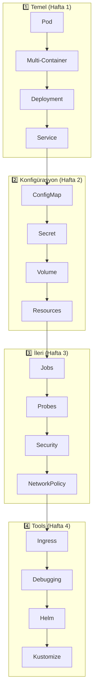

# 🎯 CKAD Pratik Lablar

**Certified Kubernetes Application Developer (CKAD)** sınavına hazırlık için uygulamalı laboratuvar çalışmaları.

> 🖥️ Bu lablar **k3s** ortamı için optimize edilmiştir.

---

## 🆕 Yeni Başlayanlar Buradan!

Kubernetes'e yeni misin? Önce felsefeyi anla:

### 📖 [Kubernetes Öğrenme Rehberi](docs/00-giris.md)
- Kubernetes nedir ve neden gerekli?
- Temel kavramlar ve mimari
- K3s kurulumu
- Öğrenme yolu

---

## 📊 CKAD Sınav Bilgileri

| Özellik | Değer |
|---------|-------|
| ⏱️ Süre | 2 saat |
| 📝 Soru Sayısı | ~15-20 |
| 🎯 Geçme Notu | %66 |
| 💻 Format | Hands-on (Terminal) |
| 📚 Kaynak | kubernetes.io erişimi VAR |
| 🔄 K8s Versiyonu | v1.30+ |

---

## �️ Büyük Resim: Ne Öğreneceksin?



---

## 📋 Lab Listesi (17 Lab, 100+ Alıştırma)

### 🟢 Hafta 1: Temel Kavramlar

| # | Lab | Konu | Öğreneceklerin |
|---|-----|------|----------------|
| 01 | [Pod Temelleri](labs/lab-01-pod-basics.md) | Pod | Container çalıştırma, log, exec |
| 02 | [Multi-Container](labs/lab-02-multi-container-pods.md) | Sidecar, Init | Birden fazla container |
| 03 | [Deployments](labs/lab-03-deployments.md) | Deployment | Scaling, rolling update |
| 04 | [Services](labs/lab-04-services.md) | Service | ClusterIP, NodePort |

### 🟡 Hafta 2: Konfigürasyon

| # | Lab | Konu | Öğreneceklerin |
|---|-----|------|----------------|
| 05 | [ConfigMaps & Secrets](labs/lab-05-configmaps-secrets.md) | Config | Env vars, dosya mount |
| 06 | [Volumes](labs/lab-06-volumes.md) | Storage | emptyDir, PV/PVC |
| 09 | [Resources](labs/lab-09-resource-limits.md) | Limits | CPU/Memory, Quota |

### 🟠 Hafta 3: İleri Konular

| # | Lab | Konu | Öğreneceklerin |
|---|-----|------|----------------|
| 07 | [Jobs & CronJobs](labs/lab-07-jobs-cronjobs.md) | Batch | Tek seferlik ve zamanlanmış işler |
| 08 | [Probes](labs/lab-08-probes.md) | Health | Liveness, Readiness |
| 11 | [Security](labs/lab-11-security.md) | Security | SecurityContext, SA |
| 10 | [Network Policies](labs/lab-10-network-policies.md) | Network | Firewall kuralları |

### 🔴 Hafta 4: Deployment & Tooling

| # | Lab | Konu | Öğreneceklerin |
|---|-----|------|----------------|
| 12 | [Ingress](labs/lab-12-ingress.md) | HTTP | Path/Host routing |
| 13 | [Debugging](labs/lab-13-debugging.md) | Debug | Troubleshooting |
| 14 | [Helm](labs/lab-14-helm.md) | Packaging | Chart install, upgrade |
| 15 | [Deployment Strategies](labs/lab-15-deployment-strategies.md) | Deploy | Blue-Green, Canary |
| 16 | [Kustomize](labs/lab-16-kustomize.md) | Config | Overlay, patch |
| 17 | [Dockerfile](labs/lab-17-dockerfile.md) | Container | Image build |

---

## 🚀 Hızlı Başlangıç

### 1. K3s Kontrol
```bash
kubectl get nodes
```

### 2. İlk Lab'a Başla
```bash
# Lab 01'i aç
cat labs/lab-01-pod-basics.md
```

### 3. Alias'ları Ayarla (Opsiyonel)
```bash
echo 'alias k=kubectl' >> ~/.bashrc
echo 'export do="--dry-run=client -o yaml"' >> ~/.bashrc
source ~/.bashrc
```

---

## 💡 Her Lab'ın Yapısı

```
📖 Teori & Neden Önemli?
     ├── Mermaid diyagramı
     └── Gerçek dünya örneği

🔨 Pratik Alıştırmalar (8-10 adet)
     ├── Görev açıklaması
     ├── 💡 İpucu (dropdown)
     └── ✅ Çözüm (dropdown)

🎯 Sınav Pratiği (2-3 senaryo)
     └── Timer ile çöz!

🧹 Temizlik
     └── Kaynakları sil

✅ Öğrendiklerimiz
     └── Checklist
```

---

## 📚 Ek Kaynaklar

### Resmi
- [📖 Kubernetes Docs](https://kubernetes.io/docs/) - Sınavda erişim VAR
- [📋 kubectl Cheat Sheet](https://kubernetes.io/docs/reference/kubectl/cheatsheet/)
- [📜 CKAD Curriculum](https://github.com/cncf/curriculum)

### Pratik
- [🧪 Killer Shell](https://killer.sh/ckad) - Gerçek sınav simülasyonu
- [🎮 KillerCoda](https://killercoda.com/ckad) - Ücretsiz senaryolar
- [🎯 CKAD Exercises](https://github.com/dgkanatsios/CKAD-exercises)

---

## 📊 Repo İstatistikleri

| Metrik | Değer |
|--------|-------|
| 📚 Toplam Lab | 17 |
| 📝 Alıştırma | 100+ |
| 🎯 Sınav Senaryosu | 35+ |
| 📊 Mermaid Diyagram | 30+ |
| 📋 Müfredat Kapsama | %100 |

---

## 🎯 Sınav Günü Cheatsheet

```bash
# Alias'lar
alias k=kubectl
export do="--dry-run=client -o yaml"
export now="--force --grace-period=0"

# En sık kullanılan komutlar
k run nginx --image=nginx $do > pod.yaml
k create deploy web --image=nginx --replicas=3
k expose deploy web --port=80
k create cm myconfig --from-literal=key=value
k create secret generic mysecret --from-literal=pass=123

# Hızlı silme
k delete pod nginx $now
```

---

⭐ **Bu repo işinize yaradıysa star vermeyi unutmayın!**

📝 **Katkı:** Pull request'ler kabul edilir!

🐛 **Hata:** Issue açabilirsiniz.

---

[📖 Başlamadan Önce: Kubernetes Rehberi](docs/00-giris.md) | [🚀 Lab 01: Pod Temelleri](labs/lab-01-pod-basics.md)
