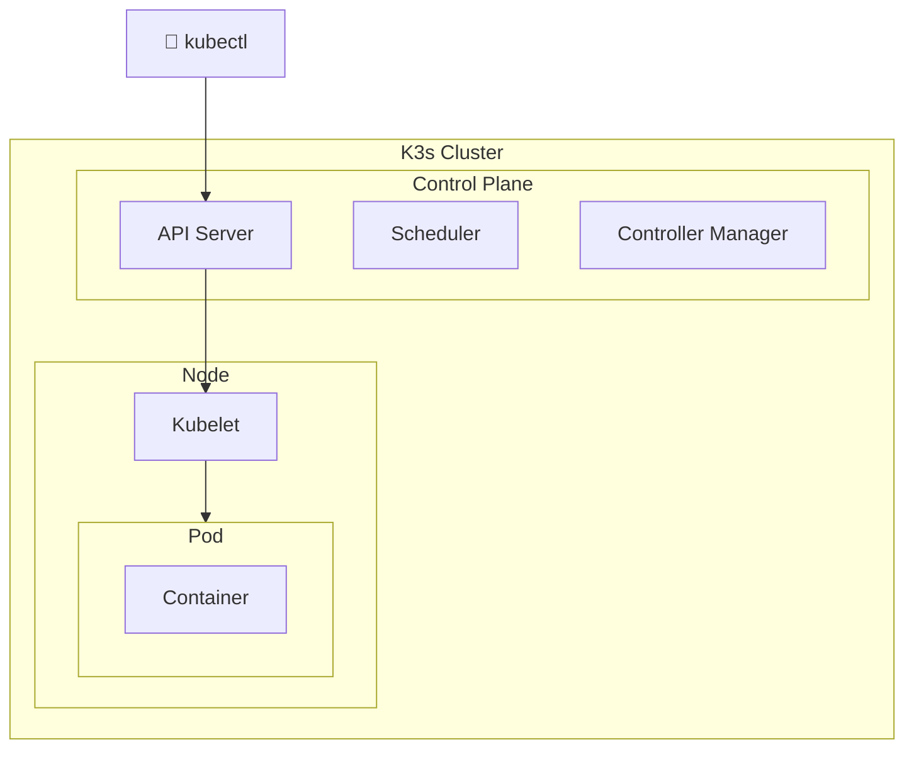

# 🎯 CKAD Pratik Lablar

**Certified Kubernetes Application Developer (CKAD)** sınavına hazırlık için uygulamalı laboratuvar çalışmaları.

> 🖥️ Bu lablar **k3s** ortamı için optimize edilmiştir.  
> 📚 Referans: [bmuschko/ckad-crash-course](https://github.com/bmuschko/ckad-crash-course)

## 📊 CKAD Sınav Bilgileri

| Özellik | Değer |
|---------|-------|
| ⏱️ Süre | 2 saat |
| 📝 Soru Sayısı | ~15-20 |
| 🎯 Geçme Notu | %66 |
| 💻 Format | Hands-on (Terminal) |
| 📚 Kaynak | kubernetes.io erişimi VAR |
| 🔄 K8s Versiyonu | v1.30+ |

## 📋 Lab Listesi (17 Lab, 100+ Alıştırma)

### Domain 1: Application Design & Build (%20)

| Lab | Konu | Zorluk |
|-----|------|--------|
| [Lab 01](labs/lab-01-pod-basics.md) | Pod Temelleri | ⭐ |
| [Lab 02](labs/lab-02-multi-container-pods.md) | Multi-Container Pods (Sidecar, Init) | ⭐ |
| [Lab 07](labs/lab-07-jobs-cronjobs.md) | Jobs & CronJobs | ⭐⭐ |
| [Lab 17](labs/lab-17-dockerfile.md) | Dockerfile & Container Basics | ⭐⭐ |

### Domain 2: Application Deployment (%20)

| Lab | Konu | Zorluk |
|-----|------|--------|
| [Lab 03](labs/lab-03-deployments.md) | Deployments, Rolling Update, Rollback | ⭐ |
| [Lab 14](labs/lab-14-helm.md) | Helm Basics | ⭐⭐ |
| [Lab 15](labs/lab-15-deployment-strategies.md) | Blue-Green & Canary Deployments | ⭐⭐⭐ |
| [Lab 16](labs/lab-16-kustomize.md) | Kustomize | ⭐⭐ |

### Domain 3: Application Observability (%15)

| Lab | Konu | Zorluk |
|-----|------|--------|
| [Lab 08](labs/lab-08-probes.md) | Liveness & Readiness Probes | ⭐⭐ |
| [Lab 13](labs/lab-13-debugging.md) | Debugging & Troubleshooting | ⭐⭐ |

### Domain 4: Application Environment & Security (%25)

| Lab | Konu | Zorluk |
|-----|------|--------|
| [Lab 05](labs/lab-05-configmaps-secrets.md) | ConfigMaps & Secrets | ⭐⭐ |
| [Lab 06](labs/lab-06-volumes.md) | Volumes & PV/PVC | ⭐⭐ |
| [Lab 09](labs/lab-09-resource-limits.md) | Resource Limits & Quotas | ⭐⭐ |
| [Lab 11](labs/lab-11-security.md) | SecurityContext & ServiceAccounts | ⭐⭐ |

### Domain 5: Services & Networking (%20)

| Lab | Konu | Zorluk |
|-----|------|--------|
| [Lab 04](labs/lab-04-services.md) | Services (ClusterIP, NodePort, LB) | ⭐ |
| [Lab 10](labs/lab-10-network-policies.md) | Network Policies | ⭐⭐⭐ |
| [Lab 12](labs/lab-12-ingress.md) | Ingress (K3s Traefik) | ⭐⭐ |

## 🏗️ Kubernetes Mimarisi



## 🚀 K3s Kurulumu

### Hızlı Kontrol
```bash
# K3s durumu
sudo systemctl status k3s

# Cluster hazır mı?
kubectl get nodes
kubectl cluster-info
```

### kubectl Ayarları
```bash
# KUBECONFIG
export KUBECONFIG=/etc/rancher/k3s/k3s.yaml

# veya kopyala
mkdir -p ~/.kube
sudo cp /etc/rancher/k3s/k3s.yaml ~/.kube/config
sudo chown $(id -u):$(id -g) ~/.kube/config
```

### K3s Özellikleri
- ✅ Traefik Ingress Controller
- ✅ Local Path Provisioner (dinamik PV)
- ✅ CoreDNS
- ✅ ServiceLB (LoadBalancer)
- ✅ Flannel CNI

## 💡 Sınav İpuçları

### Zaman Kazandıran Alias'lar
```bash
# ~/.bashrc'ye ekle
alias k=kubectl
alias kgp='kubectl get pods'
alias kgs='kubectl get svc'
alias kgd='kubectl get deploy'
alias kgi='kubectl get ingress'
alias kgn='kubectl get nodes'
alias kaf='kubectl apply -f'
alias kdf='kubectl delete -f'
alias kd='kubectl describe'
alias kl='kubectl logs'
alias ke='kubectl exec -it'

export do="--dry-run=client -o yaml"
export now="--force --grace-period=0"

# Kullanım:
# k run nginx --image=nginx $do > pod.yaml
# k delete pod nginx $now
```

### Hızlı Komutlar Cheatsheet
```bash
# Pod
kubectl run nginx --image=nginx
kubectl run nginx --image=nginx --port=80 --labels=app=web

# Deployment
kubectl create deployment web --image=nginx --replicas=3

# Service
kubectl expose deployment web --port=80 --type=NodePort

# ConfigMap
kubectl create configmap myconfig --from-literal=key=value

# Secret
kubectl create secret generic mysecret --from-literal=pass=123

# Job
kubectl create job myjob --image=busybox -- echo hello

# CronJob  
kubectl create cronjob mycron --image=busybox --schedule="*/5 * * * *" -- date

# ServiceAccount
kubectl create sa mysa

# YAML oluştur
kubectl run nginx --image=nginx --dry-run=client -o yaml > pod.yaml
```

### vim Ayarları (Sınav için)
```bash
# ~/.vimrc
set tabstop=2
set shiftwidth=2
set expandtab
set number
set autoindent
```

## 📚 Ek Kaynaklar

### Resmi Kaynaklar
- [Kubernetes Docs](https://kubernetes.io/docs/) - Sınavda erişim VAR
- [kubectl Cheat Sheet](https://kubernetes.io/docs/reference/kubectl/cheatsheet/)
- [CKAD Curriculum](https://github.com/cncf/curriculum)

### Pratik Platformlar
- [Killer Shell](https://killer.sh/ckad) - Gerçek sınav simülasyonu
- [KillerCoda CKAD](https://killercoda.com/ckad) - Ücretsiz senaryolar
- [K8s Playground](https://labs.play-with-k8s.com/)

### Diğer Repolar
- [bmuschko/ckad-crash-course](https://github.com/bmuschko/ckad-crash-course)
- [dgkanatsios/CKAD-exercises](https://github.com/dgkanatsios/CKAD-exercises)

## 📊 Bu Repo İstatistikleri

| Metrik | Değer |
|--------|-------|
| 📚 Toplam Lab | 17 |
| 📝 Alıştırma | 100+ |
| 🎯 Sınav Senaryosu | 35+ |
| 📊 Mermaid Diyagram | 30+ |
| 📋 Müfredat Kapsama | %100 |

---

## 🎯 Önerilen Çalışma Sırası

### Hafta 1: Temel Kavramlar
1. Lab 01 - Pod Basics
2. Lab 02 - Multi-Container
3. Lab 03 - Deployments
4. Lab 04 - Services

### Hafta 2: Konfigürasyon
5. Lab 05 - ConfigMaps & Secrets
6. Lab 06 - Volumes
7. Lab 09 - Resources

### Hafta 3: İleri Konular
8. Lab 07 - Jobs & CronJobs
9. Lab 08 - Probes
10. Lab 11 - Security
11. Lab 10 - Network Policies

### Hafta 4: Deployment & Tooling
12. Lab 12 - Ingress
13. Lab 13 - Debugging
14. Lab 14 - Helm
15. Lab 15 - Blue-Green/Canary
16. Lab 16 - Kustomize
17. Lab 17 - Dockerfile

---

⭐ **Bu repo işinize yaradıysa star vermeyi unutmayın!**

📝 **Katkıda Bulunmak İçin:** Pull request'ler kabul edilir!

🐛 **Hata Bildirimi:** Issue açabilirsiniz.
