```mermaid
%%{init: {'theme': 'dark'}}%%
graph TB
    subgraph "Week 1: Basics"
        POD[Pod] --> MULTI[Multi-Container]
        MULTI --> DEP[Deployment]
        DEP --> SVC[Service]
    end
    
    subgraph "Week 2: Configuration"
        CM[ConfigMap] --> SEC[Secret]
        SEC --> VOL[Volume]
    end
    
    subgraph "Week 3: Advanced"
        JOB[Jobs] --> PROBE[Probes]
        PROBE --> SECCTX[Security]
    end
    
    subgraph "Week 4: Tools"
        ING[Ingress] --> HELM[Helm]
        HELM --> KUS[Kustomize]
    end
```

# 🎯 CKAD Practice Labs


Hands-on lab exercises to prepare for the **Certified Kubernetes Application Developer (CKAD)** exam.

> 🖥️ These labs are optimized for **k3s** environment.

---

## 🆕 New to Kubernetes?

Start with the basics:

[📖 Kubernetes Learning Guide](docs/00-intro.md){: .btn .btn-primary }

---

## 📊 CKAD Exam Info

| Property | Value |
|----------|-------|
| ⏱️ Duration | 2 hours |
| 📝 Questions | ~15-20 |
| 🎯 Passing Score | 66% |
| 💻 Format | Hands-on (Terminal) |
| 📚 Resources | kubernetes.io access ALLOWED |

---

## 🗺️ The Big Picture



---

## 📋 Quick Navigation

### Week 1: Core Concepts
- [Lab 01: Pod Basics](labs/lab-01-pod-basics.md)
- [Lab 02: Multi-Container Pods](labs/lab-02-multi-container-pods.md)
- [Lab 03: Deployments](labs/lab-03-deployments.md)
- [Lab 04: Services](labs/lab-04-services.md)

### Week 2: Configuration
- [Lab 05: ConfigMaps & Secrets](labs/lab-05-configmaps-secrets.md)
- [Lab 06: Volumes](labs/lab-06-volumes.md)
- [Lab 09: Resource Limits](labs/lab-09-resource-limits.md)

### Week 3: Advanced
- [Lab 07: Jobs & CronJobs](labs/lab-07-jobs-cronjobs.md)
- [Lab 08: Probes](labs/lab-08-probes.md)
- [Lab 10: Network Policies](labs/lab-10-network-policies.md)
- [Lab 11: Security](labs/lab-11-security.md)

### Week 4: Tools
- [Lab 12: Ingress](labs/lab-12-ingress.md)
- [Lab 13: Debugging](labs/lab-13-debugging.md)
- [Lab 14: Helm](labs/lab-14-helm.md)
- [Lab 15: Deployment Strategies](labs/lab-15-deployment-strategies.md)
- [Lab 16: Kustomize](labs/lab-16-kustomize.md)
- [Lab 17: Dockerfile](labs/lab-17-dockerfile.md)

---

## 🎯 Exam Day Cheatsheet

```bash
# Aliases
alias k=kubectl
export do="--dry-run=client -o yaml"
export now="--force --grace-period=0"

# Quick commands
k run nginx --image=nginx $do > pod.yaml
k create deploy web --image=nginx --replicas=3
k expose deploy web --port=80
```

---

## 📊 Repository Stats

| Metric | Value |
|--------|-------|
| 📚 Total Labs | 17 |
| 📝 Exercises | 100+ |
| 📊 Mermaid Diagrams | 30+ |
| 📋 Curriculum Coverage | 100% |

---

⭐ **If this repo helped you, please give it a star!**

[View on GitHub](https://github.com/uzunenes/CKAD){: .btn }
