# 🎯 CKAD Practice Labs


Hands-on lab exercises to prepare for the **Certified Kubernetes Application Developer (CKAD)** exam.

> 🖥️ These labs are optimized for **k3s** environment.

---

## 🆕 New to Kubernetes?

Start with the basics:

### 📖 [Kubernetes Learning Guide](docs/00-intro.md)
- What is Kubernetes and why do you need it?
- Core concepts and architecture
- K3s setup
- Learning path

---

## 📊 CKAD Exam Info

| Property | Value |
|----------|-------|
| ⏱️ Duration | 2 hours |
| 📝 Questions | ~15-20 |
| 🎯 Passing Score | 66% |
| 💻 Format | Hands-on (Terminal) |
| 📚 Resources | kubernetes.io access ALLOWED |
| 🔄 K8s Version | v1.30+ |

---

## 🗺️ The Big Picture: What You'll Learn

```mermaid
%%{init: {'theme': 'dark', 'themeVariables': { 'primaryColor': '#1f6feb', 'primaryTextColor': '#fff', 'primaryBorderColor': '#388bfd', 'lineColor': '#8b949e', 'secondaryColor': '#21262d', 'tertiaryColor': '#161b22'}}}%%
graph TB
    subgraph "1️⃣ Basics (Week 1)"
        POD[Pod] --> MULTI[Multi-Container]
        MULTI --> DEP[Deployment]
        DEP --> SVC[Service]
    end
    
    subgraph "2️⃣ Configuration (Week 2)"
        CM[ConfigMap] --> SEC[Secret]
        SEC --> VOL[Volume]
        VOL --> RES[Resources]
    end
    
    subgraph "3️⃣ Advanced (Week 3)"
        JOB[Jobs] --> PROBE[Probes]
        PROBE --> SECCTX[Security]
        SECCTX --> NP[NetworkPolicy]
    end
    
    subgraph "4️⃣ Tools (Week 4)"
        ING[Ingress] --> DEBUG[Debugging]
        DEBUG --> HELM[Helm]
        HELM --> KUS[Kustomize]
    end
    
    SVC --> CM
    RES --> JOB
    NP --> ING
```



---

## 📋 Lab List (17 Labs, 100+ Exercises)

### 🟢 Week 1: Core Concepts

| # | Lab | Topic | What You'll Learn |
|---|-----|-------|-------------------|
| 01 | [Pod Basics](labs/lab-01-pod-basics.md) | Pod | Run containers, logs, exec |
| 02 | [Multi-Container](labs/lab-02-multi-container-pods.md) | Sidecar, Init | Multiple containers in a pod |
| 03 | [Deployments](labs/lab-03-deployments.md) | Deployment | Scaling, rolling updates |
| 04 | [Services](labs/lab-04-services.md) | Service | ClusterIP, NodePort |

### 🟡 Week 2: Configuration

| # | Lab | Topic | What You'll Learn |
|---|-----|-------|-------------------|
| 05 | [ConfigMaps & Secrets](labs/lab-05-configmaps-secrets.md) | Config | Env vars, volume mounts |
| 06 | [Volumes](labs/lab-06-volumes.md) | Storage | emptyDir, PV/PVC |
| 09 | [Resources](labs/lab-09-resource-limits.md) | Limits | CPU/Memory, Quota |

### 🟠 Week 3: Advanced Topics

| # | Lab | Topic | What You'll Learn |
|---|-----|-------|-------------------|
| 07 | [Jobs & CronJobs](labs/lab-07-jobs-cronjobs.md) | Batch | One-time and scheduled jobs |
| 08 | [Probes](labs/lab-08-probes.md) | Health | Liveness, Readiness |
| 11 | [Security](labs/lab-11-security.md) | Security | SecurityContext, SA |
| 10 | [Network Policies](labs/lab-10-network-policies.md) | Network | Firewall rules |

### 🔴 Week 4: Deployment & Tooling

| # | Lab | Topic | What You'll Learn |
|---|-----|-------|-------------------|
| 12 | [Ingress](labs/lab-12-ingress.md) | HTTP | Path/Host routing |
| 13 | [Debugging](labs/lab-13-debugging.md) | Debug | Troubleshooting |
| 14 | [Helm](labs/lab-14-helm.md) | Packaging | Chart install, upgrade |
| 15 | [Deployment Strategies](labs/lab-15-deployment-strategies.md) | Deploy | Blue-Green, Canary |
| 16 | [Kustomize](labs/lab-16-kustomize.md) | Config | Overlay, patch |
| 17 | [Dockerfile](labs/lab-17-dockerfile.md) | Container | Image build |

---

## 🚀 Quick Start

### 1. Check K3s
```bash
kubectl get nodes
```

### 2. Start First Lab
```bash
cat labs/lab-01-pod-basics.md
```

### 3. Set Up Aliases (Optional)
```bash
echo 'alias k=kubectl' >> ~/.bashrc
echo 'export do="--dry-run=client -o yaml"' >> ~/.bashrc
source ~/.bashrc
```

---

## 💡 Each Lab Structure

```
📖 Theory & Why It Matters
     ├── Mermaid diagram
     └── Real-world example

🔨 Hands-on Exercises (8-10 each)
     ├── Task description
     ├── 💡 Hint (dropdown)
     └── ✅ Solution (dropdown)

🎯 Exam Practice (2-3 scenarios)
     └── Time yourself!

🧹 Cleanup
     └── Delete resources

✅ What We Learned
     └── Checklist
```

---

## 📚 Additional Resources

### Official
- [📖 Kubernetes Docs](https://kubernetes.io/docs/) - Accessible during exam!
- [📋 kubectl Cheat Sheet](https://kubernetes.io/docs/reference/kubectl/cheatsheet/)
- [📜 CKAD Curriculum](https://github.com/cncf/curriculum)

### Practice
- [🧪 Killer Shell](https://killer.sh/ckad) - Real exam simulator
- [🎮 KillerCoda](https://killercoda.com/ckad) - Free scenarios
- [🎯 CKAD Exercises](https://github.com/dgkanatsios/CKAD-exercises)

---

## 📊 Repository Stats

| Metric | Value |
|--------|-------|
| 📚 Total Labs | 17 |
| 📝 Exercises | 100+ |
| 🎯 Exam Scenarios | 35+ |
| 📊 Mermaid Diagrams | 30+ |
| 📋 Curriculum Coverage | 100% |

---

## 🎯 Exam Day Cheatsheet

```bash
# Aliases
alias k=kubectl
export do="--dry-run=client -o yaml"
export now="--force --grace-period=0"

# Most used commands
k run nginx --image=nginx $do > pod.yaml
k create deploy web --image=nginx --replicas=3
k expose deploy web --port=80
k create cm myconfig --from-literal=key=value
k create secret generic mysecret --from-literal=pass=123

# Quick delete
k delete pod nginx $now
```

---

⭐ **If this repo helped you, please give it a star!**

📝 **Contributing:** Pull requests are welcome!

🐛 **Bugs:** Feel free to open an issue.

---

[📖 Before You Start: Kubernetes Guide](docs/00-intro.md) | [🚀 Lab 01: Pod Basics](labs/lab-01-pod-basics.md)
