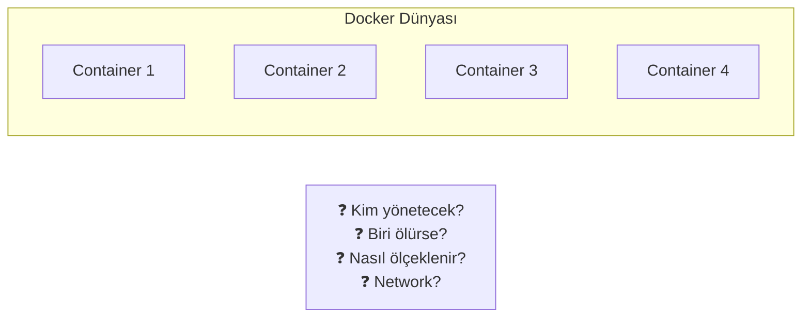
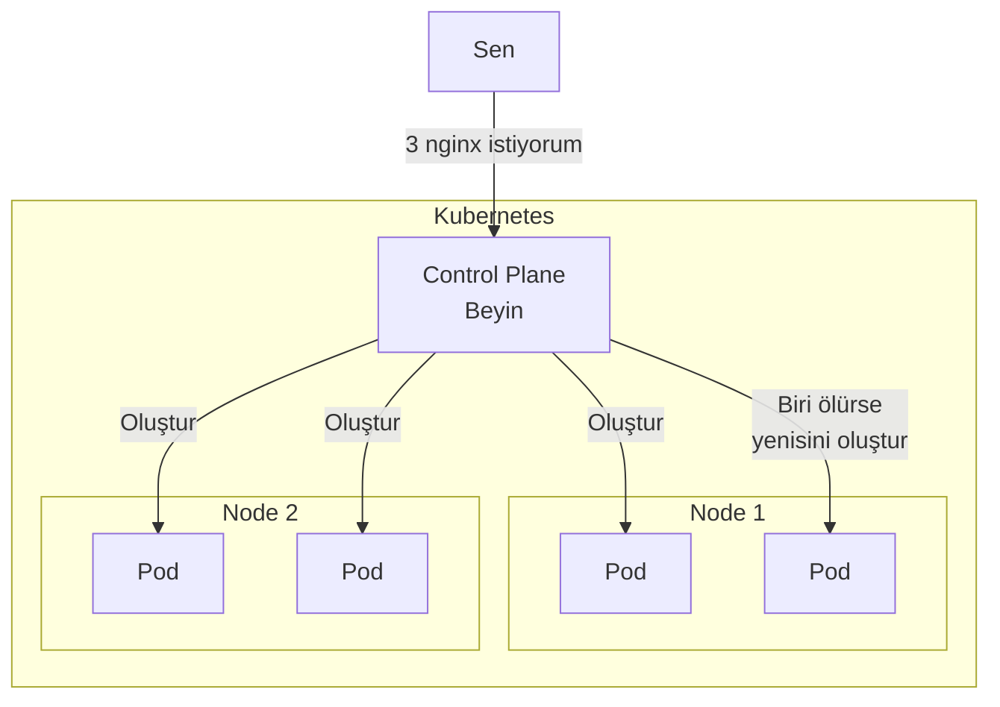
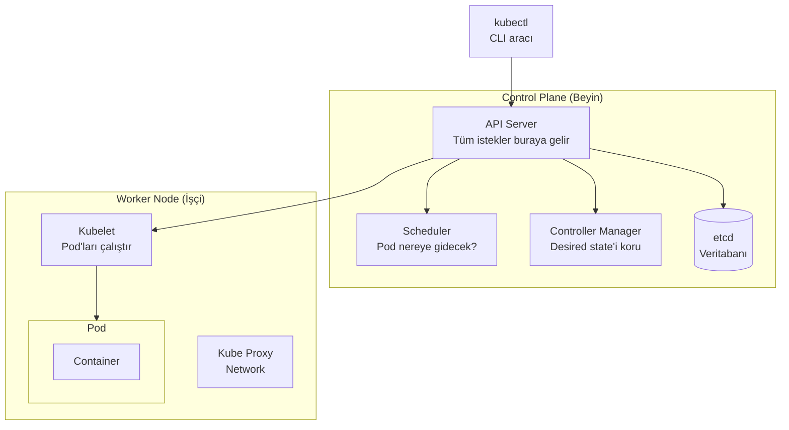
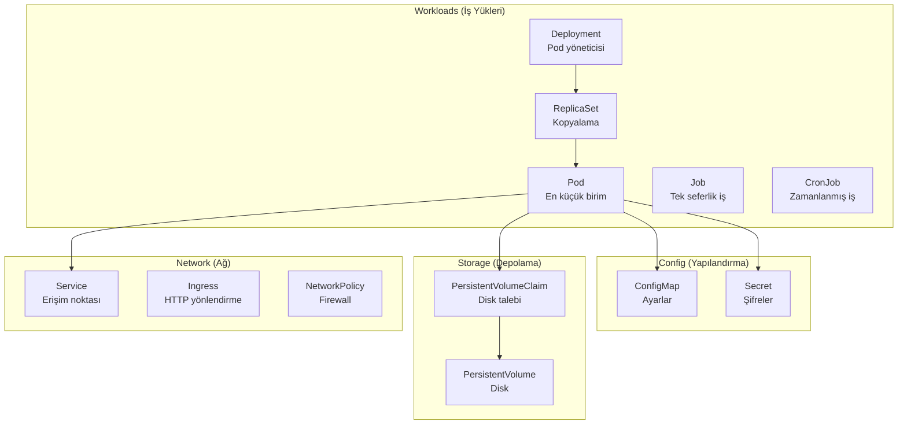
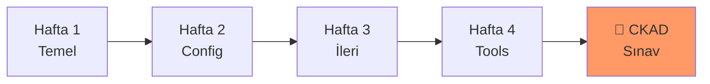

# Kubernetes Öğrenme Rehberi

## 🎯 Bu Repo Kimin İçin?

Bu repo, **sıfırdan Kubernetes öğrenmek** ve **CKAD sınavına hazırlanmak** isteyen herkes için hazırlandı.

### Önkoşullar
- ✅ Temel Linux terminal bilgisi (`cd`, `ls`, `cat`, `vim`)
- ✅ Docker'ın ne olduğunu bilmek (çalıştırmış olmak şart değil)
- ✅ Çalışan bir K3s cluster (kurulum aşağıda)

### Hedef Kitle
- 🎓 Kubernetes'e yeni başlayanlar
- 📚 CKAD sınavına hazırlananlar
- 💼 DevOps/Cloud kariyer hedefleyenler

---

## 🧠 Kubernetes Felsefesi

### Problem: Containerları Kim Yönetecek?



Docker harika, ama...
- 100 container'ı nasıl yönetirsin?
- Biri çökerse otomatik yeniden başlar mı?
- Trafik arttığında nasıl ölçeklenir?
- Container'lar birbirini nasıl bulur?

### Çözüm: Kubernetes (Container Orkestratörü)



**Kubernetes'in Temel Prensibi:**
> "Desired State" (İstenen Durum) → Kubernetes bunu sağlar ve korur

Sen: "3 tane nginx pod istiyorum"
Kubernetes: "Tamam, 3 tane oluşturdum. Biri ölürse yenisini yaparım."

---

## 🏗️ Kubernetes Mimarisi (Basitleştirilmiş)



### Basit Açıklama

| Bileşen | Görevi | Gerçek Dünya Benzetmesi |
|---------|--------|------------------------|
| **API Server** | Tüm istekleri alır | Şirketin resepsiyonu |
| **etcd** | Tüm bilgileri saklar | Şirketin veritabanı |
| **Scheduler** | Pod'ları node'lara yerleştirir | İK departmanı |
| **Controller Manager** | Her şeyin düzgün çalışmasını sağlar | Müdür |
| **Kubelet** | Node'da pod'ları çalıştırır | Çalışan |
| **Kube Proxy** | Network trafiğini yönetir | BT departmanı |

---

## 📦 Kubernetes Kaynakları (Resources)

Kubernetes'te her şey bir "kaynak" (resource). Lab'lar boyunca öğreneceklerinin özeti:



### Kaynak Hiyerarşisi

```
Deployment
    └── ReplicaSet
            └── Pod
                    └── Container(s)
                            └── Image
```

---

## 🛠️ K3s Kurulumu

K3s, hafif bir Kubernetes dağıtımıdır. Öğrenmek için ideal!

### Linux'ta Kurulum
```bash
# K3s kur (tek komut!)
curl -sfL https://get.k3s.io | sh -

# Kontrol et
sudo systemctl status k3s

# kubectl ayarla
mkdir -p ~/.kube
sudo cp /etc/rancher/k3s/k3s.yaml ~/.kube/config
sudo chown $(id -u):$(id -g) ~/.kube/config

# Test
kubectl get nodes
```

### WSL2'de Kurulum
```bash
# WSL2'de systemd gerekli
# /etc/wsl.conf dosyasını düzenle:
sudo nano /etc/wsl.conf
# Ekle:
# [boot]
# systemd=true

# WSL'i yeniden başlat (PowerShell'de):
# wsl --shutdown

# Sonra K3s kur
curl -sfL https://get.k3s.io | sh -
```

---

## 📚 Öğrenme Yolu



### Hafta 1: Temeli Öğren
1. **Lab 01** - Pod nedir? Nasıl oluşturulur?
2. **Lab 02** - Birden fazla container
3. **Lab 03** - Deployment ile pod yönetimi
4. **Lab 04** - Service ile erişim

### Hafta 2: Yapılandırma
5. **Lab 05** - ConfigMap ve Secret
6. **Lab 06** - Kalıcı depolama (Volume)
7. **Lab 09** - CPU/Memory limitleri

### Hafta 3: İleri Konular
8. **Lab 07** - Job ve CronJob
9. **Lab 08** - Sağlık kontrolleri (Probes)
10. **Lab 10** - Network güvenliği
11. **Lab 11** - Güvenlik ayarları

### Hafta 4: Araçlar ve Deployment
12. **Lab 12** - Ingress (HTTP trafiği)
13. **Lab 13** - Hata ayıklama
14. **Lab 14** - Helm (paket yönetimi)
15. **Lab 15** - Blue-Green/Canary
16. **Lab 16** - Kustomize
17. **Lab 17** - Dockerfile

---

## 💡 Başarı İpuçları

### Sınavda Başarılı Olmak İçin

1. **Pratik, Pratik, Pratik** - Teori yetmez, el yap
2. **kubectl'i çok iyi öğren** - Her şey CLI'dan
3. **YAML ezberleme** - `--dry-run=client -o yaml` kullan
4. **Zaman yönetimi** - 2 saat, 15-20 soru
5. **kubernetes.io kullan** - Sınavda erişim var!

### Alias'ları Öğren
```bash
alias k=kubectl
export do="--dry-run=client -o yaml"
export now="--force --grace-period=0"
```

---

## 🚀 Hadi Başlayalım!

➡️ [Lab 01: Pod Temelleri](labs/lab-01-pod-basics.md)

---

⭐ Bu repo faydalıysa star vermeyi unutma!
