# Kubernetes Learning Guide

## 🎯 Who Is This For?

This repo is for anyone who wants to **learn Kubernetes from scratch** and **prepare for the CKAD exam**.

### Prerequisites
- ✅ Basic Linux terminal knowledge (`cd`, `ls`, `cat`, `vim`)
- ✅ Know what Docker is (don't need to have used it)
- ✅ A running K3s cluster (setup instructions below)

### Target Audience
- 🎓 Kubernetes beginners
- 📚 CKAD exam candidates
- 💼 DevOps/Cloud career seekers

---

## 🧠 Kubernetes Philosophy

### The Problem: Who Will Manage the Containers?

```mermaid
%%{init: {'theme': 'dark'}}%%
graph LR
    subgraph "Docker World"
        D1[Container 1]
        D2[Container 2]
        D3[Container 3]
        D4[Container 4]
    end
    
    Q[❓ Who manages?<br/>❓ What if one dies?<br/>❓ How to scale?<br/>❓ Networking?]
```



Docker is great, but...
- How do you manage 100 containers?
- If one crashes, does it auto-restart?
- How does it scale when traffic increases?
- How do containers find each other?

### The Solution: Kubernetes (Container Orchestrator)


**Kubernetes Core Principle:**
> "Desired State" → Kubernetes makes it happen and maintains it

You: "I want 3 nginx pods"
Kubernetes: "Done. If one dies, I'll create a new one."

---

## 🏗️ Kubernetes Architecture (Simplified)


### Simple Explanation

| Component | Role | Real-World Analogy |
|-----------|------|-------------------|
| **API Server** | Receives all requests | Company reception |
| **etcd** | Stores all data | Company database |
| **Scheduler** | Places pods on nodes | HR department |
| **Controller Manager** | Ensures everything works | Manager |
| **Kubelet** | Runs pods on node | Employee |
| **Kube Proxy** | Manages network traffic | IT department |

---

## 📦 Kubernetes Resources

Everything in Kubernetes is a "resource". Here's what you'll learn:


### Resource Hierarchy

```
Deployment
    └── ReplicaSet
            └── Pod
                    └── Container(s)
                            └── Image
```

---

## 🛠️ K3s Setup

K3s is a lightweight Kubernetes distribution. Perfect for learning!

### Linux Installation
```bash
# Install K3s (one command!)
curl -sfL https://get.k3s.io | sh -

# Check status
sudo systemctl status k3s

# Configure kubectl
mkdir -p ~/.kube
sudo cp /etc/rancher/k3s/k3s.yaml ~/.kube/config
sudo chown $(id -u):$(id -g) ~/.kube/config

# Test
kubectl get nodes
```

### WSL2 Installation
```bash
# WSL2 needs systemd
# Edit /etc/wsl.conf:
sudo nano /etc/wsl.conf
# Add:
# [boot]
# systemd=true

# Restart WSL (in PowerShell):
# wsl --shutdown

# Then install K3s
curl -sfL https://get.k3s.io | sh -
```

---

## 📚 Learning Path

```mermaid
%%{init: {'theme': 'dark'}}%%
graph LR
    A[Week 1<br/>Basics] --> B[Week 2<br/>Config]
    B --> C[Week 3<br/>Advanced]
    C --> D[Week 4<br/>Tools]
    D --> E[🎯 CKAD<br/>Exam]
    
    style E fill:#f96
```



### Week 1: Learn the Basics
1. **Lab 01** - What is a Pod? How to create one?
2. **Lab 02** - Multiple containers
3. **Lab 03** - Deployment for pod management
4. **Lab 04** - Service for access

### Week 2: Configuration
5. **Lab 05** - ConfigMap and Secret
6. **Lab 06** - Persistent storage (Volume)
7. **Lab 09** - CPU/Memory limits

### Week 3: Advanced Topics
8. **Lab 07** - Job and CronJob
9. **Lab 08** - Health checks (Probes)
10. **Lab 10** - Network security
11. **Lab 11** - Security settings

### Week 4: Tools and Deployment
12. **Lab 12** - Ingress (HTTP traffic)
13. **Lab 13** - Debugging
14. **Lab 14** - Helm (package management)
15. **Lab 15** - Blue-Green/Canary
16. **Lab 16** - Kustomize
17. **Lab 17** - Dockerfile

---

## 💡 Success Tips

### To Pass the Exam

1. **Practice, Practice, Practice** - Theory isn't enough
2. **Master kubectl** - Everything is CLI
3. **Don't memorize YAML** - Use `--dry-run=client -o yaml`
4. **Time management** - 2 hours, 15-20 questions
5. **Use kubernetes.io** - You have access during the exam!

### Learn the Aliases
```bash
alias k=kubectl
export do="--dry-run=client -o yaml"
export now="--force --grace-period=0"
```

---

## 🚀 Let's Begin!

➡️ [Lab 01: Pod Basics](labs/lab-01-pod-basics.md)

---

⭐ If this repo is helpful, don't forget to star it!
