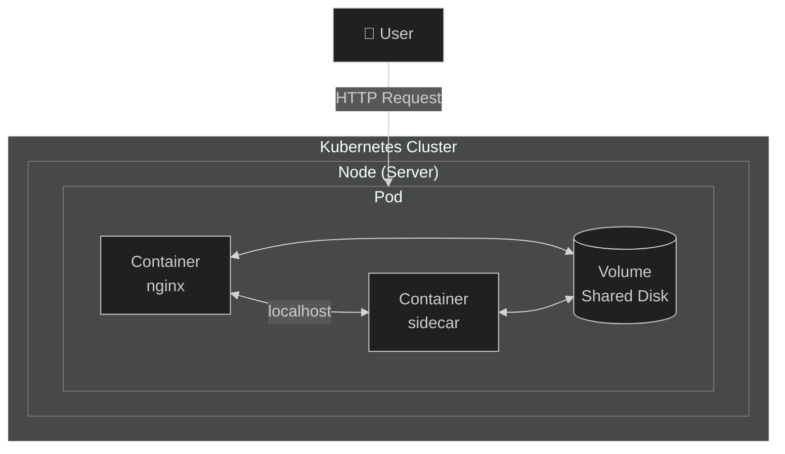
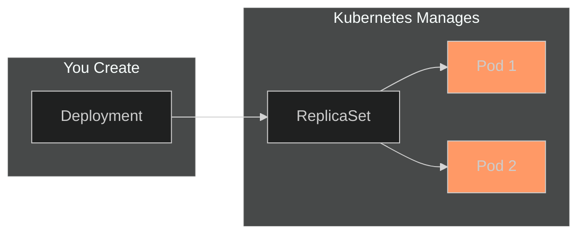

# Lab 01: Pod Basics

## 🎯 Learning Objectives
- Understand what a Pod is
- Create Pods (imperative and declarative)
- List and inspect Pods
- Delete Pods

---

## 📖 What is a Pod?



### 🤔 Why is Pod Important?

A **Pod** is the fundamental building block of Kubernetes. What a "container" is in Docker, a "Pod" is in Kubernetes.

| Concept | Docker | Kubernetes |
|---------|--------|------------|
| Smallest unit | Container | Pod |
| Run command | `docker run` | `kubectl run` |
| Network | Container network | Pod network |

### 💡 Real-World Example

Think of a website:
- **Container 1:** Web server (nginx)
- **Container 2:** Log collector (fluentd)
- **Shared Volume:** Log files

These run in the same Pod because:
- They share the same lifecycle
- They communicate closely
- They share data

### 🔑 Key Pod Properties

| Property | Description |
|----------|-------------|
| **IP Address** | Each Pod gets its own cluster IP |
| **Shared Network** | Containers in a Pod talk via `localhost` |
| **Ephemeral** | If a Pod dies, a new one is created (not the same one) |
| **Disposable** | Don't create Pods directly, use Deployment! |

---

## 🗺️ Big Picture: Where Does Pod Fit?



> ⚠️ **Important:** In the real world, we don't create Pods directly! We use Deployments (Lab 03). But you can't understand Deployments without understanding Pods.

---

## 🔨 Hands-on Exercises

### Exercise 1: Create Your First Pod

**Task:** Create a pod named `my-first-pod` using the `nginx` image.

**What does this do?** We're starting a web server. nginx is one of the most popular web servers.

<details>
<summary>💡 Hint</summary>

```bash
kubectl run <pod-name> --image=<image-name>
```
</details>

<details>
<summary>✅ Solution</summary>

```bash
kubectl run my-first-pod --image=nginx
```

**What happened?**
1. Kubernetes pulled the nginx image from Docker Hub
2. Created a container
3. Put the container in a Pod
4. Scheduled the Pod on a Node

Check:
```bash
kubectl get pods
```
</details>

---

### Exercise 2: Watch Pod Status

**Task:** Watch the Pod transition to `Running` state.

<details>
<summary>✅ Solution</summary>

```bash
# Watch mode (Ctrl+C to exit)
kubectl get pods -w
```

**Pod States (Lifecycle):**
```
Pending → ContainerCreating → Running
   ↓              ↓              ↓
Queued       Image is       Working!
             being pulled
```

If there's an error:
- `ImagePullBackOff` → Wrong image name
- `CrashLoopBackOff` → Container keeps crashing
- `Error` → Something is wrong

</details>

---

### Exercise 3: Inspect Pod Details

**Task:** Get detailed information about `my-first-pod`.

**What's this for?** This is the most important command for debugging!

<details>
<summary>✅ Solution</summary>

```bash
kubectl describe pod my-first-pod
```

**Important sections to look at:**

| Section | Description |
|---------|-------------|
| **Node** | Which server is the Pod running on |
| **IP** | Pod's cluster-internal IP address |
| **Containers** | Container status and restart count |
| **Events** | Recent events (for finding errors!) |

</details>

---

### Exercise 4: Create Pod with YAML

**Task:** Create a pod YAML file with these specs:
- Name: `redis-pod`
- Image: `redis:alpine`
- Label: `app=cache`

**What's this for?** YAML = Infrastructure as Code. Keep all settings in a file, use version control.

<details>
<summary>💡 Hint - Exam Trick!</summary>

You don't need to memorize YAML! Kubernetes gives you a template:

```bash
kubectl run redis-pod --image=redis:alpine --labels=app=cache --dry-run=client -o yaml
```

`--dry-run=client` → Don't actually create, just show YAML
`-o yaml` → Output in YAML format
</details>

<details>
<summary>✅ Solution</summary>

```bash
# 1. Generate YAML template
kubectl run redis-pod --image=redis:alpine --labels=app=cache --dry-run=client -o yaml > redis-pod.yaml

# 2. Inspect the file
cat redis-pod.yaml

# 3. Apply
kubectl apply -f redis-pod.yaml
```

**YAML Explained:**
```yaml
apiVersion: v1          # API version
kind: Pod               # Resource type
metadata:
  name: redis-pod       # Pod name
  labels:
    app: cache          # Label (for filtering)
spec:
  containers:
  - name: redis         # Container name
    image: redis:alpine # Image to use
```
</details>

---

### Exercise 5: View Pod Logs

**Task:** View logs from `my-first-pod`.

**What's this for?** What's happening inside the container? Any errors? Logs will tell you.

<details>
<summary>✅ Solution</summary>

```bash
# Current logs
kubectl logs my-first-pod

# Follow logs live (Ctrl+C to exit)
kubectl logs -f my-first-pod

# Last 10 lines
kubectl logs --tail=10 my-first-pod

# Previous (crashed) container logs
kubectl logs my-first-pod --previous
```
</details>

---

### Exercise 6: Execute Commands in Pod

**Task:** Open a shell in `my-first-pod` and run `hostname`.

**What's this for?** Debug inside the container, check files, test network.

<details>
<summary>✅ Solution</summary>

```bash
# Run a single command
kubectl exec my-first-pod -- hostname

# Open interactive shell
kubectl exec -it my-first-pod -- /bin/sh

# Commands to try inside:
# ls -la
# cat /etc/nginx/nginx.conf
# curl localhost:80
# exit
```

**What does -it mean?**
- `-i` = interactive (stdin open)
- `-t` = TTY (terminal)
</details>

---

### Exercise 7: Filter with Labels

**Task:** List pods with label `app=cache`.

**What's this for?** Labels are Kubernetes' "search engine". Find what you want among thousands of pods!

<details>
<summary>✅ Solution</summary>

```bash
# Filter by label
kubectl get pods -l app=cache

# Show all labels
kubectl get pods --show-labels

# Add a label
kubectl label pod my-first-pod env=dev

# Remove a label (- at the end)
kubectl label pod my-first-pod env-
```
</details>

---

### Exercise 8: Delete Pods

**Task:** Delete the pods you created.

<details>
<summary>✅ Solution</summary>

```bash
# Delete single pod
kubectl delete pod my-first-pod

# Delete using YAML (deletes what you created)
kubectl delete -f redis-pod.yaml

# Delete by label
kubectl delete pods -l app=cache

# Delete all (CAREFUL!)
kubectl delete pods --all

# Quick delete (for exam)
kubectl delete pod my-first-pod --force --grace-period=0
```
</details>

---

## 🎯 Exam Practice

Solve these scenarios with a timer! Target: < 2 minutes each

### Scenario 1
> Create a pod named `test-pod` using `busybox` image. The pod should run `sleep 3600` command.

<details>
<summary>✅ Solution</summary>

```bash
kubectl run test-pod --image=busybox --command -- sleep 3600
```
</details>

---

### Scenario 2
> Create a pod named `webapp` using `nginx:1.21` image with label `tier=frontend`.

<details>
<summary>✅ Solution</summary>

```bash
kubectl run webapp --image=nginx:1.21 --labels=tier=frontend
```
</details>

---

### Scenario 3
> Find which node the `webapp` pod is running on.

<details>
<summary>✅ Solution</summary>

```bash
kubectl get pod webapp -o wide
# or
kubectl describe pod webapp | grep Node
```
</details>

---

## ❌ Common Mistakes

| Error | Symptom | Solution |
|-------|---------|----------|
| Wrong image name | `ImagePullBackOff` | Check image name |
| Wrong command | `CrashLoopBackOff` | Check with `kubectl logs` |
| Port conflict | `Error` | Use different port |
| YAML syntax error | `error parsing` | Check YAML indentation |

---

## 🧹 Cleanup

```bash
kubectl delete pod --all
rm -f redis-pod.yaml
```

---

## ✅ What We Learned

- [x] Pod = Kubernetes' smallest unit
- [x] `kubectl run` to create pods
- [x] `kubectl get pods` to list
- [x] `kubectl describe` for details
- [x] `kubectl logs` for logs
- [x] `kubectl exec` to run commands inside
- [x] `--dry-run=client -o yaml` for YAML generation (exam trick!)
- [x] Label filtering

---

## 🔗 Next Steps

You understand Pods. But is a single Pod enough? What if the Pod dies?

➡️ [Lab 02: Multi-Container Pods](lab-02-multi-container-pods.md) - Put multiple containers in a Pod

➡️ [Lab 03: Deployments](lab-03-deployments.md) - Manage Pods automatically, recreate if they die

---

[⬅️ Home](../README.md) | [Lab 02: Multi-Container Pods ➡️](lab-02-multi-container-pods.md)
