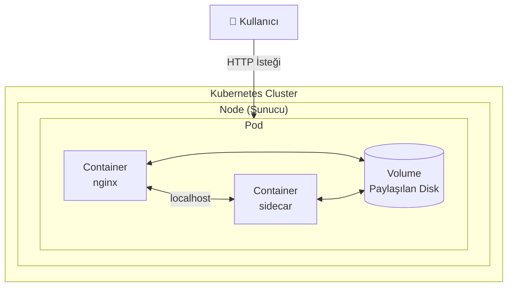
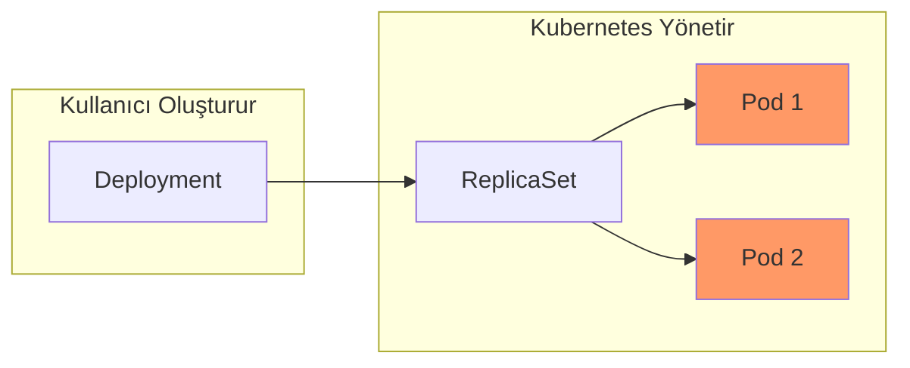

# Lab 01: Pod Temelleri

## 🎯 Öğrenme Hedefleri
- Pod nedir anlamak
- Pod oluşturmak (imperative ve declarative)
- Pod'ları listelemek ve incelemek
- Pod silmek

---

## 📖 Pod Nedir?



### 🤔 Pod Neden Önemli?

**Pod**, Kubernetes'in en temel yapı taşıdır. Docker'da "container" ne ise, Kubernetes'te "Pod" odur.

| Kavram | Docker | Kubernetes |
|--------|--------|------------|
| En küçük birim | Container | Pod |
| Çalıştırma | `docker run` | `kubectl run` |
| Ağ | Container network | Pod network |

### 💡 Gerçek Dünya Örneği

Bir web sitesi düşünün:
- **Container 1:** Web sunucusu (nginx)
- **Container 2:** Log toplayıcı (fluentd)
- **Shared Volume:** Log dosyaları

Bu ikisi aynı Pod içinde çalışır çünkü:
- Aynı yaşam döngüsüne sahipler
- Birbirleriyle sıkı iletişim halindeler
- Aynı veriyi paylaşıyorlar

### 🔑 Pod'un Temel Özellikleri

| Özellik | Açıklama |
|---------|----------|
| **IP Adresi** | Her Pod'un kendine özel cluster IP'si var |
| **Paylaşımlı Ağ** | Pod içindeki container'lar `localhost` ile konuşur |
| **Geçici (Ephemeral)** | Pod ölürse, aynı Pod geri gelmez (yeni Pod oluşur) |
| **Tek Kullanımlık** | Pod'ları doğrudan oluşturma, Deployment kullan! |

---

## 🗺️ Büyük Resim: Pod Nerede Duruyor?



> ⚠️ **Önemli:** Gerçek dünyada Pod'ları direkt oluşturmayız! Deployment kullanırız (Lab 03). Ama Pod'u anlamadan Deployment anlayamayız.

---

## 🔨 Pratik Alıştırmalar

### Alıştırma 1: İlk Pod'unu Oluştur

**Görev:** `nginx` image kullanan `my-first-pod` adında bir pod oluştur.

**Bu ne işe yarar?** Bir web sunucusu başlatıyoruz. nginx, internette en çok kullanılan web sunucularından biri.

<details>
<summary>💡 İpucu</summary>

```bash
kubectl run <pod-adı> --image=<image-adı>
```
</details>

<details>
<summary>✅ Çözüm</summary>

```bash
kubectl run my-first-pod --image=nginx
```

**Ne oldu?**
1. Kubernetes, nginx image'ını Docker Hub'dan çekti
2. Bir container oluşturdu
3. Bu container'ı bir Pod içine koydu
4. Pod'u bir Node'a yerleştirdi (schedule)

Kontrol:
```bash
kubectl get pods
```
</details>

---

### Alıştırma 2: Pod Durumunu İzle

**Görev:** Pod'un `Running` durumuna geçmesini izle.

<details>
<summary>✅ Çözüm</summary>

```bash
# Watch modunda izle (Ctrl+C ile çık)
kubectl get pods -w
```

**Pod Durumları (Lifecycle):**
```
Pending → ContainerCreating → Running
   ↓              ↓              ↓
 Sıraya     Image         Çalışıyor!
 alındı     çekiliyor
```

Eğer hata varsa:
- `ImagePullBackOff` → Image adı yanlış
- `CrashLoopBackOff` → Container sürekli çöküyor
- `Error` → Bir şeyler yanlış

</details>

---

### Alıştırma 3: Pod Detaylarını İncele

**Görev:** `my-first-pod` hakkında detaylı bilgi al.

**Bu ne işe yarar?** Hata ayıklama (debugging) için en önemli komut!

<details>
<summary>✅ Çözüm</summary>

```bash
kubectl describe pod my-first-pod
```

**Bakılacak önemli bölümler:**

| Bölüm | Açıklama |
|-------|----------|
| **Node** | Pod hangi sunucuda çalışıyor |
| **IP** | Pod'un cluster içi IP adresi |
| **Containers** | Container durumu ve restart sayısı |
| **Events** | Son olaylar (hata bulmak için!) |

</details>

---

### Alıştırma 4: YAML ile Pod Oluştur

**Görev:** Aşağıdaki özelliklere sahip bir pod YAML dosyası oluştur:
- İsim: `redis-pod`
- Image: `redis:alpine`
- Label: `app=cache`

**Bu ne işe yarar?** YAML = Infrastructure as Code. Tüm ayarları dosyada tutarsın, versiyon kontrolü yapabilirsin.

<details>
<summary>💡 İpucu - Sınav Hilesi!</summary>

YAML ezberlemene gerek yok! Kubernetes sana template verir:

```bash
kubectl run redis-pod --image=redis:alpine --labels=app=cache --dry-run=client -o yaml
```

`--dry-run=client` → Gerçekten oluşturma, sadece YAML göster
`-o yaml` → Çıktıyı YAML formatında ver
</details>

<details>
<summary>✅ Çözüm</summary>

```bash
# 1. YAML şablonu oluştur
kubectl run redis-pod --image=redis:alpine --labels=app=cache --dry-run=client -o yaml > redis-pod.yaml

# 2. Dosyayı incele
cat redis-pod.yaml

# 3. Uygula
kubectl apply -f redis-pod.yaml
```

**YAML Açıklaması:**
```yaml
apiVersion: v1          # API versiyonu
kind: Pod                # Kaynak türü
metadata:
  name: redis-pod        # Pod'un adı
  labels:
    app: cache           # Etiket (filtreleme için)
spec:
  containers:
  - name: redis          # Container adı
    image: redis:alpine  # Kullanılacak image
```
</details>

---

### Alıştırma 5: Pod Loglarını Gör

**Görev:** `my-first-pod` loglarını görüntüle.

**Bu ne işe yarar?** Container içinde ne oluyor? Hata var mı? Log'lar söyler.

<details>
<summary>✅ Çözüm</summary>

```bash
# Mevcut loglar
kubectl logs my-first-pod

# Canlı takip (Ctrl+C ile çık)
kubectl logs -f my-first-pod

# Son 10 satır
kubectl logs --tail=10 my-first-pod

# Önceki (crash olmuş) container logu
kubectl logs my-first-pod --previous
```
</details>

---

### Alıştırma 6: Pod İçine Gir

**Görev:** `my-first-pod` içine shell aç ve `hostname` komutunu çalıştır.

**Bu ne işe yarar?** Container içinde debug yapmak, dosyaları kontrol etmek, network test etmek için.

<details>
<summary>✅ Çözüm</summary>

```bash
# Tek komut çalıştır
kubectl exec my-first-pod -- hostname

# Interactive shell aç
kubectl exec -it my-first-pod -- /bin/sh

# İçerideyken örnek komutlar:
# ls -la
# cat /etc/nginx/nginx.conf
# curl localhost:80
# exit
```

**-it ne demek?**
- `-i` = interactive (stdin açık)
- `-t` = TTY (terminal)
</details>

---

### Alıştırma 7: Label ile Filtreleme

**Görev:** `app=cache` label'ına sahip pod'ları listele.

**Bu ne işe yarar?** Label'lar Kubernetes'in "arama motoru". Binlerce pod içinden istediğini bul!

<details>
<summary>✅ Çözüm</summary>

```bash
# Label ile filtrele
kubectl get pods -l app=cache

# Tüm label'ları göster
kubectl get pods --show-labels

# Label ekle
kubectl label pod my-first-pod env=dev

# Label sil (- işareti)
kubectl label pod my-first-pod env-
```
</details>

---

### Alıştırma 8: Pod Sil

**Görev:** Oluşturduğun pod'ları sil.

<details>
<summary>✅ Çözüm</summary>

```bash
# Tek pod sil
kubectl delete pod my-first-pod

# YAML ile sil (ne oluşturduysan onu siler)
kubectl delete -f redis-pod.yaml

# Label ile sil
kubectl delete pods -l app=cache

# Hepsini sil (DİKKAT!)
kubectl delete pods --all

# Hızlı silme (sınav için)
kubectl delete pod my-first-pod --force --grace-period=0
```
</details>

---

## 🎯 Sınav Pratiği

Aşağıdaki senaryoları timer ile çöz! Hedef: Her biri < 2 dakika

### Senaryo 1
> `busybox` image kullanan `test-pod` adında bir pod oluştur. Pod, `sleep 3600` komutunu çalıştırmalı.

<details>
<summary>✅ Çözüm</summary>

```bash
kubectl run test-pod --image=busybox --command -- sleep 3600
```
</details>

---

### Senaryo 2
> `webapp` adında, `nginx:1.21` image kullanan ve `tier=frontend` label'ına sahip bir pod oluştur.

<details>
<summary>✅ Çözüm</summary>

```bash
kubectl run webapp --image=nginx:1.21 --labels=tier=frontend
```
</details>

---

### Senaryo 3
> Mevcut `webapp` pod'unun hangi node'da çalıştığını bul.

<details>
<summary>✅ Çözüm</summary>

```bash
kubectl get pod webapp -o wide
# veya
kubectl describe pod webapp | grep Node
```
</details>

---

## ❌ Sık Yapılan Hatalar

| Hata | Belirti | Çözüm |
|------|---------|-------|
| Image adı yanlış | `ImagePullBackOff` | Image adını kontrol et |
| Command yanlış | `CrashLoopBackOff` | `kubectl logs` ile bak |
| Port çakışması | `Error` | Farklı port kullan |
| YAML syntax hatası | `error parsing` | YAML girintileri kontrol et |

---

## 🧹 Temizlik

```bash
kubectl delete pod --all
rm -f redis-pod.yaml
```

---

## ✅ Öğrendiklerimiz

- [x] Pod = Kubernetes'in en küçük birimi
- [x] `kubectl run` ile pod oluşturma
- [x] `kubectl get pods` ile listeleme
- [x] `kubectl describe` ile detay görme
- [x] `kubectl logs` ile log okuma
- [x] `kubectl exec` ile pod içinde komut çalıştırma
- [x] `--dry-run=client -o yaml` ile YAML oluşturma (sınav hilesi!)
- [x] Label ile filtreleme

---

## 🔗 Sonraki Adım

Pod'ları anladın. Ama tek bir Pod yeterli mi? Ya Pod ölürse?

➡️ [Lab 02: Multi-Container Pods](lab-02-multi-container-pods.md) - Bir Pod'a birden fazla container koy

➡️ [Lab 03: Deployments](lab-03-deployments.md) - Pod'ları otomatik yönet, ölürse yeniden oluştur

---

[⬅️ Ana Sayfa](../README.md) | [Lab 02: Multi-Container Pods ➡️](lab-02-multi-container-pods.md)
