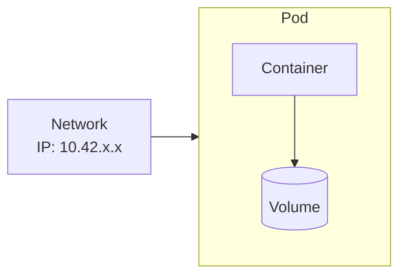

# Lab 01: Pod Temelleri

## 🎯 Öğrenme Hedefleri
- Pod nedir anlamak
- Pod oluşturmak (imperative ve declarative)
- Pod'ları listelemek ve incelemek
- Pod silmek

---

## 📖 Pod Nedir?



**Pod**, Kubernetes'te deploy edilebilen en küçük birimdir:
- Bir veya daha fazla container içerir
- Container'lar aynı network namespace'i paylaşır
- Ortak storage (volume) kullanabilirler

---

## 🔨 Pratik Alıştırmalar

### Alıştırma 1: İlk Pod'unu Oluştur

**Görev:** `nginx` image kullanan `my-first-pod` adında bir pod oluştur.

<details>
<summary>💡 İpucu</summary>

```bash
kubectl run <pod-adı> --image=<image-adı>
```
</details>

<details>
<summary>✅ Çözüm</summary>

```bash
kubectl run my-first-pod --image=nginx
```

Kontrol:
```bash
kubectl get pods
```
</details>

---

### Alıştırma 2: Pod Durumunu İzle

**Görev:** Pod'un `Running` durumuna geçmesini izle.

<details>
<summary>✅ Çözüm</summary>

```bash
# Watch modunda izle
kubectl get pods -w

# veya belirli pod
kubectl get pod my-first-pod -w
```

k3s'te pod durumları:
```
Pending → ContainerCreating → Running
```
</details>

---

### Alıştırma 3: Pod Detayları

**Görev:** `my-first-pod` hakkında detaylı bilgi al.

<details>
<summary>✅ Çözüm</summary>

```bash
kubectl describe pod my-first-pod
```

Dikkat edilecek bölümler:
- **Node:** Pod hangi node'da çalışıyor
- **IP:** Pod'un cluster IP'si
- **Containers:** Container durumu
- **Events:** Olaylar (hata ayıklama için)
</details>

---

### Alıştırma 4: YAML ile Pod Oluştur

**Görev:** Aşağıdaki özelliklere sahip bir pod YAML dosyası oluştur:
- İsim: `redis-pod`
- Image: `redis:alpine`
- Label: `app=cache`

<details>
<summary>💡 İpucu - YAML Şablonu</summary>

```bash
kubectl run redis-pod --image=redis:alpine --labels=app=cache --dry-run=client -o yaml
```
</details>

<details>
<summary>✅ Çözüm</summary>

```bash
# YAML oluştur
kubectl run redis-pod --image=redis:alpine --labels=app=cache --dry-run=client -o yaml > redis-pod.yaml

# İncele ve uygula
cat redis-pod.yaml
kubectl apply -f redis-pod.yaml
```

Manuel YAML:
```yaml
apiVersion: v1
kind: Pod
metadata:
  name: redis-pod
  labels:
    app: cache
spec:
  containers:
  - name: redis
    image: redis:alpine
```
</details>

---

### Alıştırma 5: Pod Logları

**Görev:** `my-first-pod` loglarını görüntüle.

<details>
<summary>✅ Çözüm</summary>

```bash
# Mevcut loglar
kubectl logs my-first-pod

# Canlı takip
kubectl logs -f my-first-pod

# Son 10 satır
kubectl logs --tail=10 my-first-pod
```
</details>

---

### Alıştırma 6: Pod İçine Gir

**Görev:** `my-first-pod` içine shell aç ve `hostname` komutunu çalıştır.

<details>
<summary>✅ Çözüm</summary>

```bash
# Tek komut çalıştır
kubectl exec my-first-pod -- hostname

# Interactive shell
kubectl exec -it my-first-pod -- /bin/sh

# Bash varsa
kubectl exec -it my-first-pod -- /bin/bash
```
</details>

---

### Alıştırma 7: Label ile Filtreleme

**Görev:** `app=cache` label'ına sahip pod'ları listele.

<details>
<summary>✅ Çözüm</summary>

```bash
# Label ile filtrele
kubectl get pods -l app=cache

# Tüm label'ları göster
kubectl get pods --show-labels

# Label ekle
kubectl label pod my-first-pod env=dev

# Label sil
kubectl label pod my-first-pod env-
```
</details>

---

### Alıştırma 8: Pod Sil

**Görev:** Oluşturduğun pod'ları sil.

<details>
<summary>✅ Çözüm</summary>

```bash
# Tek pod sil
kubectl delete pod my-first-pod

# YAML ile sil
kubectl delete -f redis-pod.yaml

# Label ile sil
kubectl delete pods -l app=cache

# Hepsini sil (dikkatli!)
kubectl delete pods --all
```
</details>

---

## 🎯 Sınav Pratiği

### Senaryo 1
> `busybox` image kullanan `test-pod` adında bir pod oluştur. Pod, `sleep 3600` komutunu çalıştırmalı.

<details>
<summary>✅ Çözüm</summary>

```bash
kubectl run test-pod --image=busybox --command -- sleep 3600
```
</details>

---

### Senaryo 2
> `webapp` adında, `nginx:1.21` image kullanan ve `tier=frontend` label'ına sahip bir pod oluştur.

<details>
<summary>✅ Çözüm</summary>

```bash
kubectl run webapp --image=nginx:1.21 --labels=tier=frontend
```
</details>

---

### Senaryo 3
> Mevcut `webapp` pod'unun hangi node'da çalıştığını bul.

<details>
<summary>✅ Çözüm</summary>

```bash
kubectl get pod webapp -o wide
# veya
kubectl describe pod webapp | grep Node
```
</details>

---

## 🧹 Temizlik

```bash
kubectl delete pod --all
rm -f redis-pod.yaml
```

---

## ✅ Öğrendiklerimiz

- [x] `kubectl run` ile pod oluşturma
- [x] `kubectl get pods` ile listeleme
- [x] `kubectl describe` ile detay görme
- [x] `kubectl logs` ile log okuma
- [x] `kubectl exec` ile pod içinde komut çalıştırma
- [x] `--dry-run=client -o yaml` ile YAML oluşturma
- [x] Label ile filtreleme

---

[⬅️ Ana Sayfa](../README.md) | [Lab 02: Multi-Container Pods ➡️](lab-02-multi-container-pods.md)
