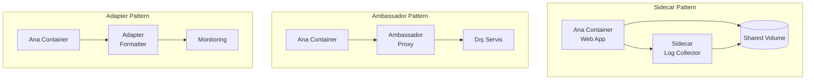
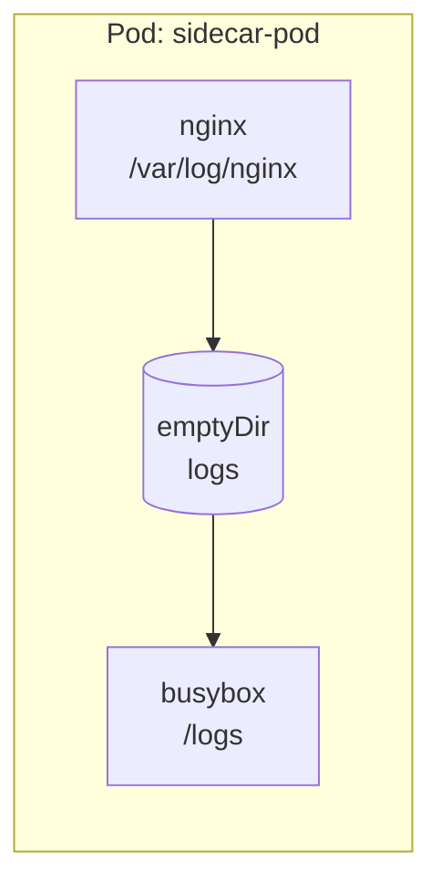
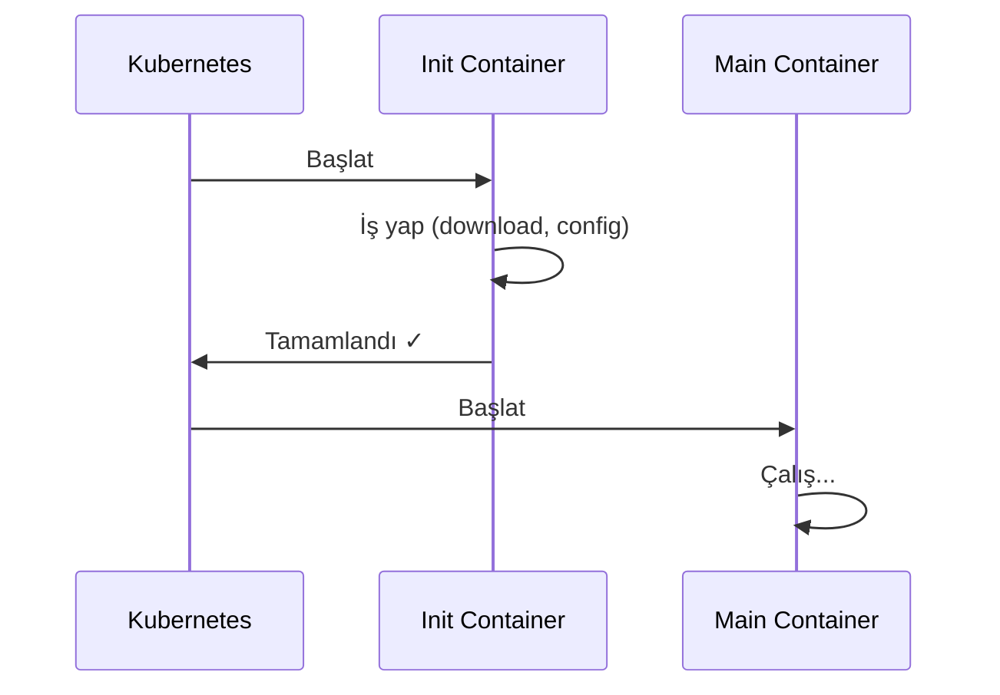

# Lab 02: Multi-Container Pods

## 🎯 Öğrenme Hedefleri
- Multi-container pod kalıplarını anlamak
- Sidecar pattern uygulamak
- Init container kullanmak
- Container'lar arası iletişim

---

## 📖 Multi-Container Patterns



| Pattern | Kullanım |
|---------|----------|
| **Sidecar** | Log toplama, sync, proxy |
| **Ambassador** | Dış servislere bağlantı |
| **Adapter** | Veri format dönüşümü |

---

## 🔨 Pratik Alıştırmalar

### Alıştırma 1: İki Container'lı Pod

**Görev:** Aşağıdaki özelliklere sahip bir pod oluştur:
- Pod adı: `two-containers`
- Container 1: `nginx` (isim: web)
- Container 2: `busybox` (isim: sidecar), `sleep 3600`

<details>
<summary>✅ Çözüm</summary>

```yaml
apiVersion: v1
kind: Pod
metadata:
  name: two-containers
spec:
  containers:
  - name: web
    image: nginx
    ports:
    - containerPort: 80
  - name: sidecar
    image: busybox
    command: ["sleep", "3600"]
```

```bash
kubectl apply -f two-containers.yaml
kubectl get pods two-containers
```
</details>

---

### Alıştırma 2: Belirli Container'a Erişim

**Görev:** `two-containers` pod'undaki `sidecar` container'ına bağlan.

<details>
<summary>✅ Çözüm</summary>

```bash
# Belirli container'a exec
kubectl exec -it two-containers -c sidecar -- /bin/sh

# Belirli container logu
kubectl logs two-containers -c web
kubectl logs two-containers -c sidecar
```
</details>

---

### Alıştırma 3: Shared Volume ile Sidecar

**Görev:** Ana container log yazar, sidecar okur.



<details>
<summary>✅ Çözüm</summary>

```yaml
apiVersion: v1
kind: Pod
metadata:
  name: sidecar-pod
spec:
  containers:
  - name: web
    image: nginx
    volumeMounts:
    - name: logs
      mountPath: /var/log/nginx
  
  - name: log-reader
    image: busybox
    command: ["sh", "-c", "tail -f /logs/access.log 2>/dev/null || sleep 3600"]
    volumeMounts:
    - name: logs
      mountPath: /logs
  
  volumes:
  - name: logs
    emptyDir: {}
```

```bash
kubectl apply -f sidecar-pod.yaml

# Web container'a trafik gönder
kubectl exec sidecar-pod -c web -- curl -s localhost

# Log reader'ı kontrol et
kubectl logs sidecar-pod -c log-reader
```
</details>

---

### Alıştırma 4: Init Container



**Görev:** Ana container başlamadan önce bir dosya hazırlayan init container ekle.

<details>
<summary>✅ Çözüm</summary>

```yaml
apiVersion: v1
kind: Pod
metadata:
  name: init-pod
spec:
  initContainers:
  - name: init-download
    image: busybox
    command: ['sh', '-c', 'echo "Hazırlandı: $(date)" > /work/status.txt']
    volumeMounts:
    - name: workdir
      mountPath: /work
  
  containers:
  - name: main-app
    image: busybox
    command: ['sh', '-c', 'cat /work/status.txt && sleep 3600']
    volumeMounts:
    - name: workdir
      mountPath: /work
  
  volumes:
  - name: workdir
    emptyDir: {}
```

```bash
kubectl apply -f init-pod.yaml

# İzle
kubectl get pod init-pod -w

# Sonucu gör
kubectl logs init-pod
```
</details>

---

### Alıştırma 5: Birden Fazla Init Container

**Görev:** Sırayla çalışan iki init container oluştur.

<details>
<summary>✅ Çözüm</summary>

```yaml
apiVersion: v1
kind: Pod
metadata:
  name: multi-init-pod
spec:
  initContainers:
  - name: init-1
    image: busybox
    command: ['sh', '-c', 'echo "Step 1" && sleep 2']
  
  - name: init-2
    image: busybox
    command: ['sh', '-c', 'echo "Step 2" && sleep 2']
  
  containers:
  - name: main
    image: nginx
```

Init container'lar sırayla çalışır. Biri bitmeden diğeri başlamaz.
</details>

---

### Alıştırma 6: Container'lar Arası Network

**Görev:** Aynı pod içinde container'ların localhost üzerinden iletişimini test et.

<details>
<summary>✅ Çözüm</summary>

```yaml
apiVersion: v1
kind: Pod
metadata:
  name: network-test
spec:
  containers:
  - name: web
    image: nginx
  - name: tester
    image: curlimages/curl
    command: ["sleep", "3600"]
```

```bash
kubectl apply -f network-test.yaml

# Tester'dan web'e eriş (localhost)
kubectl exec network-test -c tester -- curl -s localhost:80
```

Aynı pod içindeki container'lar `localhost` üzerinden haberleşir!
</details>

---

## 🎯 Sınav Pratiği

### Senaryo 1
> `log-app` adında pod oluştur:
> - Container 1: `nginx` (isim: app)
> - Container 2: `busybox` (isim: logger), `sleep 3600` çalıştırsın

<details>
<summary>✅ Çözüm</summary>

```yaml
apiVersion: v1
kind: Pod
metadata:
  name: log-app
spec:
  containers:
  - name: app
    image: nginx
  - name: logger
    image: busybox
    command: ["sleep", "3600"]
```
</details>

---

### Senaryo 2
> Init container'lı bir pod oluştur. Init container `wget -O /data/index.html http://info.cern.ch` çalıştırsın. Ana container nginx olsun ve bu dosyayı sunsun.

<details>
<summary>✅ Çözüm</summary>

```yaml
apiVersion: v1
kind: Pod
metadata:
  name: web-init
spec:
  initContainers:
  - name: downloader
    image: busybox
    command: ['wget', '-O', '/data/index.html', 'http://info.cern.ch']
    volumeMounts:
    - name: html
      mountPath: /data
  
  containers:
  - name: nginx
    image: nginx
    volumeMounts:
    - name: html
      mountPath: /usr/share/nginx/html
  
  volumes:
  - name: html
    emptyDir: {}
```
</details>

---

## 🧹 Temizlik

```bash
kubectl delete pod two-containers sidecar-pod init-pod multi-init-pod network-test --ignore-not-found
```

---

## ✅ Öğrendiklerimiz

- [x] Multi-container pod oluşturma
- [x] Sidecar pattern
- [x] Init containers
- [x] Volume ile container'lar arası veri paylaşımı
- [x] `-c` flag ile container seçimi
- [x] Container'lar arası localhost iletişimi

---

[⬅️ Lab 01: Pod Basics](lab-01-pod-basics.md) | [Lab 03: Deployments ➡️](lab-03-deployments.md)
