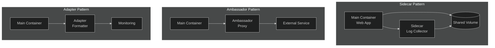
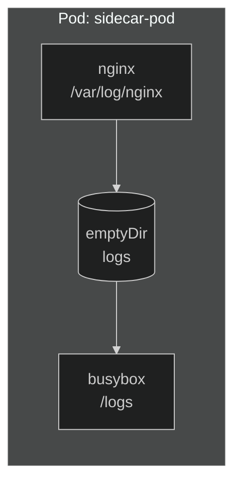
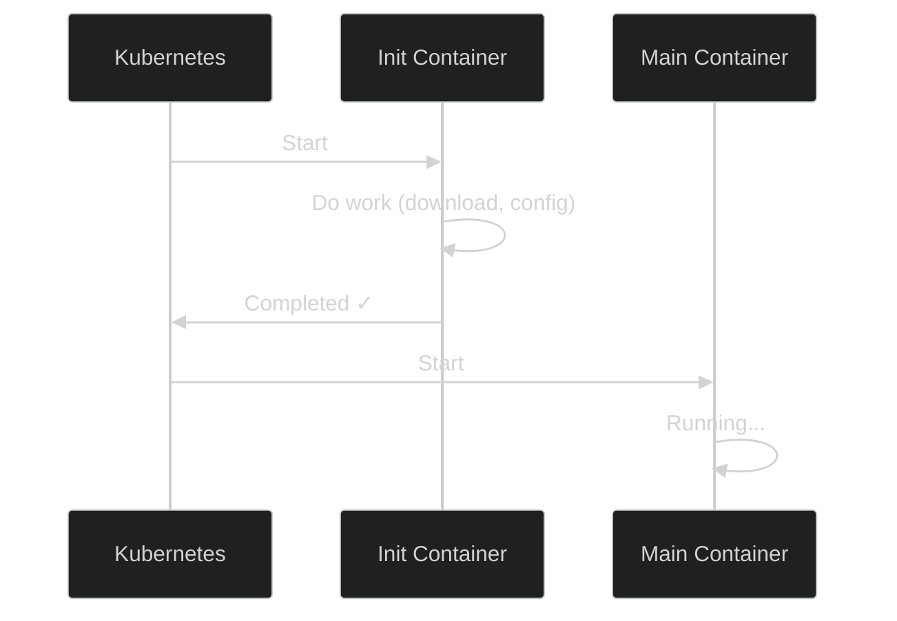

# Lab 02: Multi-Container Pods

## 🎯 Learning Objectives
- Understand multi-container pod patterns
- Implement Sidecar pattern
- Use Init Containers
- Communication between containers

---

## 📖 Multi-Container Patterns



| Pattern | Use Case |
|---------|----------|
| **Sidecar** | Log collection, sync, proxy |
| **Ambassador** | Connection to external services |
| **Adapter** | Data format conversion |

---

## 🔨 Hands-on Exercises

### Exercise 1: Two-Container Pod

**Task:** Create a pod with these specs:
- Pod name: `two-containers`
- Container 1: `nginx` (name: web)
- Container 2: `busybox` (name: sidecar), runs `sleep 3600`

<details>
<summary>✅ Solution</summary>

```yaml
apiVersion: v1
kind: Pod
metadata:
  name: two-containers
spec:
  containers:
  - name: web
    image: nginx
    ports:
    - containerPort: 80
  - name: sidecar
    image: busybox
    command: ["sleep", "3600"]
```

```bash
kubectl apply -f two-containers.yaml
kubectl get pods two-containers
```
</details>

---

### Exercise 2: Access Specific Container

**Task:** Connect to the `sidecar` container in `two-containers` pod.

<details>
<summary>✅ Solution</summary>

```bash
# Exec into specific container
kubectl exec -it two-containers -c sidecar -- /bin/sh

# Logs from specific container
kubectl logs two-containers -c web
kubectl logs two-containers -c sidecar
```
</details>

---

### Exercise 3: Sidecar with Shared Volume

**Task:** Main container writes logs, sidecar reads them.



<details>
<summary>✅ Solution</summary>

```yaml
apiVersion: v1
kind: Pod
metadata:
  name: sidecar-pod
spec:
  containers:
  - name: web
    image: nginx
    volumeMounts:
    - name: logs
      mountPath: /var/log/nginx
  
  - name: log-reader
    image: busybox
    command: ["sh", "-c", "tail -f /logs/access.log 2>/dev/null || sleep 3600"]
    volumeMounts:
    - name: logs
      mountPath: /logs
  
  volumes:
  - name: logs
    emptyDir: {}
```
</details>

---

### Exercise 4: Init Container



**Task:** Add an init container that prepares a file before main container starts.

<details>
<summary>✅ Solution</summary>

```yaml
apiVersion: v1
kind: Pod
metadata:
  name: init-pod
spec:
  initContainers:
  - name: init-download
    image: busybox
    command: ['sh', '-c', 'echo "Ready: $(date)" > /work/status.txt']
    volumeMounts:
    - name: workdir
      mountPath: /work
  
  containers:
  - name: main-app
    image: busybox
    command: ['sh', '-c', 'cat /work/status.txt && sleep 3600']
    volumeMounts:
    - name: workdir
      mountPath: /work
  
  volumes:
  - name: workdir
    emptyDir: {}
```
</details>

---

### Exercise 5: Multiple Init Containers

**Task:** Create two init containers that run sequentially.

<details>
<summary>✅ Solution</summary>

```yaml
apiVersion: v1
kind: Pod
metadata:
  name: multi-init-pod
spec:
  initContainers:
  - name: init-1
    image: busybox
    command: ['sh', '-c', 'echo "Step 1" && sleep 2']
  
  - name: init-2
    image: busybox
    command: ['sh', '-c', 'echo "Step 2" && sleep 2']
  
  containers:
  - name: main
    image: nginx
```

Init containers run sequentially. One must finish before the next starts.
</details>

---

### Exercise 6: Inter-Container Networking

**Task:** Test that containers in the same pod can communicate via localhost.

<details>
<summary>✅ Solution</summary>

```yaml
apiVersion: v1
kind: Pod
metadata:
  name: network-test
spec:
  containers:
  - name: web
    image: nginx
  - name: tester
    image: curlimages/curl
    command: ["sleep", "3600"]
```

```bash
kubectl apply -f network-test.yaml

# Access web from tester (localhost)
kubectl exec network-test -c tester -- curl -s localhost:80
```

Containers in the same pod communicate via `localhost`!
</details>

---

## 🎯 Exam Practice

### Scenario 1
> Create a pod named `log-app`:
> - Container 1: `nginx` (name: app)
> - Container 2: `busybox` (name: logger), runs `sleep 3600`

<details>
<summary>✅ Solution</summary>

```yaml
apiVersion: v1
kind: Pod
metadata:
  name: log-app
spec:
  containers:
  - name: app
    image: nginx
  - name: logger
    image: busybox
    command: ["sleep", "3600"]
```
</details>

---

### Scenario 2
> Create a pod with init container. Init container runs `wget -O /data/index.html http://info.cern.ch`. Main container is nginx and serves this file.

<details>
<summary>✅ Solution</summary>

```yaml
apiVersion: v1
kind: Pod
metadata:
  name: web-init
spec:
  initContainers:
  - name: downloader
    image: busybox
    command: ['wget', '-O', '/data/index.html', 'http://info.cern.ch']
    volumeMounts:
    - name: html
      mountPath: /data
  
  containers:
  - name: nginx
    image: nginx
    volumeMounts:
    - name: html
      mountPath: /usr/share/nginx/html
  
  volumes:
  - name: html
    emptyDir: {}
```
</details>

---

## 🧹 Cleanup

```bash
kubectl delete pod two-containers sidecar-pod init-pod multi-init-pod network-test --ignore-not-found
```

---

## ✅ What We Learned

- [x] Multi-container pod creation
- [x] Sidecar pattern
- [x] Init containers
- [x] Shared volumes between containers
- [x] `-c` flag for container selection
- [x] Localhost communication between containers

---

[⬅️ Lab 01: Pod Basics](lab-01-pod-basics.md) | [Lab 03: Deployments ➡️](lab-03-deployments.md)
