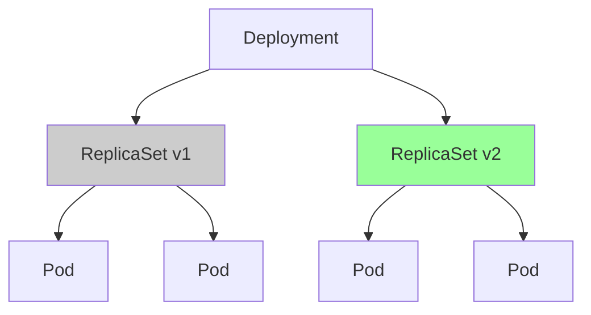
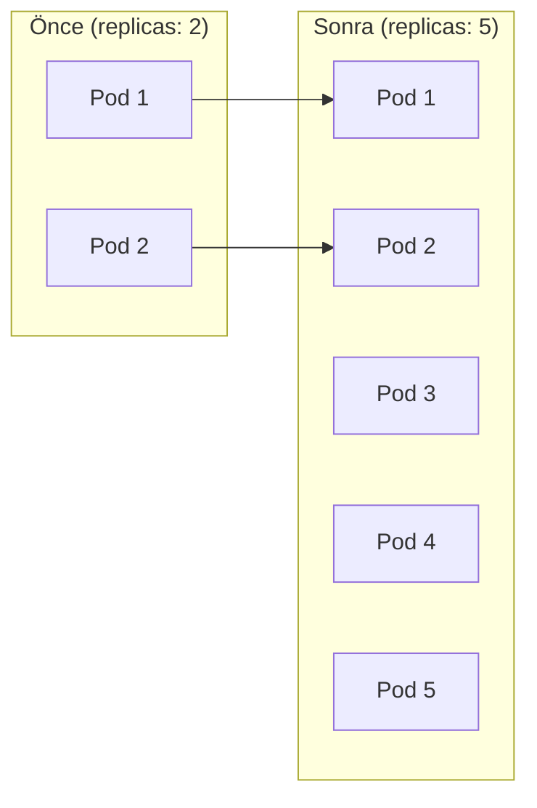
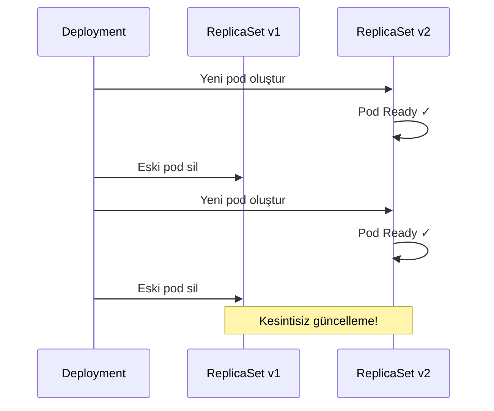

# Lab 03: Deployments

## 🎯 Öğrenme Hedefleri
- Deployment nedir ve neden kullanılır
- Deployment oluşturma ve yönetme
- Rolling Update ve Rollback
- Scaling (ölçeklendirme)

---

## 📖 Deployment Nedir?



Deployment şunları sağlar:
- ✅ Pod'ların otomatik yeniden oluşturulması
- ✅ Rolling update (kesintisiz güncelleme)
- ✅ Rollback (geri alma)
- ✅ Scaling (ölçeklendirme)

---

## 🔨 Pratik Alıştırmalar

### Alıştırma 1: Deployment Oluştur

**Görev:** `nginx` image kullanan `web-deploy` adında 3 replica'lı deployment oluştur.

<details>
<summary>✅ Çözüm</summary>

```bash
kubectl create deployment web-deploy --image=nginx --replicas=3
```

Kontrol:
```bash
kubectl get deployments
kubectl get replicasets
kubectl get pods
```
</details>

---

### Alıştırma 2: Deployment YAML

**Görev:** YAML dosyası ile deployment oluştur.

<details>
<summary>✅ Çözüm</summary>

```bash
# Şablon oluştur
kubectl create deployment api-deploy --image=nginx:1.20 --replicas=2 --dry-run=client -o yaml > api-deploy.yaml
```

```yaml
apiVersion: apps/v1
kind: Deployment
metadata:
  name: api-deploy
spec:
  replicas: 2
  selector:
    matchLabels:
      app: api-deploy
  template:
    metadata:
      labels:
        app: api-deploy
    spec:
      containers:
      - name: nginx
        image: nginx:1.20
```

```bash
kubectl apply -f api-deploy.yaml
```
</details>

---

### Alıştırma 3: Scaling



**Görev:** `web-deploy`'u 5 replica'ya ölçeklendir.

<details>
<summary>✅ Çözüm</summary>

```bash
kubectl scale deployment web-deploy --replicas=5

# Kontrol
kubectl get deployment web-deploy
kubectl get pods -l app=web-deploy
```
</details>

---

### Alıştırma 4: Rolling Update



**Görev:** `web-deploy` image'ını `nginx:1.21` olarak güncelle.

<details>
<summary>✅ Çözüm</summary>

```bash
# Image güncelle
kubectl set image deployment/web-deploy nginx=nginx:1.21

# Rollout durumunu izle
kubectl rollout status deployment/web-deploy
```
</details>

---

### Alıştırma 5: Rollout Geçmişi

**Görev:** Deployment'ın güncelleme geçmişini görüntüle.

<details>
<summary>✅ Çözüm</summary>

```bash
# Geçmişi gör
kubectl rollout history deployment/web-deploy

# Belirli revision detayı
kubectl rollout history deployment/web-deploy --revision=1
```
</details>

---

### Alıştırma 6: Rollback

**Görev:** Deployment'ı önceki versiyona geri al.

<details>
<summary>✅ Çözüm</summary>

```bash
# Bir öncekine dön
kubectl rollout undo deployment/web-deploy

# Belirli revision'a dön
kubectl rollout undo deployment/web-deploy --to-revision=1

# Durumu kontrol et
kubectl rollout status deployment/web-deploy
```
</details>

---

### Alıştırma 7: Deployment Stratejileri

**RollingUpdate** (varsayılan):
```yaml
spec:
  strategy:
    type: RollingUpdate
    rollingUpdate:
      maxSurge: 1        # Fazladan kaç pod
      maxUnavailable: 1  # Kaç pod eksik olabilir
```

**Recreate** (tümünü sil, yeniden oluştur):
```yaml
spec:
  strategy:
    type: Recreate
```

---

### Alıştırma 8: Pause ve Resume

**Görev:** Rollout'u duraklat, birden fazla değişiklik yap, sonra devam et.

<details>
<summary>✅ Çözüm</summary>

```bash
# Duraklat
kubectl rollout pause deployment/web-deploy

# Değişiklikler (rollout başlamaz)
kubectl set image deployment/web-deploy nginx=nginx:1.22
kubectl set resources deployment/web-deploy -c nginx --limits=memory=256Mi

# Devam et (tek rollout)
kubectl rollout resume deployment/web-deploy
```
</details>

---

## 🎯 Sınav Pratiği

### Senaryo 1
> `frontend` adında, `httpd:2.4` image kullanan 4 replica'lı deployment oluştur.

<details>
<summary>✅ Çözüm</summary>

```bash
kubectl create deployment frontend --image=httpd:2.4 --replicas=4
```
</details>

---

### Senaryo 2
> `frontend` image'ını `httpd:alpine` olarak güncelle. Sonra revision 1'e geri al.

<details>
<summary>✅ Çözüm</summary>

```bash
kubectl set image deployment/frontend httpd=httpd:alpine
kubectl rollout status deployment/frontend
kubectl rollout undo deployment/frontend --to-revision=1
```
</details>

---

### Senaryo 3
> `backend` adında redis deployment oluştur (2 replica). Sonra 6 replica'ya ölçeklendir.

<details>
<summary>✅ Çözüm</summary>

```bash
kubectl create deployment backend --image=redis --replicas=2
kubectl scale deployment backend --replicas=6
```
</details>

---

## 🧹 Temizlik

```bash
kubectl delete deployment --all
```

---

## ✅ Öğrendiklerimiz

- [x] Deployment oluşturma
- [x] ReplicaSet ilişkisi
- [x] Scaling
- [x] Rolling update
- [x] Rollback
- [x] Deployment stratejileri

---

[⬅️ Lab 02](lab-02-multi-container-pods.md) | [Lab 04: Services ➡️](lab-04-services.md)
