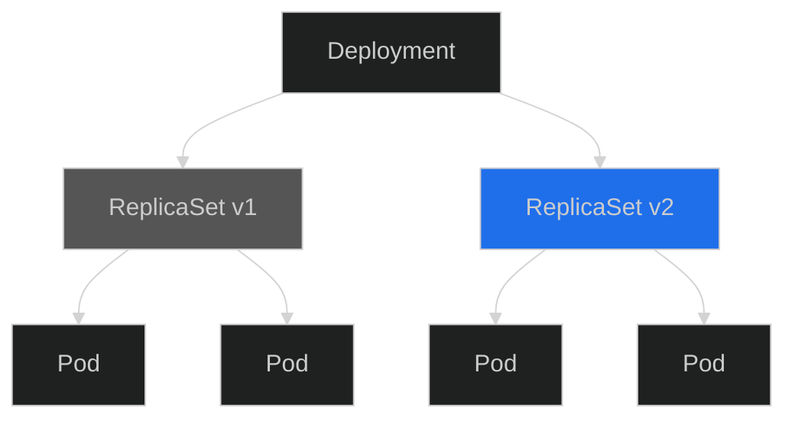
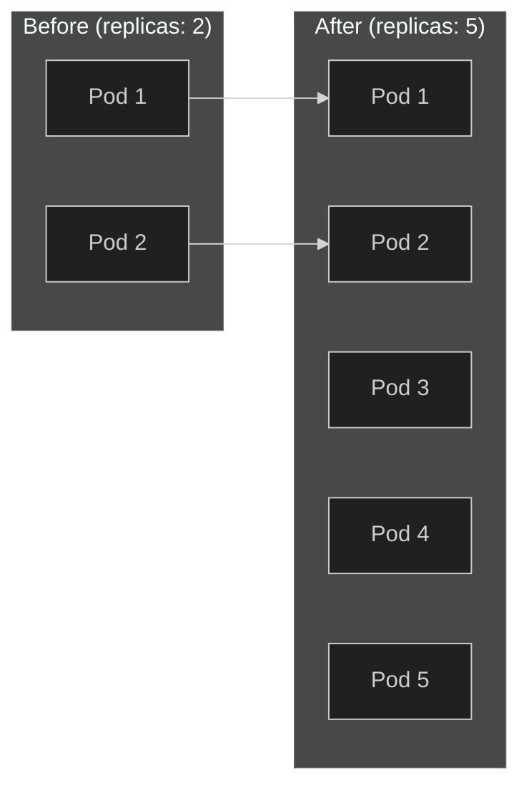
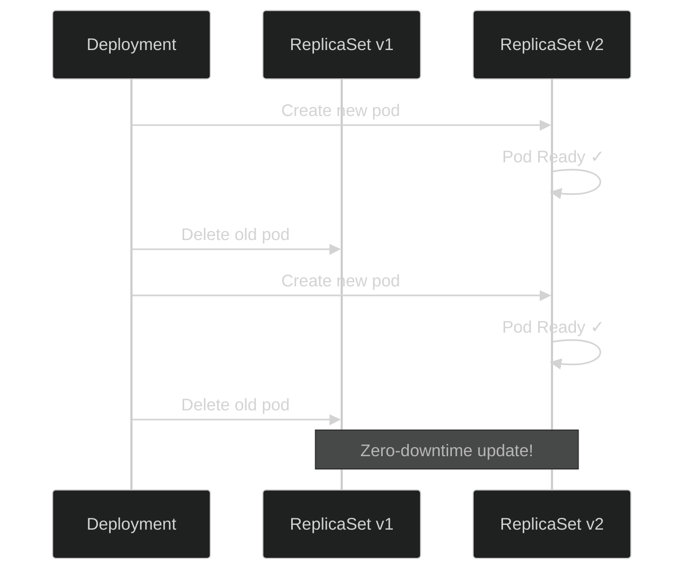

# Lab 03: Deployments

## 🎯 Learning Objectives
- Understand what a Deployment is and why it's used
- Create and manage Deployments
- Rolling Update and Rollback
- Scaling

---

## 📖 What is a Deployment?



Deployment provides:
- ✅ Automatic pod recreation
- ✅ Rolling updates (zero-downtime)
- ✅ Rollback capability
- ✅ Scaling

---

## 🔨 Hands-on Exercises

### Exercise 1: Create Deployment

**Task:** Create a deployment named `web-deploy` using `nginx` image with 3 replicas.

<details open>
<summary>✅ Solution</summary>

```bash
kubectl create deployment web-deploy --image=nginx --replicas=3
```

Check:
```bash
kubectl get deployments
kubectl get replicasets
kubectl get pods
```
</details>

---

### Exercise 2: Deployment YAML

**Task:** Create a deployment using a YAML file.

<details open>
<summary>✅ Solution</summary>

```bash
# Generate template
kubectl create deployment api-deploy --image=nginx:1.20 --replicas=2 --dry-run=client -o yaml > api-deploy.yaml
```

```yaml
apiVersion: apps/v1
kind: Deployment
metadata:
  name: api-deploy
spec:
  replicas: 2
  selector:
    matchLabels:
      app: api-deploy
  template:
    metadata:
      labels:
        app: api-deploy
    spec:
      containers:
      - name: nginx
        image: nginx:1.20
```

```bash
kubectl apply -f api-deploy.yaml
```
</details>

---

### Exercise 3: Scaling



**Task:** Scale `web-deploy` to 5 replicas.

<details open>
<summary>✅ Solution</summary>

```bash
kubectl scale deployment web-deploy --replicas=5

# Check
kubectl get deployment web-deploy
kubectl get pods -l app=web-deploy
```
</details>

---

### Exercise 4: Rolling Update



**Task:** Update `web-deploy` image to `nginx:1.21`.

<details open>
<summary>✅ Solution</summary>

```bash
# Update image
kubectl set image deployment/web-deploy nginx=nginx:1.21

# Watch rollout status
kubectl rollout status deployment/web-deploy
```
</details>

---

### Exercise 5: Rollout History

**Task:** View deployment update history.

<details open>
<summary>✅ Solution</summary>

```bash
# View history
kubectl rollout history deployment/web-deploy

# Specific revision details
kubectl rollout history deployment/web-deploy --revision=1
```
</details>

---

### Exercise 6: Rollback

**Task:** Rollback deployment to previous version.

<details open>
<summary>✅ Solution</summary>

```bash
# Rollback to previous
kubectl rollout undo deployment/web-deploy

# Rollback to specific revision
kubectl rollout undo deployment/web-deploy --to-revision=1

# Check status
kubectl rollout status deployment/web-deploy
```
</details>

---

### Exercise 7: Deployment Strategies

**RollingUpdate** (default):
```yaml
spec:
  strategy:
    type: RollingUpdate
    rollingUpdate:
      maxSurge: 1        # How many extra pods
      maxUnavailable: 1  # How many pods can be unavailable
```

**Recreate** (delete all, create new):
```yaml
spec:
  strategy:
    type: Recreate
```

---

### Exercise 8: Pause and Resume

**Task:** Pause rollout, make multiple changes, then resume.

<details open>
<summary>✅ Solution</summary>

```bash
# Pause
kubectl rollout pause deployment/web-deploy

# Make changes (rollout won't start)
kubectl set image deployment/web-deploy nginx=nginx:1.22
kubectl set resources deployment/web-deploy -c nginx --limits=memory=256Mi

# Resume (single rollout)
kubectl rollout resume deployment/web-deploy
```
</details>

---

## 🎯 Exam Practice

### Scenario 1
> Create a deployment named `frontend` using `httpd:2.4` image with 4 replicas.

<details open>
<summary>✅ Solution</summary>

```bash
kubectl create deployment frontend --image=httpd:2.4 --replicas=4
```
</details>

---

### Scenario 2
> Update `frontend` image to `httpd:alpine`. Then rollback to revision 1.

<details open>
<summary>✅ Solution</summary>

```bash
kubectl set image deployment/frontend httpd=httpd:alpine
kubectl rollout status deployment/frontend
kubectl rollout undo deployment/frontend --to-revision=1
```
</details>

---

### Scenario 3
> Create a redis deployment named `backend` with 2 replicas. Then scale to 6 replicas.

<details open>
<summary>✅ Solution</summary>

```bash
kubectl create deployment backend --image=redis --replicas=2
kubectl scale deployment backend --replicas=6
```
</details>

---

## 🧹 Cleanup

```bash
kubectl delete deployment --all
```

---

## ✅ What We Learned

- [x] Deployment creation
- [x] ReplicaSet relationship
- [x] Scaling
- [x] Rolling update
- [x] Rollback
- [x] Deployment strategies

---

[⬅️ Lab 02](lab-02-multi-container-pods.md) | [Lab 04: Services ➡️](lab-04-services.md)
