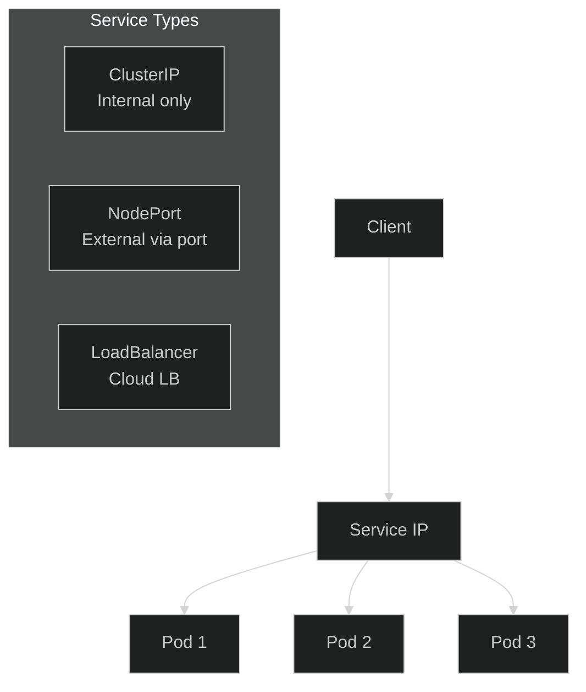
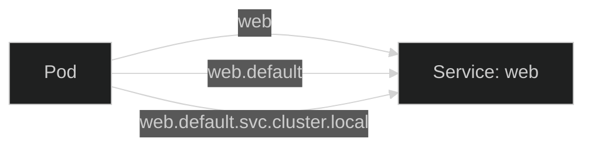

# Lab 04: Services

## 🎯 Learning Objectives
- Understand what a Service is
- Service types (ClusterIP, NodePort, LoadBalancer)
- Service discovery and DNS
- Expose deployments

---

## 📖 What is a Service?



| Type | Access | Use Case |
|------|--------|----------|
| **ClusterIP** | Internal only | Pod-to-pod communication |
| **NodePort** | `NodeIP:Port` | Development, testing |
| **LoadBalancer** | External IP | Production (cloud) |

---

## 🔨 Hands-on Exercises

### Exercise 1: Create Deployment for Testing

```bash
kubectl create deployment web --image=nginx --replicas=3
```

---

### Exercise 2: ClusterIP Service

**Task:** Expose `web` deployment with ClusterIP service.

<details>
<summary>✅ Solution</summary>

```bash
kubectl expose deployment web --port=80 --type=ClusterIP
```

Check:
```bash
kubectl get svc web
kubectl describe svc web
kubectl get endpoints web
```
</details>

---

### Exercise 3: NodePort Service

**Task:** Create a NodePort service for `web` deployment.

<details>
<summary>✅ Solution</summary>

```bash
kubectl expose deployment web --port=80 --type=NodePort --name=web-nodeport
```

```bash
kubectl get svc web-nodeport
# Note the NodePort (e.g., 32000)

# Access from outside
curl http://<NODE_IP>:<NODE_PORT>
```
</details>

---

### Exercise 4: Service YAML

<details>
<summary>✅ Solution</summary>

```yaml
apiVersion: v1
kind: Service
metadata:
  name: web-svc
spec:
  type: ClusterIP
  selector:
    app: web      # Must match pod labels
  ports:
  - port: 80      # Service port
    targetPort: 80 # Container port
```
</details>

---

### Exercise 5: Service DNS

**Task:** Test service DNS resolution.



<details>
<summary>✅ Solution</summary>

```bash
# Create a test pod
kubectl run test-dns --image=busybox --rm -it --restart=Never -- nslookup web

# Full DNS name
# <service>.<namespace>.svc.cluster.local
# web.default.svc.cluster.local
```
</details>

---

### Exercise 6: Endpoints

**Task:** View service endpoints.

<details>
<summary>✅ Solution</summary>

```bash
kubectl get endpoints web

# Shows pod IPs that match the selector
# When pods scale, endpoints update automatically
```
</details>

---

### Exercise 7: LoadBalancer (K3s)

K3s has built-in LoadBalancer support (ServiceLB).

<details>
<summary>✅ Solution</summary>

```bash
kubectl expose deployment web --port=80 --type=LoadBalancer --name=web-lb

kubectl get svc web-lb
# EXTERNAL-IP will show node IP in K3s
```
</details>

---

### Exercise 8: Multi-Port Service

**Task:** Create a service with multiple ports.

<details>
<summary>✅ Solution</summary>

```yaml
apiVersion: v1
kind: Service
metadata:
  name: multi-port-svc
spec:
  selector:
    app: myapp
  ports:
  - name: http
    port: 80
    targetPort: 80
  - name: https
    port: 443
    targetPort: 443
```
</details>

---

## 🎯 Exam Practice

### Scenario 1
> Create a ClusterIP service named `backend-svc` for pods with label `app=backend`, port 8080.

<details>
<summary>✅ Solution</summary>

```yaml
apiVersion: v1
kind: Service
metadata:
  name: backend-svc
spec:
  selector:
    app: backend
  ports:
  - port: 8080
```
</details>

---

### Scenario 2
> Expose deployment `api` on NodePort 30080.

<details>
<summary>✅ Solution</summary>

```yaml
apiVersion: v1
kind: Service
metadata:
  name: api-svc
spec:
  type: NodePort
  selector:
    app: api
  ports:
  - port: 80
    nodePort: 30080
```
</details>

---

## 🧹 Cleanup

```bash
kubectl delete deployment web
kubectl delete svc web web-nodeport web-lb multi-port-svc --ignore-not-found
```

---

## ✅ What We Learned

- [x] Service types (ClusterIP, NodePort, LoadBalancer)
- [x] `kubectl expose` command
- [x] Service selectors and endpoints
- [x] DNS resolution in Kubernetes
- [x] Multi-port services

---

[⬅️ Lab 03](lab-03-deployments.md) | [Lab 05: ConfigMaps & Secrets ➡️](lab-05-configmaps-secrets.md)
