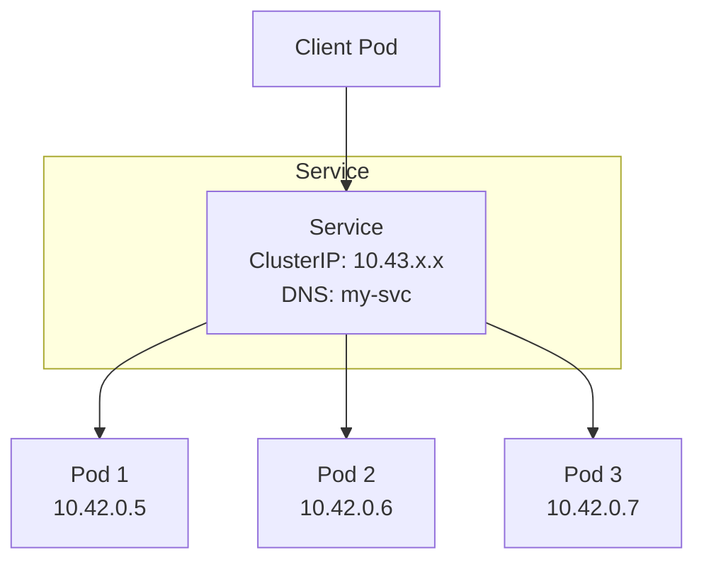
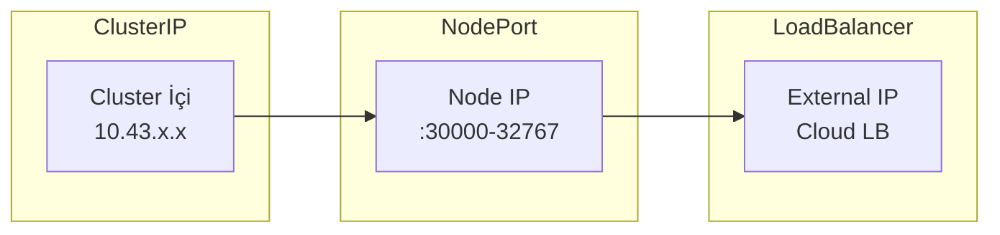
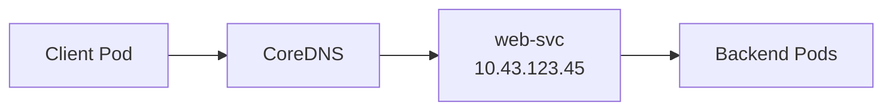

# Lab 04: Services

## 🎯 Öğrenme Hedefleri
- Service türlerini anlamak
- ClusterIP, NodePort, LoadBalancer oluşturmak
- Service Discovery (DNS)

---

## 📖 Service Nedir?



**Service**, pod'lara sabit bir endpoint sağlar. Pod IP'leri değişse bile Service IP/DNS değişmez.

---

## 📖 Service Türleri



| Tür | Erişim | K3s Desteği |
|-----|--------|-------------|
| **ClusterIP** | Sadece cluster içi | ✅ |
| **NodePort** | Node IP:Port (30000-32767) | ✅ |
| **LoadBalancer** | External IP | ✅ (ServiceLB) |

---

## 🔨 Pratik Alıştırmalar

### Hazırlık: Deployment Oluştur

```bash
kubectl create deployment web --image=nginx --replicas=3
```

---

### Alıştırma 1: ClusterIP Service

**Görev:** `web` deployment'ı için ClusterIP service oluştur.

<details>
<summary>✅ Çözüm</summary>

```bash
kubectl expose deployment web --port=80 --name=web-svc
```

Kontrol:
```bash
kubectl get svc web-svc
kubectl describe svc web-svc
```

Test (cluster içinden):
```bash
kubectl run test --image=busybox --rm -it --restart=Never -- wget -qO- web-svc
```
</details>

---

### Alıştırma 2: NodePort Service

**Görev:** NodePort service oluştur, port 30080 olsun.

<details>
<summary>✅ Çözüm</summary>

```yaml
apiVersion: v1
kind: Service
metadata:
  name: web-nodeport
spec:
  type: NodePort
  selector:
    app: web
  ports:
  - port: 80
    targetPort: 80
    nodePort: 30080
```

```bash
kubectl apply -f web-nodeport.yaml

# Node IP'sini bul
kubectl get nodes -o wide

# Test (Node IP ile)
curl http://<NODE_IP>:30080
```
</details>

---

### Alıştırma 3: LoadBalancer (K3s)

**Görev:** LoadBalancer service oluştur.

<details>
<summary>✅ Çözüm</summary>

```bash
kubectl expose deployment web --type=LoadBalancer --port=80 --name=web-lb
```

```bash
kubectl get svc web-lb
# EXTERNAL-IP sütununa bak (K3s ServiceLB ile)
```

K3s'te LoadBalancer, node IP'sini EXTERNAL-IP olarak atar.
</details>

---

### Alıştırma 4: Service DNS



**Görev:** DNS ile service'e eriş.

<details>
<summary>✅ Çözüm</summary>

```bash
# DNS çözümleme
kubectl run dns-test --image=busybox --rm -it --restart=Never -- nslookup web-svc
```

DNS formatları:
- `<service>` - Aynı namespace
- `<service>.<namespace>` - Farklı namespace
- `<service>.<namespace>.svc.cluster.local` - Tam ad
</details>

---

### Alıştırma 5: Service Endpoints

**Görev:** Service'in hangi pod'lara yönlendirdiğini gör.

<details>
<summary>✅ Çözüm</summary>

```bash
kubectl get endpoints web-svc
# veya
kubectl describe svc web-svc | grep Endpoints
```

Endpoints = Service selector'a uyan pod IP'leri
</details>

---

### Alıştırma 6: YAML ile Service

**Görev:** Manuel YAML ile service oluştur.

<details>
<summary>✅ Çözüm</summary>

```yaml
apiVersion: v1
kind: Service
metadata:
  name: api-svc
spec:
  type: ClusterIP
  selector:
    app: api
  ports:
  - name: http
    port: 8080
    targetPort: 80
  - name: https
    port: 8443
    targetPort: 443
```

Multi-port service'lerde `name` zorunludur.
</details>

---

### Alıştırma 7: Headless Service

**Görev:** ClusterIP olmayan (headless) service oluştur.

<details>
<summary>✅ Çözüm</summary>

```yaml
apiVersion: v1
kind: Service
metadata:
  name: headless-svc
spec:
  clusterIP: None  # Headless!
  selector:
    app: web
  ports:
  - port: 80
```

Headless service doğrudan pod IP'lerini döndürür (StatefulSet için kullanışlı).
</details>

---

## 🎯 Sınav Pratiği

### Senaryo 1
> `redis` pod oluştur, `cache-svc` adında service ile port 6379'u expose et.

<details>
<summary>✅ Çözüm</summary>

```bash
kubectl run redis --image=redis
kubectl expose pod redis --port=6379 --name=cache-svc
```
</details>

---

### Senaryo 2
> Mevcut `web` deployment için NodePort service oluştur. Port 80, NodePort 30100 olsun.

<details>
<summary>✅ Çözüm</summary>

```yaml
apiVersion: v1
kind: Service
metadata:
  name: web-np
spec:
  type: NodePort
  selector:
    app: web
  ports:
  - port: 80
    nodePort: 30100
```
</details>

---

## 🧹 Temizlik

```bash
kubectl delete svc --all
kubectl delete deployment --all
kubectl delete pod --all
```

---

## ✅ Öğrendiklerimiz

- [x] ClusterIP, NodePort, LoadBalancer farkları
- [x] `kubectl expose` komutu
- [x] Service DNS
- [x] Endpoints
- [x] K3s ServiceLB

---

[⬅️ Lab 03](lab-03-deployments.md) | [Lab 05: ConfigMaps & Secrets ➡️](lab-05-configmaps-secrets.md)
