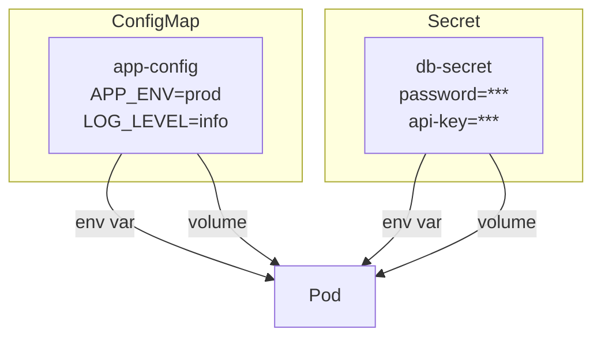
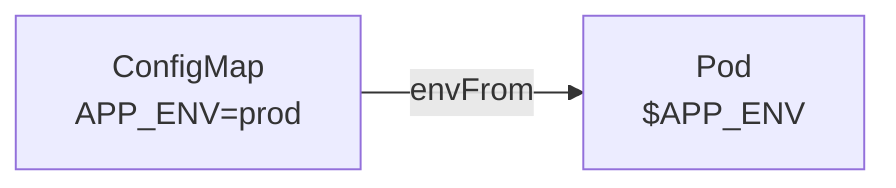
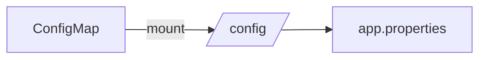

# Lab 05: ConfigMaps & Secrets

## 🎯 Öğrenme Hedefleri
- ConfigMap oluşturmak ve kullanmak
- Secret oluşturmak ve kullanmak
- Environment variable olarak kullanmak
- Volume olarak mount etmek

---

## 📖 ConfigMap vs Secret



| Kaynak | Kullanım | Saklama |
|--------|----------|---------|
| **ConfigMap** | Genel config | Plain text |
| **Secret** | Hassas veri | Base64 |

---

## 🔨 ConfigMap Alıştırmaları

### Alıştırma 1: Literal ile ConfigMap

**Görev:** Key-value ile ConfigMap oluştur.

<details>
<summary>✅ Çözüm</summary>

```bash
kubectl create configmap app-config \
  --from-literal=APP_ENV=production \
  --from-literal=LOG_LEVEL=info
```

Kontrol:
```bash
kubectl get configmap app-config -o yaml
```
</details>

---

### Alıştırma 2: Dosyadan ConfigMap

**Görev:** Dosyadan ConfigMap oluştur.

<details>
<summary>✅ Çözüm</summary>

```bash
# Config dosyası oluştur
cat <<EOF > app.properties
db.host=localhost
db.port=5432
db.name=myapp
EOF

# ConfigMap oluştur
kubectl create configmap file-config --from-file=app.properties

# Kontrol
kubectl get configmap file-config -o yaml
```
</details>

---

### Alıştırma 3: ConfigMap → Env Variable



**Görev:** ConfigMap'i environment variable olarak kullan.

<details>
<summary>✅ Çözüm</summary>

```yaml
apiVersion: v1
kind: Pod
metadata:
  name: env-pod
spec:
  containers:
  - name: app
    image: busybox
    command: ["sh", "-c", "echo $APP_ENV && sleep 3600"]
    envFrom:
    - configMapRef:
        name: app-config
```

Tek key için:
```yaml
env:
- name: MY_ENV
  valueFrom:
    configMapKeyRef:
      name: app-config
      key: APP_ENV
```
</details>

---

### Alıştırma 4: ConfigMap → Volume



<details>
<summary>✅ Çözüm</summary>

```yaml
apiVersion: v1
kind: Pod
metadata:
  name: vol-pod
spec:
  containers:
  - name: app
    image: busybox
    command: ["sh", "-c", "cat /config/app.properties && sleep 3600"]
    volumeMounts:
    - name: config
      mountPath: /config
  volumes:
  - name: config
    configMap:
      name: file-config
```
</details>

---

## 🔨 Secret Alıştırmaları

### Alıştırma 5: Secret Oluştur

**Görev:** Username ve password içeren secret oluştur.

<details>
<summary>✅ Çözüm</summary>

```bash
kubectl create secret generic db-secret \
  --from-literal=username=admin \
  --from-literal=password=S3cr3t!
```

Kontrol:
```bash
kubectl get secret db-secret -o yaml
# data base64 encoded görünür

# Decode
kubectl get secret db-secret -o jsonpath='{.data.password}' | base64 -d
```
</details>

---

### Alıştırma 6: YAML ile Secret

**Görev:** YAML ile secret oluştur.

<details>
<summary>✅ Çözüm</summary>

**stringData ile (otomatik encode):**
```yaml
apiVersion: v1
kind: Secret
metadata:
  name: easy-secret
type: Opaque
stringData:
  username: myuser
  password: mypass123
```

**data ile (manuel base64):**
```bash
echo -n "myuser" | base64    # bXl1c2Vy
echo -n "mypass123" | base64 # bXlwYXNzMTIz
```

```yaml
apiVersion: v1
kind: Secret
metadata:
  name: manual-secret
type: Opaque
data:
  username: bXl1c2Vy
  password: bXlwYXNzMTIz
```
</details>

---

### Alıştırma 7: Secret → Env Variable

<details>
<summary>✅ Çözüm</summary>

```yaml
apiVersion: v1
kind: Pod
metadata:
  name: secret-env-pod
spec:
  containers:
  - name: app
    image: busybox
    command: ["sh", "-c", "echo User:$DB_USER Pass:$DB_PASS && sleep 3600"]
    env:
    - name: DB_USER
      valueFrom:
        secretKeyRef:
          name: db-secret
          key: username
    - name: DB_PASS
      valueFrom:
        secretKeyRef:
          name: db-secret
          key: password
```
</details>

---

### Alıştırma 8: Secret → Volume

<details>
<summary>✅ Çözüm</summary>

```yaml
apiVersion: v1
kind: Pod
metadata:
  name: secret-vol-pod
spec:
  containers:
  - name: app
    image: busybox
    command: ["sh", "-c", "cat /secrets/password && sleep 3600"]
    volumeMounts:
    - name: secret-vol
      mountPath: /secrets
      readOnly: true
  volumes:
  - name: secret-vol
    secret:
      secretName: db-secret
```
</details>

---

## 🎯 Sınav Pratiği

### Senaryo 1
> `web-config` ConfigMap oluştur: `THEME=dark`. Bu ConfigMap'i kullanan `webapp` pod oluştur.

<details>
<summary>✅ Çözüm</summary>

```bash
kubectl create configmap web-config --from-literal=THEME=dark
```

```yaml
apiVersion: v1
kind: Pod
metadata:
  name: webapp
spec:
  containers:
  - name: nginx
    image: nginx
    envFrom:
    - configMapRef:
        name: web-config
```
</details>

---

### Senaryo 2
> `api-secret` adında secret oluştur: `API_KEY=xyz789`. `/etc/api/` dizinine mount et.

<details>
<summary>✅ Çözüm</summary>

```bash
kubectl create secret generic api-secret --from-literal=API_KEY=xyz789
```

```yaml
apiVersion: v1
kind: Pod
metadata:
  name: api-pod
spec:
  containers:
  - name: app
    image: busybox
    command: ["sleep", "3600"]
    volumeMounts:
    - name: api-vol
      mountPath: /etc/api
  volumes:
  - name: api-vol
    secret:
      secretName: api-secret
```
</details>

---

## 🧹 Temizlik

```bash
kubectl delete pod --all
kubectl delete configmap --all
kubectl delete secret --all
rm -f app.properties
```

---

## ✅ Öğrendiklerimiz

- [x] ConfigMap oluşturma (literal, file)
- [x] Secret oluşturma
- [x] envFrom ve valueFrom
- [x] Volume mount
- [x] Base64 encoding

---

[⬅️ Lab 04](lab-04-services.md) | [Lab 06: Volumes ➡️](lab-06-volumes.md)
