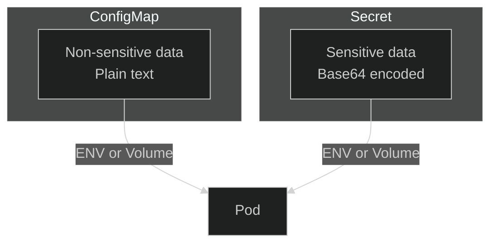

# Lab 05: ConfigMaps & Secrets

## 🎯 Learning Objectives
- Create and use ConfigMaps
- Create and use Secrets
- Environment variables from ConfigMaps/Secrets
- Mount as volumes

---

## 📖 ConfigMap vs Secret



| Feature | ConfigMap | Secret |
|---------|-----------|--------|
| **Data Type** | Plain text | Base64 encoded |
| **Use Case** | Config files, env vars | Passwords, tokens, keys |
| **Visibility** | Visible in `kubectl get` | Hidden by default |

---

## 🔨 ConfigMap Exercises

### Exercise 1: Create ConfigMap (literal)

**Task:** Create a ConfigMap named `app-config` with key `APP_ENV=production`.

<details open>
<summary>✅ Solution</summary>

```bash
kubectl create configmap app-config --from-literal=APP_ENV=production --from-literal=LOG_LEVEL=info
```

Check:
```bash
kubectl get cm app-config
kubectl describe cm app-config
```
</details>

---

### Exercise 2: Create ConfigMap (from file)

<details open>
<summary>✅ Solution</summary>

```bash
# Create a config file
echo "database_host=db.example.com
database_port=5432" > config.txt

kubectl create configmap file-config --from-file=config.txt
```
</details>

---

### Exercise 3: ConfigMap as Environment Variables

**Task:** Use ConfigMap values as environment variables in a pod.

<details open>
<summary>✅ Solution</summary>

```yaml
apiVersion: v1
kind: Pod
metadata:
  name: cm-env-pod
spec:
  containers:
  - name: app
    image: busybox
    command: ["sh", "-c", "echo $APP_ENV && sleep 3600"]
    envFrom:
    - configMapRef:
        name: app-config
```

Or specific keys:
```yaml
env:
- name: MY_APP_ENV
  valueFrom:
    configMapKeyRef:
      name: app-config
      key: APP_ENV
```
</details>

---

### Exercise 4: ConfigMap as Volume

**Task:** Mount ConfigMap as a file.

<details open>
<summary>✅ Solution</summary>

```yaml
apiVersion: v1
kind: Pod
metadata:
  name: cm-vol-pod
spec:
  containers:
  - name: app
    image: busybox
    command: ["sh", "-c", "cat /config/config.txt && sleep 3600"]
    volumeMounts:
    - name: config-volume
      mountPath: /config
  volumes:
  - name: config-volume
    configMap:
      name: file-config
```
</details>

---

## 🔨 Secret Exercises

### Exercise 5: Create Secret

**Task:** Create a Secret named `db-secret` with `DB_PASSWORD=mysecret123`.

<details open>
<summary>✅ Solution</summary>

```bash
kubectl create secret generic db-secret --from-literal=DB_PASSWORD=mysecret123
```

Check:
```bash
kubectl get secret db-secret
kubectl describe secret db-secret  # Values hidden
kubectl get secret db-secret -o yaml  # Base64 encoded
```
</details>

---

### Exercise 6: Decode Secret

<details open>
<summary>✅ Solution</summary>

```bash
# Get base64 value
kubectl get secret db-secret -o jsonpath='{.data.DB_PASSWORD}'

# Decode
kubectl get secret db-secret -o jsonpath='{.data.DB_PASSWORD}' | base64 -d
```
</details>

---

### Exercise 7: Secret as Environment Variable

<details open>
<summary>✅ Solution</summary>

```yaml
apiVersion: v1
kind: Pod
metadata:
  name: secret-env-pod
spec:
  containers:
  - name: app
    image: busybox
    command: ["sh", "-c", "echo $DB_PASSWORD && sleep 3600"]
    env:
    - name: DB_PASSWORD
      valueFrom:
        secretKeyRef:
          name: db-secret
          key: DB_PASSWORD
```
</details>

---

### Exercise 8: Secret as Volume

<details open>
<summary>✅ Solution</summary>

```yaml
apiVersion: v1
kind: Pod
metadata:
  name: secret-vol-pod
spec:
  containers:
  - name: app
    image: busybox
    command: ["sh", "-c", "cat /secrets/DB_PASSWORD && sleep 3600"]
    volumeMounts:
    - name: secret-volume
      mountPath: /secrets
      readOnly: true
  volumes:
  - name: secret-volume
    secret:
      secretName: db-secret
```
</details>

---

## 🎯 Exam Practice

### Scenario 1
> Create ConfigMap `webapp-config` with `THEME=dark` and `CACHE_TTL=3600`.

<details open>
<summary>✅ Solution</summary>

```bash
kubectl create cm webapp-config --from-literal=THEME=dark --from-literal=CACHE_TTL=3600
```
</details>

---

### Scenario 2
> Create a pod that uses `webapp-config` as environment variables.

<details open>
<summary>✅ Solution</summary>

```yaml
apiVersion: v1
kind: Pod
metadata:
  name: webapp
spec:
  containers:
  - name: app
    image: nginx
    envFrom:
    - configMapRef:
        name: webapp-config
```
</details>

---

## 🧹 Cleanup

```bash
kubectl delete pod --all
kubectl delete cm app-config file-config webapp-config --ignore-not-found
kubectl delete secret db-secret --ignore-not-found
rm -f config.txt
```

---

## ✅ What We Learned

- [x] Create ConfigMaps (literal, file)
- [x] Create Secrets
- [x] Use as environment variables
- [x] Mount as volumes
- [x] Base64 encoding/decoding

---

[⬅️ Lab 04](lab-04-services.md) | [Lab 06: Volumes ➡️](lab-06-volumes.md)
