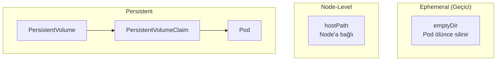
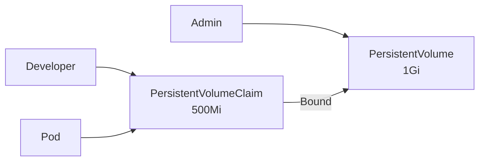

# Lab 06: Volumes & PersistentVolumes

## 🎯 Öğrenme Hedefleri
- Volume türlerini anlamak
- emptyDir ve hostPath kullanmak
- PersistentVolume (PV) ve PersistentVolumeClaim (PVC)
- K3s Local Path Provisioner

---

## 📖 Volume Türleri



| Tür | Yaşam Süresi | Kullanım |
|-----|--------------|----------|
| **emptyDir** | Pod ile birlikte | Geçici cache, container arası paylaşım |
| **hostPath** | Node'a bağlı | Test, özel durumlar |
| **PV/PVC** | Bağımsız | Kalıcı veri |

---

## 🔨 Pratik Alıştırmalar

### Alıştırma 1: emptyDir

**Görev:** İki container arası veri paylaşımı.

<details>
<summary>✅ Çözüm</summary>

```yaml
apiVersion: v1
kind: Pod
metadata:
  name: emptydir-pod
spec:
  containers:
  - name: writer
    image: busybox
    command: ["sh", "-c", "echo Merhaba > /data/msg && sleep 3600"]
    volumeMounts:
    - name: shared
      mountPath: /data
  - name: reader
    image: busybox
    command: ["sh", "-c", "cat /data/msg && sleep 3600"]
    volumeMounts:
    - name: shared
      mountPath: /data
  volumes:
  - name: shared
    emptyDir: {}
```

```bash
kubectl apply -f emptydir-pod.yaml
kubectl logs emptydir-pod -c reader
```
</details>

---

### Alıştırma 2: hostPath

⚠️ Production'da dikkatli kullan!

<details>
<summary>✅ Çözüm</summary>

```yaml
apiVersion: v1
kind: Pod
metadata:
  name: hostpath-pod
spec:
  containers:
  - name: app
    image: busybox
    command: ["sh", "-c", "ls /host && sleep 3600"]
    volumeMounts:
    - name: hostdir
      mountPath: /host
  volumes:
  - name: hostdir
    hostPath:
      path: /tmp/k3s-test
      type: DirectoryOrCreate
```
</details>

---

### Alıştırma 3: PersistentVolume Oluştur



<details>
<summary>✅ Çözüm</summary>

```yaml
apiVersion: v1
kind: PersistentVolume
metadata:
  name: my-pv
spec:
  capacity:
    storage: 1Gi
  accessModes:
  - ReadWriteOnce
  persistentVolumeReclaimPolicy: Retain
  hostPath:
    path: /tmp/pv-data
```

```bash
kubectl apply -f my-pv.yaml
kubectl get pv
```
</details>

---

### Alıştırma 4: PersistentVolumeClaim

<details>
<summary>✅ Çözüm</summary>

```yaml
apiVersion: v1
kind: PersistentVolumeClaim
metadata:
  name: my-pvc
spec:
  accessModes:
  - ReadWriteOnce
  resources:
    requests:
      storage: 500Mi
```

```bash
kubectl apply -f my-pvc.yaml
kubectl get pvc
kubectl get pv  # STATUS: Bound
```
</details>

---

### Alıştırma 5: PVC Kullanan Pod

<details>
<summary>✅ Çözüm</summary>

```yaml
apiVersion: v1
kind: Pod
metadata:
  name: pvc-pod
spec:
  containers:
  - name: app
    image: busybox
    command: ["sh", "-c", "echo Kalıcı veri > /data/test && cat /data/test && sleep 3600"]
    volumeMounts:
    - name: storage
      mountPath: /data
  volumes:
  - name: storage
    persistentVolumeClaim:
      claimName: my-pvc
```
</details>

---

### Alıştırma 6: K3s Local Path Provisioner

K3s otomatik olarak **local-path** StorageClass sağlar!

<details>
<summary>✅ Çözüm</summary>

```bash
# StorageClass'ları listele
kubectl get storageclass
```

Dinamik PVC (PV otomatik oluşur):
```yaml
apiVersion: v1
kind: PersistentVolumeClaim
metadata:
  name: dynamic-pvc
spec:
  accessModes:
  - ReadWriteOnce
  storageClassName: local-path  # K3s default
  resources:
    requests:
      storage: 1Gi
```

```bash
kubectl apply -f dynamic-pvc.yaml
kubectl get pvc
kubectl get pv  # Otomatik oluştu!
```
</details>

---

### Access Modes

| Mode | Kısaltma | Açıklama |
|------|----------|----------|
| ReadWriteOnce | RWO | Tek node read/write |
| ReadOnlyMany | ROX | Çok node read-only |
| ReadWriteMany | RWX | Çok node read/write |

---

## 🎯 Sınav Pratiği

### Senaryo 1
> `data-pod` oluştur, `/app/cache` dizinine emptyDir mount et.

<details>
<summary>✅ Çözüm</summary>

```yaml
apiVersion: v1
kind: Pod
metadata:
  name: data-pod
spec:
  containers:
  - name: app
    image: busybox
    command: ["sleep", "3600"]
    volumeMounts:
    - name: cache
      mountPath: /app/cache
  volumes:
  - name: cache
    emptyDir: {}
```
</details>

---

### Senaryo 2
> 2Gi PV ve 1Gi PVC oluştur, pod ile kullan.

<details>
<summary>✅ Çözüm</summary>

```yaml
# pv.yaml
apiVersion: v1
kind: PersistentVolume
metadata:
  name: task-pv
spec:
  capacity:
    storage: 2Gi
  accessModes:
  - ReadWriteOnce
  hostPath:
    path: /tmp/task-data
---
# pvc.yaml
apiVersion: v1
kind: PersistentVolumeClaim
metadata:
  name: task-pvc
spec:
  accessModes:
  - ReadWriteOnce
  resources:
    requests:
      storage: 1Gi
```
</details>

---

## 🧹 Temizlik

```bash
kubectl delete pod --all
kubectl delete pvc --all
kubectl delete pv --all
```

---

## ✅ Öğrendiklerimiz

- [x] emptyDir volume
- [x] hostPath volume
- [x] PV ve PVC oluşturma
- [x] K3s local-path provisioner
- [x] Access modes

---

[⬅️ Lab 05](lab-05-configmaps-secrets.md) | [Lab 07: Jobs ➡️](lab-07-jobs-cronjobs.md)
