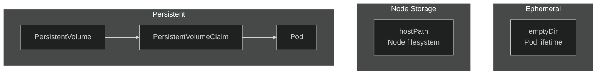

# Lab 06: Volumes & PersistentVolumes

## 🎯 Learning Objectives
- Understand volume types
- Use emptyDir and hostPath
- Create PersistentVolume and PersistentVolumeClaim
- K3s local-path provisioner

---

## 📖 Volume Types



| Type | Lifetime | Use Case |
|------|----------|----------|
| **emptyDir** | Pod lifetime | Temp files, cache |
| **hostPath** | Node lifetime | Testing only |
| **PV/PVC** | Independent | Production data |

---

## 🔨 Hands-on Exercises

### Exercise 1: emptyDir

**Task:** Create a pod with emptyDir volume shared between containers.

<details>
<summary>✅ Solution</summary>

```yaml
apiVersion: v1
kind: Pod
metadata:
  name: emptydir-pod
spec:
  containers:
  - name: writer
    image: busybox
    command: ["sh", "-c", "echo 'Hello' > /data/file.txt && sleep 3600"]
    volumeMounts:
    - name: shared-data
      mountPath: /data
  
  - name: reader
    image: busybox
    command: ["sh", "-c", "cat /data/file.txt && sleep 3600"]
    volumeMounts:
    - name: shared-data
      mountPath: /data
  
  volumes:
  - name: shared-data
    emptyDir: {}
```
</details>

---

### Exercise 2: hostPath

**Task:** Mount node's `/tmp` directory into a pod.

<details>
<summary>✅ Solution</summary>

```yaml
apiVersion: v1
kind: Pod
metadata:
  name: hostpath-pod
spec:
  containers:
  - name: app
    image: busybox
    command: ["sleep", "3600"]
    volumeMounts:
    - name: host-volume
      mountPath: /host-data
  volumes:
  - name: host-volume
    hostPath:
      path: /tmp
      type: Directory
```

⚠️ **Warning:** hostPath is not recommended for production!
</details>

---

### Exercise 3: PersistentVolume (Static)

**Task:** Create a PersistentVolume.

<details>
<summary>✅ Solution</summary>

```yaml
apiVersion: v1
kind: PersistentVolume
metadata:
  name: my-pv
spec:
  capacity:
    storage: 1Gi
  accessModes:
    - ReadWriteOnce
  hostPath:
    path: /tmp/my-pv
---
apiVersion: v1
kind: PersistentVolumeClaim
metadata:
  name: my-pvc
spec:
  accessModes:
    - ReadWriteOnce
  resources:
    requests:
      storage: 500Mi
```

```bash
kubectl apply -f pv-pvc.yaml
kubectl get pv
kubectl get pvc
```
</details>

---

### Exercise 4: Use PVC in Pod

<details>
<summary>✅ Solution</summary>

```yaml
apiVersion: v1
kind: Pod
metadata:
  name: pvc-pod
spec:
  containers:
  - name: app
    image: nginx
    volumeMounts:
    - name: data
      mountPath: /usr/share/nginx/html
  volumes:
  - name: data
    persistentVolumeClaim:
      claimName: my-pvc
```
</details>

---

### Exercise 5: K3s Dynamic Provisioning

K3s includes `local-path` provisioner for automatic PV creation.

<details>
<summary>✅ Solution</summary>

```yaml
apiVersion: v1
kind: PersistentVolumeClaim
metadata:
  name: dynamic-pvc
spec:
  accessModes:
    - ReadWriteOnce
  storageClassName: local-path  # K3s default
  resources:
    requests:
      storage: 1Gi
```

```bash
kubectl apply -f dynamic-pvc.yaml
kubectl get pvc
# Status will be Bound automatically!
```
</details>

---

### Exercise 6: Access Modes

| Mode | Description |
|------|-------------|
| **ReadWriteOnce (RWO)** | Single node read/write |
| **ReadOnlyMany (ROX)** | Multiple nodes read-only |
| **ReadWriteMany (RWX)** | Multiple nodes read/write |

---

## 🎯 Exam Practice

### Scenario 1
> Create a pod with emptyDir volume mounted at `/cache`.

<details>
<summary>✅ Solution</summary>

```yaml
apiVersion: v1
kind: Pod
metadata:
  name: cache-pod
spec:
  containers:
  - name: app
    image: nginx
    volumeMounts:
    - name: cache-vol
      mountPath: /cache
  volumes:
  - name: cache-vol
    emptyDir: {}
```
</details>

---

### Scenario 2
> Create PVC named `data-pvc` requesting 2Gi storage.

<details>
<summary>✅ Solution</summary>

```yaml
apiVersion: v1
kind: PersistentVolumeClaim
metadata:
  name: data-pvc
spec:
  accessModes:
    - ReadWriteOnce
  resources:
    requests:
      storage: 2Gi
```
</details>

---

## 🧹 Cleanup

```bash
kubectl delete pod emptydir-pod hostpath-pod pvc-pod cache-pod --ignore-not-found
kubectl delete pvc my-pvc dynamic-pvc data-pvc --ignore-not-found
kubectl delete pv my-pv --ignore-not-found
```

---

## ✅ What We Learned

- [x] emptyDir for temporary storage
- [x] hostPath for node storage
- [x] PersistentVolume and PersistentVolumeClaim
- [x] Dynamic provisioning with StorageClass
- [x] K3s local-path provisioner

---

[⬅️ Lab 05](lab-05-configmaps-secrets.md) | [Lab 07: Jobs & CronJobs ➡️](lab-07-jobs-cronjobs.md)
