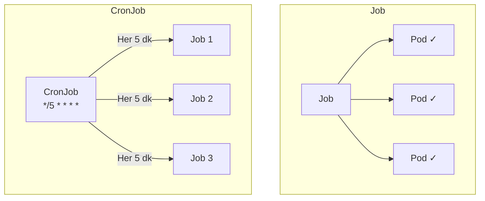
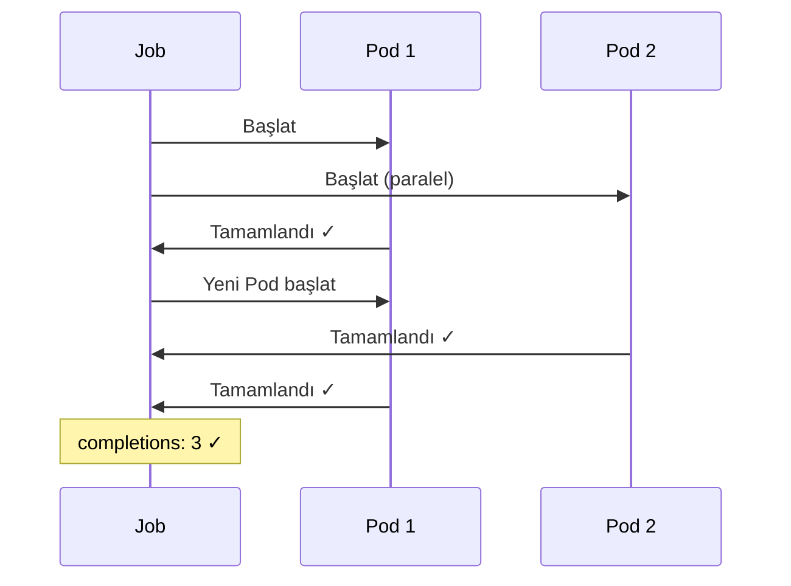
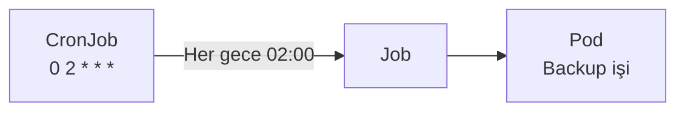

# Lab 07: Jobs & CronJobs

## 🎯 Öğrenme Hedefleri
- Job oluşturmak ve yönetmek
- CronJob oluşturmak
- Parallelism ve completions

---

## 📖 Job vs CronJob



| Kaynak | Açıklama |
|--------|----------|
| **Job** | Bir kez çalışıp biten görev |
| **CronJob** | Zamanlanmış tekrarlayan görev |

---

## 🔨 Job Alıştırmaları

### Alıştırma 1: Basit Job

**Görev:** Pi sayısını hesaplayan job oluştur.

<details>
<summary>✅ Çözüm</summary>

```bash
kubectl create job pi-job --image=perl:5.34 -- perl -Mbignum=bpi -wle 'print bpi(100)'
```

Kontrol:
```bash
kubectl get jobs
kubectl get pods
kubectl logs <pod-adı>
```
</details>

---

### Alıştırma 2: Job YAML

**Görev:** 3 kez başarılı tamamlanması gereken job oluştur.



<details>
<summary>✅ Çözüm</summary>

```yaml
apiVersion: batch/v1
kind: Job
metadata:
  name: multi-job
spec:
  completions: 3       # Toplam kaç başarılı
  parallelism: 2       # Aynı anda kaç pod
  backoffLimit: 4      # Max retry
  template:
    spec:
      containers:
      - name: worker
        image: busybox
        command: ["sh", "-c", "echo İş $(date) && sleep 5"]
      restartPolicy: Never
```

```bash
kubectl apply -f multi-job.yaml
kubectl get jobs -w
kubectl get pods -w
```
</details>

---

### Alıştırma 3: Başarısız Job

**Görev:** Başarısız olan job'ın davranışını gözlemle.

<details>
<summary>✅ Çözüm</summary>

```yaml
apiVersion: batch/v1
kind: Job
metadata:
  name: fail-job
spec:
  backoffLimit: 2  # 2 retry sonra dur
  template:
    spec:
      containers:
      - name: fail
        image: busybox
        command: ["sh", "-c", "exit 1"]  # Hep başarısız
      restartPolicy: Never
```

```bash
kubectl apply -f fail-job.yaml
kubectl get pods  # Birden fazla pod (retry)
kubectl describe job fail-job
```
</details>

---

### Alıştırma 4: Job Silme

<details>
<summary>✅ Çözüm</summary>

```bash
# Job ve pod'larını sil
kubectl delete job pi-job

# Tüm job'ları sil
kubectl delete jobs --all
```
</details>

---

## 🔨 CronJob Alıştırmaları

### Alıştırma 5: CronJob Oluştur

**Görev:** Her dakika çalışan cronjob oluştur.

<details>
<summary>✅ Çözüm</summary>

```bash
kubectl create cronjob hello-cron --image=busybox --schedule="*/1 * * * *" -- echo "Merhaba $(date)"
```

Kontrol:
```bash
kubectl get cronjobs
kubectl get jobs -w  # 1 dk bekle
```
</details>

---

### Alıştırma 6: CronJob YAML



<details>
<summary>✅ Çözüm</summary>

```yaml
apiVersion: batch/v1
kind: CronJob
metadata:
  name: backup-cron
spec:
  schedule: "0 2 * * *"  # Her gün 02:00
  successfulJobsHistoryLimit: 3
  failedJobsHistoryLimit: 1
  jobTemplate:
    spec:
      template:
        spec:
          containers:
          - name: backup
            image: busybox
            command: ["sh", "-c", "echo Backup $(date)"]
          restartPolicy: OnFailure
```
</details>

---

### Cron Format

```
┌───────────── dakika (0 - 59)
│ ┌───────────── saat (0 - 23)
│ │ ┌───────────── gün (1 - 31)
│ │ │ ┌───────────── ay (1 - 12)
│ │ │ │ ┌───────────── haftanın günü (0 - 6)
│ │ │ │ │
* * * * *
```

| Örnek | Açıklama |
|-------|----------|
| `*/5 * * * *` | Her 5 dakikada |
| `0 * * * *` | Her saat başı |
| `0 0 * * *` | Her gece 00:00 |
| `0 2 * * 0` | Her Pazar 02:00 |

---

## 🎯 Sınav Pratiği

### Senaryo 1
> `math-job` adında job oluştur: `expr 5 + 3` çalıştırsın.

<details>
<summary>✅ Çözüm</summary>

```bash
kubectl create job math-job --image=busybox -- expr 5 + 3
kubectl logs job/math-job
```
</details>

---

### Senaryo 2
> Her 10 dakikada çalışan `cleanup` cronjob oluştur.

<details>
<summary>✅ Çözüm</summary>

```bash
kubectl create cronjob cleanup --image=busybox --schedule="*/10 * * * *" -- echo "Cleanup done"
```
</details>

---

## 🧹 Temizlik

```bash
kubectl delete job --all
kubectl delete cronjob --all
```

---

## ✅ Öğrendiklerimiz

- [x] Job oluşturma
- [x] completions ve parallelism
- [x] CronJob oluşturma
- [x] Cron schedule formatı

---

[⬅️ Lab 06](lab-06-volumes.md) | [Lab 08: Probes ➡️](lab-08-probes.md)
