# Lab 07: Jobs & CronJobs

## 🎯 Learning Objectives
- Understand Jobs for one-time tasks
- Understand CronJobs for scheduled tasks
- Parallelism and completions
- Cron syntax

---

## 📖 Job vs CronJob

```mermaid
%%{init: {'theme': 'dark'}}%%
graph LR
    JOB[Job<br/>Run once] --> POD1[Pod]
    POD1 --> |Completed| DONE[✓ Done]
    
    CRON[CronJob<br/>Schedule] --> |Every X time| JOB2[Job]
    JOB2 --> POD2[Pod]
```



| Resource | Use Case |
|----------|----------|
| **Job** | Batch processing, one-time tasks |
| **CronJob** | Scheduled backups, reports |

---

## 🔨 Job Exercises

### Exercise 1: Simple Job

**Task:** Create a Job that prints "Hello CKAD" and exits.

<details>
<summary>✅ Solution</summary>

```bash
kubectl create job hello-job --image=busybox -- echo "Hello CKAD"
```

Check:
```bash
kubectl get jobs
kubectl get pods
kubectl logs <pod-name>
```
</details>

---

### Exercise 2: Job YAML

<details>
<summary>✅ Solution</summary>

```yaml
apiVersion: batch/v1
kind: Job
metadata:
  name: pi-job
spec:
  template:
    spec:
      containers:
      - name: pi
        image: perl
        command: ["perl", "-Mbignum=bpi", "-wle", "print bpi(100)"]
      restartPolicy: Never
  backoffLimit: 4
```
</details>

---

### Exercise 3: Job with Completions

**Task:** Create a Job that runs 5 times.

<details>
<summary>✅ Solution</summary>

```yaml
apiVersion: batch/v1
kind: Job
metadata:
  name: multi-job
spec:
  completions: 5      # Run 5 times
  parallelism: 2      # 2 at a time
  template:
    spec:
      containers:
      - name: worker
        image: busybox
        command: ["sh", "-c", "echo Processing && sleep 5"]
      restartPolicy: Never
```
</details>

---

### Exercise 4: Job Cleanup

<details>
<summary>✅ Solution</summary>

```yaml
spec:
  ttlSecondsAfterFinished: 60  # Auto-delete after 60s
```
</details>

---

## 🔨 CronJob Exercises

### Exercise 5: Simple CronJob

**Task:** Create a CronJob that runs every minute.

<details>
<summary>✅ Solution</summary>

```bash
kubectl create cronjob minute-cron --image=busybox --schedule="* * * * *" -- date
```

Check:
```bash
kubectl get cronjobs
kubectl get jobs  # A new job each minute
```
</details>

---

### Exercise 6: Cron Syntax

```
┌───────────── minute (0 - 59)
│ ┌───────────── hour (0 - 23)
│ │ ┌───────────── day of month (1 - 31)
│ │ │ ┌───────────── month (1 - 12)
│ │ │ │ ┌───────────── day of week (0 - 6)
│ │ │ │ │
* * * * *
```

| Schedule | Meaning |
|----------|---------|
| `* * * * *` | Every minute |
| `0 * * * *` | Every hour |
| `0 0 * * *` | Every day at midnight |
| `0 0 * * 0` | Every Sunday |
| `*/5 * * * *` | Every 5 minutes |

---

### Exercise 7: CronJob YAML

<details>
<summary>✅ Solution</summary>

```yaml
apiVersion: batch/v1
kind: CronJob
metadata:
  name: backup-cron
spec:
  schedule: "0 2 * * *"  # 2 AM daily
  jobTemplate:
    spec:
      template:
        spec:
          containers:
          - name: backup
            image: busybox
            command: ["sh", "-c", "echo Backup at $(date)"]
          restartPolicy: OnFailure
```
</details>

---

### Exercise 8: Concurrency Policy

| Policy | Behavior |
|--------|----------|
| **Allow** | Multiple jobs can run |
| **Forbid** | Skip if previous running |
| **Replace** | Replace previous job |

<details>
<summary>✅ Solution</summary>

```yaml
spec:
  concurrencyPolicy: Forbid
```
</details>

---

## 🎯 Exam Practice

### Scenario 1
> Create a Job named `count-job` that counts from 1 to 10.

<details>
<summary>✅ Solution</summary>

```bash
kubectl create job count-job --image=busybox -- sh -c "for i in $(seq 1 10); do echo $i; done"
```
</details>

---

### Scenario 2
> Create a CronJob named `report-cron` that runs every 5 minutes.

<details>
<summary>✅ Solution</summary>

```bash
kubectl create cronjob report-cron --image=busybox --schedule="*/5 * * * *" -- echo "Report generated"
```
</details>

---

## 🧹 Cleanup

```bash
kubectl delete job --all
kubectl delete cronjob --all
```

---

## ✅ What We Learned

- [x] Create Jobs
- [x] Completions and parallelism
- [x] Create CronJobs
- [x] Cron syntax
- [x] Concurrency policies

---

[⬅️ Lab 06](lab-06-volumes.md) | [Lab 08: Probes ➡️](lab-08-probes.md)
