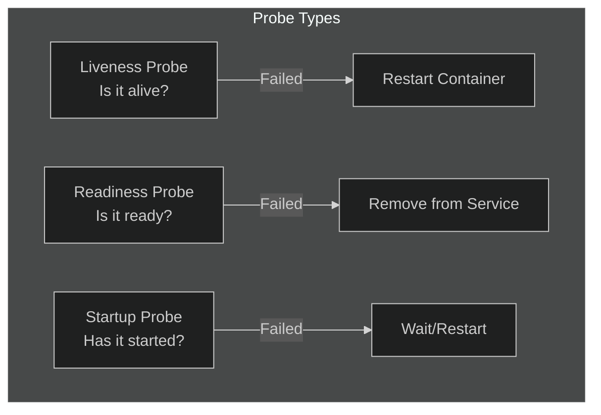

# Lab 08: Liveness & Readiness Probes

## 🎯 Learning Objectives
- Understand probe types
- Implement Liveness probes
- Implement Readiness probes
- Startup probes

---

## 📖 Probe Types



| Probe | Question | Action on Failure |
|-------|----------|-------------------|
| **Liveness** | Is the app alive? | Restart container |
| **Readiness** | Is the app ready? | Remove from Service endpoints |
| **Startup** | Has the app started? | Block other probes |

---

## 🔨 Hands-on Exercises

### Exercise 1: HTTP Liveness Probe

**Task:** Create a pod with HTTP liveness probe.

<details>
<summary>✅ Solution</summary>

```yaml
apiVersion: v1
kind: Pod
metadata:
  name: liveness-http
spec:
  containers:
  - name: app
    image: nginx
    livenessProbe:
      httpGet:
        path: /
        port: 80
      initialDelaySeconds: 5
      periodSeconds: 10
```
</details>

---

### Exercise 2: TCP Liveness Probe

<details>
<summary>✅ Solution</summary>

```yaml
apiVersion: v1
kind: Pod
metadata:
  name: liveness-tcp
spec:
  containers:
  - name: app
    image: redis
    livenessProbe:
      tcpSocket:
        port: 6379
      initialDelaySeconds: 5
      periodSeconds: 10
```
</details>

---

### Exercise 3: Exec Liveness Probe

**Task:** Run a command to check health.

<details>
<summary>✅ Solution</summary>

```yaml
apiVersion: v1
kind: Pod
metadata:
  name: liveness-exec
spec:
  containers:
  - name: app
    image: busybox
    command: ["sh", "-c", "touch /tmp/healthy && sleep 3600"]
    livenessProbe:
      exec:
        command:
        - cat
        - /tmp/healthy
      initialDelaySeconds: 5
      periodSeconds: 5
```
</details>

---

### Exercise 4: Readiness Probe

**Task:** Pod only receives traffic when ready.

<details>
<summary>✅ Solution</summary>

```yaml
apiVersion: v1
kind: Pod
metadata:
  name: readiness-pod
spec:
  containers:
  - name: app
    image: nginx
    readinessProbe:
      httpGet:
        path: /
        port: 80
      initialDelaySeconds: 5
      periodSeconds: 5
```
</details>

---

### Exercise 5: Both Probes

<details>
<summary>✅ Solution</summary>

```yaml
apiVersion: v1
kind: Pod
metadata:
  name: full-probe
spec:
  containers:
  - name: app
    image: nginx
    livenessProbe:
      httpGet:
        path: /healthz
        port: 80
      initialDelaySeconds: 10
      periodSeconds: 15
    readinessProbe:
      httpGet:
        path: /ready
        port: 80
      initialDelaySeconds: 5
      periodSeconds: 5
```
</details>

---

### Exercise 6: Probe Parameters

| Parameter | Description | Default |
|-----------|-------------|---------|
| `initialDelaySeconds` | Wait before first probe | 0 |
| `periodSeconds` | How often to probe | 10 |
| `timeoutSeconds` | Timeout for probe | 1 |
| `successThreshold` | Min successes for success | 1 |
| `failureThreshold` | Min failures for failure | 3 |

---

### Exercise 7: Startup Probe

For slow-starting applications.

<details>
<summary>✅ Solution</summary>

```yaml
apiVersion: v1
kind: Pod
metadata:
  name: slow-start
spec:
  containers:
  - name: app
    image: nginx
    startupProbe:
      httpGet:
        path: /
        port: 80
      failureThreshold: 30
      periodSeconds: 10
    livenessProbe:
      httpGet:
        path: /
        port: 80
      periodSeconds: 10
```
</details>

---

## 🎯 Exam Practice

### Scenario 1
> Create a pod `web-health` with HTTP liveness probe on port 80, path `/health`.

<details>
<summary>✅ Solution</summary>

```yaml
apiVersion: v1
kind: Pod
metadata:
  name: web-health
spec:
  containers:
  - name: web
    image: nginx
    livenessProbe:
      httpGet:
        path: /health
        port: 80
```
</details>

---

### Scenario 2
> Add readiness probe to existing pod checking TCP port 3306.

<details>
<summary>✅ Solution</summary>

```yaml
readinessProbe:
  tcpSocket:
    port: 3306
  initialDelaySeconds: 5
  periodSeconds: 10
```
</details>

---

## 🧹 Cleanup

```bash
kubectl delete pod liveness-http liveness-tcp liveness-exec readiness-pod full-probe slow-start web-health --ignore-not-found
```

---

## ✅ What We Learned

- [x] Liveness vs Readiness vs Startup probes
- [x] HTTP, TCP, and Exec probe types
- [x] Probe parameters
- [x] When to use each probe type

---

[⬅️ Lab 07](lab-07-jobs-cronjobs.md) | [Lab 09: Resource Limits ➡️](lab-09-resource-limits.md)
