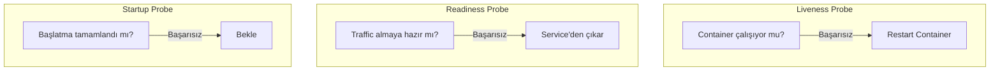
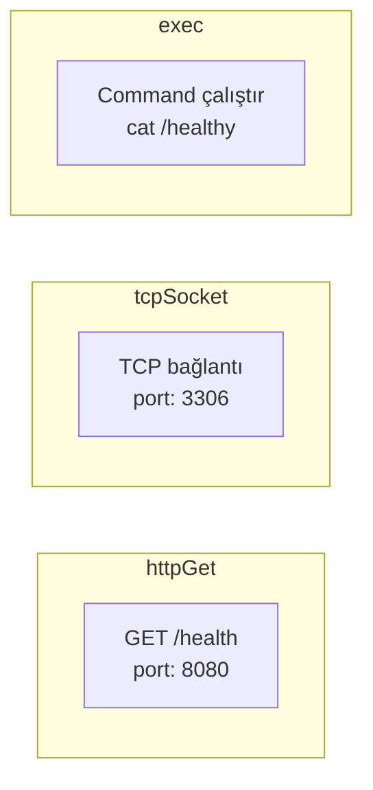

# Lab 08: Liveness & Readiness Probes

## 🎯 Öğrenme Hedefleri
- Probe türlerini anlamak
- Liveness, Readiness, Startup probes
- HTTP, TCP, Command probe yöntemleri

---

## 📖 Probe Türleri



| Probe | Amaç | Başarısızlıkta |
|-------|------|----------------|
| **Liveness** | Container sağlıklı mı? | Restart |
| **Readiness** | Traffic alabilir mi? | Service'den çıkar |
| **Startup** | Başlatma bitti mi? | Bekle (yavaş app'ler) |

---

## 📖 Probe Yöntemleri



---

## 🔨 Pratik Alıştırmalar

### Alıştırma 1: HTTP Liveness Probe

**Görev:** HTTP endpoint kontrol eden liveness probe ekle.

<details>
<summary>✅ Çözüm</summary>

```yaml
apiVersion: v1
kind: Pod
metadata:
  name: liveness-http
spec:
  containers:
  - name: app
    image: nginx
    livenessProbe:
      httpGet:
        path: /
        port: 80
      initialDelaySeconds: 5
      periodSeconds: 10
      timeoutSeconds: 1
      failureThreshold: 3
```

```bash
kubectl apply -f liveness-http.yaml
kubectl describe pod liveness-http
```
</details>

---

### Alıştırma 2: Command Liveness Probe

**Görev:** Dosya varlığını kontrol eden probe.

<details>
<summary>✅ Çözüm</summary>

```yaml
apiVersion: v1
kind: Pod
metadata:
  name: liveness-exec
spec:
  containers:
  - name: app
    image: busybox
    command: ["sh", "-c", "touch /tmp/healthy && sleep 3600"]
    livenessProbe:
      exec:
        command:
        - cat
        - /tmp/healthy
      initialDelaySeconds: 5
      periodSeconds: 5
```

Test - dosyayı sil ve gözlemle:
```bash
kubectl exec liveness-exec -- rm /tmp/healthy
kubectl get pod liveness-exec -w  # Restart olacak
```
</details>

---

### Alıştırma 3: TCP Probe

**Görev:** TCP port kontrolü yapan probe.

<details>
<summary>✅ Çözüm</summary>

```yaml
apiVersion: v1
kind: Pod
metadata:
  name: tcp-probe
spec:
  containers:
  - name: redis
    image: redis
    livenessProbe:
      tcpSocket:
        port: 6379
      initialDelaySeconds: 5
      periodSeconds: 10
```
</details>

---

### Alıştırma 4: Readiness Probe

**Görev:** Pod hazır olana kadar traffic almayan probe.

<details>
<summary>✅ Çözüm</summary>

```yaml
apiVersion: v1
kind: Pod
metadata:
  name: readiness-pod
  labels:
    app: web
spec:
  containers:
  - name: app
    image: nginx
    readinessProbe:
      httpGet:
        path: /
        port: 80
      initialDelaySeconds: 3
      periodSeconds: 5
```

```bash
kubectl apply -f readiness-pod.yaml
kubectl get pods  # READY sütununa bak

# Service oluştur
kubectl expose pod readiness-pod --port=80

# Endpoints kontrol
kubectl get endpoints
```
</details>

---

### Alıştırma 5: Her İki Probe Birlikte

<details>
<summary>✅ Çözüm</summary>

```yaml
apiVersion: v1
kind: Pod
metadata:
  name: probes-pod
spec:
  containers:
  - name: app
    image: nginx
    ports:
    - containerPort: 80
    readinessProbe:
      httpGet:
        path: /
        port: 80
      initialDelaySeconds: 3
      periodSeconds: 5
    livenessProbe:
      httpGet:
        path: /
        port: 80
      initialDelaySeconds: 10
      periodSeconds: 10
```
</details>

---

### Probe Parametreleri

| Parametre | Açıklama | Varsayılan |
|-----------|----------|------------|
| `initialDelaySeconds` | İlk kontrol öncesi bekleme | 0 |
| `periodSeconds` | Kontrol aralığı | 10 |
| `timeoutSeconds` | Timeout | 1 |
| `successThreshold` | Kaç başarı gerekli | 1 |
| `failureThreshold` | Kaç başarısızlık | 3 |

---

## 🎯 Sınav Pratiği

### Senaryo 1
> `webapp` pod oluştur (nginx). Liveness: HTTP GET `/`, port 80, 15s delay.

<details>
<summary>✅ Çözüm</summary>

```yaml
apiVersion: v1
kind: Pod
metadata:
  name: webapp
spec:
  containers:
  - name: nginx
    image: nginx
    livenessProbe:
      httpGet:
        path: /
        port: 80
      initialDelaySeconds: 15
```
</details>

---

### Senaryo 2
> `api-pod` oluştur. Readiness probe: TCP port 8080 kontrolü.

<details>
<summary>✅ Çözüm</summary>

```yaml
apiVersion: v1
kind: Pod
metadata:
  name: api-pod
spec:
  containers:
  - name: api
    image: nginx
    readinessProbe:
      tcpSocket:
        port: 80
      initialDelaySeconds: 5
```
</details>

---

## 🧹 Temizlik

```bash
kubectl delete pod --all
```

---

## ✅ Öğrendiklerimiz

- [x] Liveness vs Readiness farkı
- [x] httpGet, tcpSocket, exec yöntemleri
- [x] Probe parametreleri
- [x] Probe davranışları

---

[⬅️ Lab 07](lab-07-jobs-cronjobs.md) | [Lab 09: Resources ➡️](lab-09-resource-limits.md)
