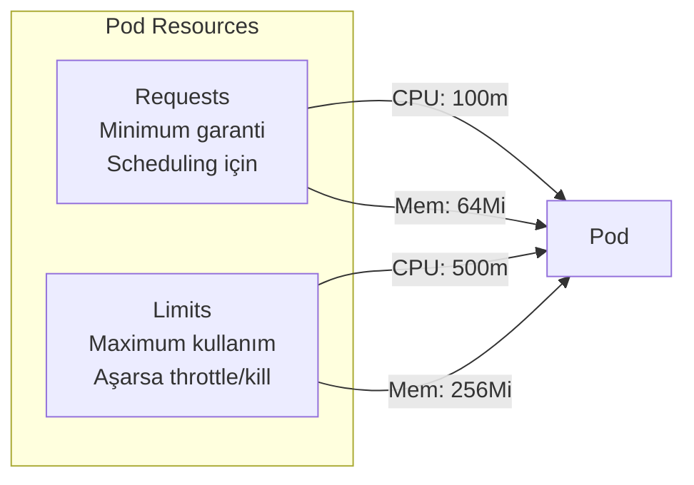
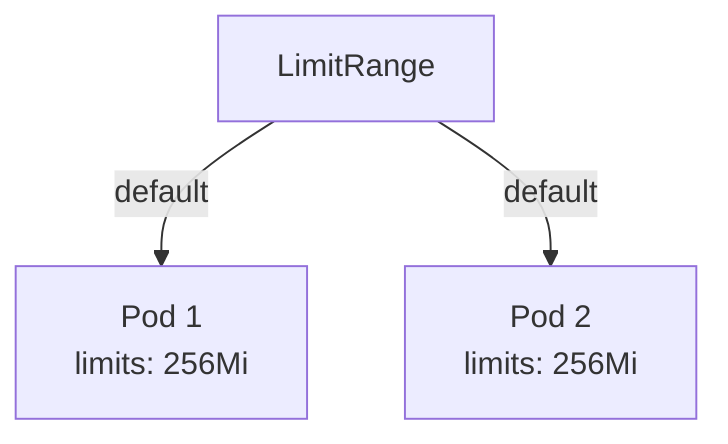

# Lab 09: Resource Limits & Requests

## 🎯 Öğrenme Hedefleri
- Resource requests ve limits anlamak
- CPU ve Memory ayarları
- LimitRange ve ResourceQuota

---

## 📖 Requests vs Limits



| Kavram | Açıklama | Aşılırsa |
|--------|----------|----------|
| **Requests** | Minimum garanti | - |
| **Limits (CPU)** | Max CPU | Throttle |
| **Limits (Memory)** | Max RAM | OOMKilled |

---

## 📖 Birimler

**CPU:**
- `1` = 1 CPU core
- `500m` = 0.5 CPU (500 millicores)
- `100m` = 0.1 CPU

**Memory:**
- `1Gi` = 1 Gibibyte
- `512Mi` = 512 Mebibyte
- `128Mi` = 128 Mebibyte

---

## 🔨 Pratik Alıştırmalar

### Alıştırma 1: Basic Resources

**Görev:** CPU ve memory limitleri olan pod oluştur.

<details>
<summary>✅ Çözüm</summary>

```yaml
apiVersion: v1
kind: Pod
metadata:
  name: resource-pod
spec:
  containers:
  - name: app
    image: nginx
    resources:
      requests:
        memory: "64Mi"
        cpu: "100m"
      limits:
        memory: "128Mi"
        cpu: "200m"
```

```bash
kubectl apply -f resource-pod.yaml
kubectl describe pod resource-pod | grep -A5 Limits
```
</details>

---

### Alıştırma 2: Memory Limit Test

**Görev:** Memory limitini aşan pod gözlemle.

<details>
<summary>✅ Çözüm</summary>

```yaml
apiVersion: v1
kind: Pod
metadata:
  name: mem-stress
spec:
  containers:
  - name: stress
    image: polinux/stress
    resources:
      limits:
        memory: "50Mi"
    command: ["stress"]
    args: ["--vm", "1", "--vm-bytes", "100M", "--vm-hang", "1"]
```

```bash
kubectl apply -f mem-stress.yaml
kubectl get pod mem-stress -w  # OOMKilled olacak
```
</details>

---

### Alıştırma 3: LimitRange

**Görev:** Namespace için default resource limitleri belirle.



<details>
<summary>✅ Çözüm</summary>

```yaml
apiVersion: v1
kind: LimitRange
metadata:
  name: default-limits
spec:
  limits:
  - default:
      memory: "256Mi"
      cpu: "500m"
    defaultRequest:
      memory: "128Mi"
      cpu: "100m"
    type: Container
```

```bash
kubectl apply -f default-limits.yaml

# Yeni pod oluştur (resources belirtmeden)
kubectl run test --image=nginx

# Default değerleri gör
kubectl describe pod test | grep -A5 Limits
```
</details>

---

### Alıştırma 4: ResourceQuota

**Görev:** Namespace için toplam resource kotası belirle.

<details>
<summary>✅ Çözüm</summary>

```yaml
apiVersion: v1
kind: ResourceQuota
metadata:
  name: compute-quota
spec:
  hard:
    requests.cpu: "2"
    requests.memory: "2Gi"
    limits.cpu: "4"
    limits.memory: "4Gi"
    pods: "10"
```

```bash
kubectl apply -f compute-quota.yaml
kubectl describe quota compute-quota
```
</details>

---

### Alıştırma 5: Kota Durumunu Kontrol

<details>
<summary>✅ Çözüm</summary>

```bash
# Mevcut kullanımı gör
kubectl describe quota compute-quota

# veya
kubectl get quota compute-quota -o yaml
```
</details>

---

## 🎯 Sınav Pratiği

### Senaryo 1
> `stress-pod` oluştur. CPU request: 100m, limit: 200m. Memory request: 64Mi, limit: 128Mi.

<details>
<summary>✅ Çözüm</summary>

```yaml
apiVersion: v1
kind: Pod
metadata:
  name: stress-pod
spec:
  containers:
  - name: nginx
    image: nginx
    resources:
      requests:
        cpu: "100m"
        memory: "64Mi"
      limits:
        cpu: "200m"
        memory: "128Mi"
```
</details>

---

### Senaryo 2
> Mevcut `resource-pod` un CPU limit'ini `300m` olarak güncelle.

<details>
<summary>✅ Çözüm</summary>

```bash
kubectl edit pod resource-pod
# resources.limits.cpu değiştir

# veya yeniden oluştur (pod resources değiştirilemez)
kubectl delete pod resource-pod
# YAML'ı düzenle ve apply
```

Not: Pod resources update edilemez, yeniden oluşturulmalı!
</details>

---

## 🧹 Temizlik

```bash
kubectl delete pod --all
kubectl delete limitrange --all
kubectl delete resourcequota --all
```

---

## ✅ Öğrendiklerimiz

- [x] Requests vs Limits farkı
- [x] CPU/Memory birimleri
- [x] LimitRange
- [x] ResourceQuota

---

[⬅️ Lab 08](lab-08-probes.md) | [Lab 10: Network Policies ➡️](lab-10-network-policies.md)
