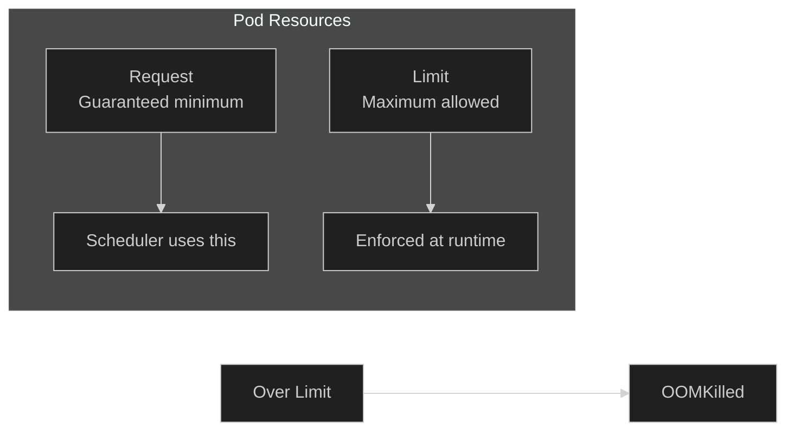

# Lab 09: Resource Limits & Requests

## 🎯 Learning Objectives
- Understand CPU and Memory requests/limits
- Configure resource constraints
- LimitRange and ResourceQuota

---

## 📖 Requests vs Limits



| Concept | Description |
|---------|-------------|
| **Request** | Minimum guaranteed resources |
| **Limit** | Maximum allowed resources |

---

## 🔨 Hands-on Exercises

### Exercise 1: Set Resource Requests and Limits

<details>
<summary>✅ Solution</summary>

```yaml
apiVersion: v1
kind: Pod
metadata:
  name: resource-pod
spec:
  containers:
  - name: app
    image: nginx
    resources:
      requests:
        memory: "64Mi"
        cpu: "250m"      # 0.25 CPU
      limits:
        memory: "128Mi"
        cpu: "500m"      # 0.5 CPU
```
</details>

---

### Exercise 2: CPU Units

| Value | Meaning |
|-------|---------|
| `1` | 1 full CPU |
| `500m` | 0.5 CPU (500 millicores) |
| `100m` | 0.1 CPU |

---

### Exercise 3: Memory Units

| Value | Meaning |
|-------|---------|
| `128Mi` | 128 Mebibytes |
| `1Gi` | 1 Gibibyte |
| `500M` | 500 Megabytes |

---

### Exercise 4: LimitRange

**Task:** Set default limits for a namespace.

<details>
<summary>✅ Solution</summary>

```yaml
apiVersion: v1
kind: LimitRange
metadata:
  name: default-limits
spec:
  limits:
  - default:          # Default limits
      cpu: "500m"
      memory: "256Mi"
    defaultRequest:   # Default requests
      cpu: "100m"
      memory: "64Mi"
    max:              # Maximum allowed
      cpu: "1"
      memory: "1Gi"
    min:              # Minimum allowed
      cpu: "50m"
      memory: "32Mi"
    type: Container
```
</details>

---

### Exercise 5: ResourceQuota

**Task:** Limit total resources in a namespace.

<details>
<summary>✅ Solution</summary>

```yaml
apiVersion: v1
kind: ResourceQuota
metadata:
  name: ns-quota
spec:
  hard:
    requests.cpu: "2"
    requests.memory: "2Gi"
    limits.cpu: "4"
    limits.memory: "4Gi"
    pods: "10"
```

```bash
kubectl apply -f quota.yaml
kubectl describe quota ns-quota
```
</details>

---

### Exercise 6: View Resource Usage

<details>
<summary>✅ Solution</summary>

```bash
# Pod resources
kubectl top pods

# Node resources
kubectl top nodes

# Describe pod for limits
kubectl describe pod <pod-name> | grep -A5 "Limits"
```
</details>

---

## 🎯 Exam Practice

### Scenario 1
> Create a pod with 100m CPU request and 200m CPU limit.

<details>
<summary>✅ Solution</summary>

```yaml
apiVersion: v1
kind: Pod
metadata:
  name: cpu-pod
spec:
  containers:
  - name: app
    image: nginx
    resources:
      requests:
        cpu: "100m"
      limits:
        cpu: "200m"
```
</details>

---

### Scenario 2
> Create ResourceQuota limiting namespace to 5 pods.

<details>
<summary>✅ Solution</summary>

```yaml
apiVersion: v1
kind: ResourceQuota
metadata:
  name: pod-quota
spec:
  hard:
    pods: "5"
```
</details>

---

## 🧹 Cleanup

```bash
kubectl delete pod resource-pod cpu-pod --ignore-not-found
kubectl delete limitrange default-limits --ignore-not-found
kubectl delete quota ns-quota pod-quota --ignore-not-found
```

---

## ✅ What We Learned

- [x] CPU and Memory units
- [x] Requests vs Limits
- [x] LimitRange for defaults
- [x] ResourceQuota for namespace limits

---

[⬅️ Lab 08](lab-08-probes.md) | [Lab 10: Network Policies ➡️](lab-10-network-policies.md)
