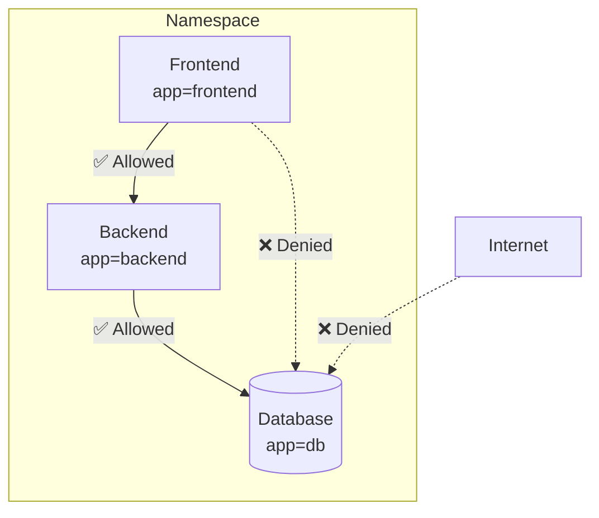
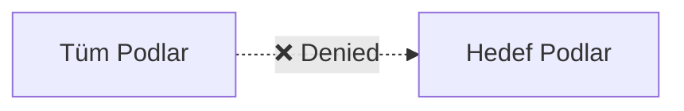
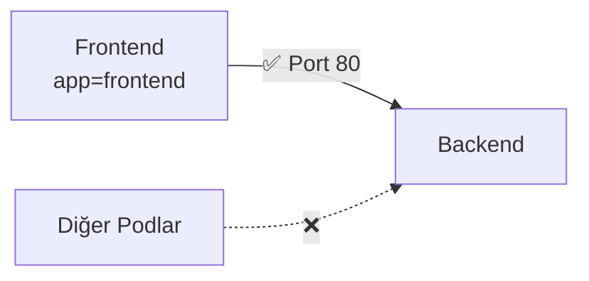
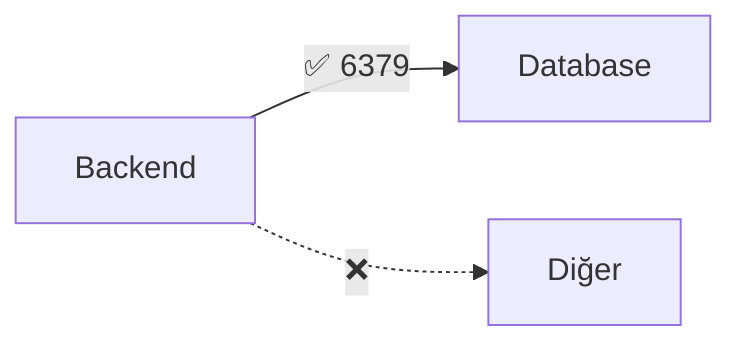

# Lab 10: Network Policies

## 🎯 Öğrenme Hedefleri
- NetworkPolicy nedir anlamak
- Ingress ve Egress kuralları
- Pod izolasyonu
- K3s'te NetworkPolicy

---

## 📖 NetworkPolicy Nedir?



**NetworkPolicy**, pod'lar arası ağ trafiğini kontrol eden firewall kurallarıdır.

- **Ingress**: Gelen trafik
- **Egress**: Giden trafik

---

## 📖 K3s NetworkPolicy

K3s varsayılan olarak **Flannel CNI** kullanır. NetworkPolicy için:

```bash
# K3s NetworkPolicy desteğini kontrol et
kubectl get pods -n kube-system | grep network
```

> ⚠️ Flannel varsayılanda NetworkPolicy desteklemez. K3s kurulumunda `--flannel-backend=none` ile Calico/Cilium kullanılabilir.

---

## 🔨 Pratik Alıştırmalar

### Hazırlık: Test Ortamı

```bash
# Frontend pod
kubectl run frontend --image=nginx --labels=app=frontend --port=80

# Backend pod  
kubectl run backend --image=nginx --labels=app=backend --port=80

# Database pod
kubectl run db --image=redis --labels=app=db

# Service'ler
kubectl expose pod frontend --port=80
kubectl expose pod backend --port=80
kubectl expose pod db --port=6379
```

Test (policy olmadan):
```bash
# Frontend'den backend'e
kubectl exec frontend -- curl -s --max-time 2 backend

# Frontend'den db'ye
kubectl exec frontend -- nc -zv db 6379
```

---

### Alıştırma 1: Default Deny All

**Görev:** Tüm ingress trafiğini engelle.



<details>
<summary>✅ Çözüm</summary>

```yaml
apiVersion: networking.k8s.io/v1
kind: NetworkPolicy
metadata:
  name: default-deny-ingress
spec:
  podSelector: {}  # Tüm pod'lara uygulanır
  policyTypes:
  - Ingress
```

```bash
kubectl apply -f default-deny.yaml

# Test - artık erişilemez
kubectl exec frontend -- curl -s --max-time 2 backend
# Timeout!
```
</details>

---

### Alıştırma 2: Belirli Pod'dan İzin Ver

**Görev:** Sadece frontend'den backend'e erişime izin ver.



<details>
<summary>✅ Çözüm</summary>

```yaml
apiVersion: networking.k8s.io/v1
kind: NetworkPolicy
metadata:
  name: allow-frontend-to-backend
spec:
  podSelector:
    matchLabels:
      app: backend
  policyTypes:
  - Ingress
  ingress:
  - from:
    - podSelector:
        matchLabels:
          app: frontend
    ports:
    - protocol: TCP
      port: 80
```

```bash
kubectl apply -f allow-frontend.yaml

# Frontend'den erişim var
kubectl exec frontend -- curl -s --max-time 2 backend

# Başka pod'dan yok
kubectl exec db -- curl -s --max-time 2 backend
```
</details>

---

### Alıştırma 3: Egress Kuralı

**Görev:** Backend sadece db'ye çıkabilsin.



<details>
<summary>✅ Çözüm</summary>

```yaml
apiVersion: networking.k8s.io/v1
kind: NetworkPolicy
metadata:
  name: backend-egress
spec:
  podSelector:
    matchLabels:
      app: backend
  policyTypes:
  - Egress
  egress:
  - to:
    - podSelector:
        matchLabels:
          app: db
    ports:
    - protocol: TCP
      port: 6379
```
</details>

---

### Alıştırma 4: Namespace Bazlı İzin

**Görev:** Belirli namespace'den gelen trafiğe izin ver.

<details>
<summary>✅ Çözüm</summary>

```yaml
apiVersion: networking.k8s.io/v1
kind: NetworkPolicy
metadata:
  name: allow-from-prod
spec:
  podSelector:
    matchLabels:
      app: db
  policyTypes:
  - Ingress
  ingress:
  - from:
    - namespaceSelector:
        matchLabels:
          env: production
```
</details>

---

### Alıştırma 5: IP Block

**Görev:** Belirli IP aralığından erişime izin ver.

<details>
<summary>✅ Çözüm</summary>

```yaml
apiVersion: networking.k8s.io/v1
kind: NetworkPolicy
metadata:
  name: allow-external
spec:
  podSelector:
    matchLabels:
      app: frontend
  policyTypes:
  - Ingress
  ingress:
  - from:
    - ipBlock:
        cidr: 10.0.0.0/8
        except:
        - 10.0.1.0/24
```
</details>

---

## 🎯 Sınav Pratiği

### Senaryo 1
> `app=web` pod'larına sadece `app=api` pod'larından port 80 erişimine izin ver.

<details>
<summary>✅ Çözüm</summary>

```yaml
apiVersion: networking.k8s.io/v1
kind: NetworkPolicy
metadata:
  name: web-policy
spec:
  podSelector:
    matchLabels:
      app: web
  policyTypes:
  - Ingress
  ingress:
  - from:
    - podSelector:
        matchLabels:
          app: api
    ports:
    - port: 80
```
</details>

---

### Senaryo 2
> Tüm egress trafiğini engelle, sadece DNS'e (port 53) izin ver.

<details>
<summary>✅ Çözüm</summary>

```yaml
apiVersion: networking.k8s.io/v1
kind: NetworkPolicy
metadata:
  name: allow-dns-only
spec:
  podSelector: {}
  policyTypes:
  - Egress
  egress:
  - ports:
    - protocol: UDP
      port: 53
    - protocol: TCP
      port: 53
```
</details>

---

## 🧹 Temizlik

```bash
kubectl delete networkpolicy --all
kubectl delete pod --all
kubectl delete svc frontend backend db
```

---

## ✅ Tüm Labları Tamamladın! 🎉

- [x] Ingress kuralları
- [x] Egress kuralları
- [x] podSelector ve namespaceSelector
- [x] Default deny pattern

---

[⬅️ Lab 09](lab-09-resource-limits.md) | [Lab 11: Security ➡️](lab-11-security.md)
