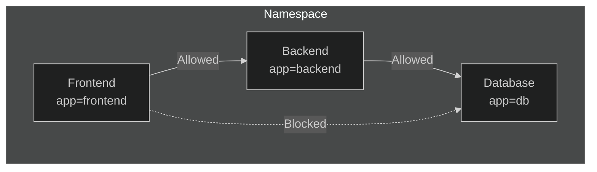

# Lab 10: Network Policies

## 🎯 Learning Objectives
- Understand NetworkPolicy
- Ingress and Egress rules
- Allow/Deny traffic between pods

---

## 📖 What is NetworkPolicy?



| Concept | Description |
|---------|-------------|
| **NetworkPolicy** | Firewall rules for pods |
| **Ingress** | Incoming traffic rules |
| **Egress** | Outgoing traffic rules |

> ⚠️ **K3s Note:** Default Flannel CNI has limited NetworkPolicy support. Consider Calico for full support.

---

## 🔨 Hands-on Exercises

### Exercise 1: Default Deny All

**Task:** Block all traffic to pods.

<details open>
<summary>✅ Solution</summary>

```yaml
apiVersion: networking.k8s.io/v1
kind: NetworkPolicy
metadata:
  name: default-deny-all
spec:
  podSelector: {}    # Apply to all pods
  policyTypes:
  - Ingress
  - Egress
```
</details>

---

### Exercise 2: Allow Specific Pod

**Task:** Allow traffic from frontend to backend.

<details open>
<summary>✅ Solution</summary>

```yaml
apiVersion: networking.k8s.io/v1
kind: NetworkPolicy
metadata:
  name: backend-allow-frontend
spec:
  podSelector:
    matchLabels:
      app: backend
  policyTypes:
  - Ingress
  ingress:
  - from:
    - podSelector:
        matchLabels:
          app: frontend
    ports:
    - protocol: TCP
      port: 80
```
</details>

---

### Exercise 3: Allow Namespace

**Task:** Allow traffic from specific namespace.

<details open>
<summary>✅ Solution</summary>

```yaml
apiVersion: networking.k8s.io/v1
kind: NetworkPolicy
metadata:
  name: allow-namespace
spec:
  podSelector:
    matchLabels:
      app: api
  ingress:
  - from:
    - namespaceSelector:
        matchLabels:
          name: production
```
</details>

---

### Exercise 4: Allow DNS (Egress)

**Task:** Allow DNS resolution.

<details open>
<summary>✅ Solution</summary>

```yaml
apiVersion: networking.k8s.io/v1
kind: NetworkPolicy
metadata:
  name: allow-dns
spec:
  podSelector: {}
  policyTypes:
  - Egress
  egress:
  - to:
    - namespaceSelector: {}
    ports:
    - protocol: UDP
      port: 53
```
</details>

---

### Exercise 5: Combined Rules

<details open>
<summary>✅ Solution</summary>

```yaml
apiVersion: networking.k8s.io/v1
kind: NetworkPolicy
metadata:
  name: db-policy
spec:
  podSelector:
    matchLabels:
      app: db
  policyTypes:
  - Ingress
  - Egress
  ingress:
  - from:
    - podSelector:
        matchLabels:
          app: backend
    ports:
    - port: 5432
  egress:
  - to:
    - podSelector:
        matchLabels:
          app: backend
```
</details>

---

## 🎯 Exam Practice

### Scenario 1
> Create NetworkPolicy that allows ingress to pods labeled `app=web` only from pods labeled `app=api` on port 80.

<details open>
<summary>✅ Solution</summary>

```yaml
apiVersion: networking.k8s.io/v1
kind: NetworkPolicy
metadata:
  name: web-allow-api
spec:
  podSelector:
    matchLabels:
      app: web
  policyTypes:
  - Ingress
  ingress:
  - from:
    - podSelector:
        matchLabels:
          app: api
    ports:
    - port: 80
```
</details>

---

### Scenario 2
> Create default deny egress policy for all pods.

<details open>
<summary>✅ Solution</summary>

```yaml
apiVersion: networking.k8s.io/v1
kind: NetworkPolicy
metadata:
  name: deny-egress
spec:
  podSelector: {}
  policyTypes:
  - Egress
```
</details>

---

## 🧹 Cleanup

```bash
kubectl delete networkpolicy --all
```

---

## ✅ What We Learned

- [x] NetworkPolicy basics
- [x] Ingress and Egress rules
- [x] Pod and namespace selectors
- [x] Default deny patterns

---

[⬅️ Lab 09](lab-09-resource-limits.md) | [Lab 11: Security ➡️](lab-11-security.md)
