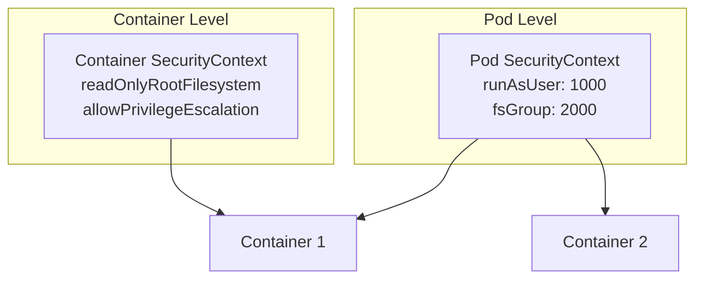
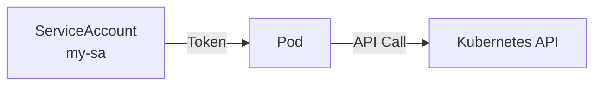

# Lab 11: Security Context & Service Accounts

## 🎯 Öğrenme Hedefleri
- SecurityContext anlamak ve uygulamak
- ServiceAccount oluşturmak ve kullanmak
- Pod güvenlik ayarları

---

## 📖 SecurityContext Nedir?



| Seviye | Uygulama | Örnekler |
|--------|----------|----------|
| **Pod** | Tüm container'lara | runAsUser, fsGroup |
| **Container** | Tek container'a | capabilities, readOnly |

---

## 🔨 SecurityContext Alıştırmaları

### Alıştırma 1: runAsUser

**Görev:** Root olmayan kullanıcı ile çalışan pod oluştur.

<details>
<summary>✅ Çözüm</summary>

```yaml
apiVersion: v1
kind: Pod
metadata:
  name: security-pod
spec:
  securityContext:
    runAsUser: 1000
    runAsGroup: 3000
    fsGroup: 2000
  containers:
  - name: app
    image: busybox
    command: ["sh", "-c", "id && sleep 3600"]
```

```bash
kubectl apply -f security-pod.yaml
kubectl logs security-pod
# uid=1000 gid=3000 groups=2000
```
</details>

---

### Alıştırma 2: readOnlyRootFilesystem

**Görev:** Root filesystem'i readonly yapan pod oluştur.

<details>
<summary>✅ Çözüm</summary>

```yaml
apiVersion: v1
kind: Pod
metadata:
  name: readonly-pod
spec:
  containers:
  - name: app
    image: busybox
    command: ["sh", "-c", "sleep 3600"]
    securityContext:
      readOnlyRootFilesystem: true
    volumeMounts:
    - name: tmp
      mountPath: /tmp
  volumes:
  - name: tmp
    emptyDir: {}
```

```bash
kubectl apply -f readonly-pod.yaml

# Yazma dene (başarısız olmalı)
kubectl exec readonly-pod -- touch /test.txt
# Read-only file system

# /tmp'ye yazabilir
kubectl exec readonly-pod -- touch /tmp/test.txt
```
</details>

---

### Alıştırma 3: Capabilities

**Görev:** NET_ADMIN capability ekle.

<details>
<summary>✅ Çözüm</summary>

```yaml
apiVersion: v1
kind: Pod
metadata:
  name: cap-pod
spec:
  containers:
  - name: app
    image: busybox
    command: ["sleep", "3600"]
    securityContext:
      capabilities:
        add: ["NET_ADMIN", "SYS_TIME"]
        drop: ["ALL"]
```
</details>

---

### Alıştırma 4: allowPrivilegeEscalation

**Görev:** Privilege escalation'ı engelle.

<details>
<summary>✅ Çözüm</summary>

```yaml
apiVersion: v1
kind: Pod
metadata:
  name: no-escalate-pod
spec:
  containers:
  - name: app
    image: busybox
    command: ["sleep", "3600"]
    securityContext:
      allowPrivilegeEscalation: false
      runAsNonRoot: true
      runAsUser: 1000
```
</details>

---

## 🔨 ServiceAccount Alıştırmaları

### Alıştırma 5: ServiceAccount Oluştur



**Görev:** Yeni bir ServiceAccount oluştur.

<details>
<summary>✅ Çözüm</summary>

```bash
kubectl create serviceaccount my-sa
```

veya YAML:
```yaml
apiVersion: v1
kind: ServiceAccount
metadata:
  name: my-sa
```

Kontrol:
```bash
kubectl get sa
kubectl describe sa my-sa
```
</details>

---

### Alıştırma 6: Pod'a ServiceAccount Ata

**Görev:** Oluşturduğun ServiceAccount'u kullanan pod oluştur.

<details>
<summary>✅ Çözüm</summary>

```yaml
apiVersion: v1
kind: Pod
metadata:
  name: sa-pod
spec:
  serviceAccountName: my-sa
  containers:
  - name: app
    image: busybox
    command: ["sleep", "3600"]
```

```bash
kubectl apply -f sa-pod.yaml

# ServiceAccount'u kontrol et
kubectl exec sa-pod -- cat /var/run/secrets/kubernetes.io/serviceaccount/token
```
</details>

---

### Alıştırma 7: automountServiceAccountToken

**Görev:** Token'ı otomatik mount etmeyi kapat.

<details>
<summary>✅ Çözüm</summary>

```yaml
apiVersion: v1
kind: Pod
metadata:
  name: no-token-pod
spec:
  serviceAccountName: my-sa
  automountServiceAccountToken: false
  containers:
  - name: app
    image: busybox
    command: ["sleep", "3600"]
```
</details>

---

## 🎯 Sınav Pratiği

### Senaryo 1 ⭐
> `secure-pod` oluştur: user 1000, group 3000, readOnlyRootFilesystem: true

<details>
<summary>✅ Çözüm</summary>

```yaml
apiVersion: v1
kind: Pod
metadata:
  name: secure-pod
spec:
  securityContext:
    runAsUser: 1000
    runAsGroup: 3000
  containers:
  - name: app
    image: busybox
    command: ["sleep", "3600"]
    securityContext:
      readOnlyRootFilesystem: true
```
</details>

---

### Senaryo 2 ⭐
> `backend-sa` adında ServiceAccount oluştur. Bu SA'yı kullanan `backend` pod oluştur.

<details>
<summary>✅ Çözüm</summary>

```bash
kubectl create sa backend-sa
```

```yaml
apiVersion: v1
kind: Pod
metadata:
  name: backend
spec:
  serviceAccountName: backend-sa
  containers:
  - name: app
    image: nginx
```
</details>

---

## 🧹 Temizlik

```bash
kubectl delete pod --all
kubectl delete sa my-sa backend-sa --ignore-not-found
```

---

## ✅ Öğrendiklerimiz

- [x] Pod ve Container SecurityContext
- [x] runAsUser, runAsGroup, fsGroup
- [x] readOnlyRootFilesystem
- [x] Capabilities (add/drop)
- [x] ServiceAccount oluşturma
- [x] Pod'a ServiceAccount atama

---

[⬅️ Lab 10](lab-10-network-policies.md) | [Lab 12: Ingress ➡️](lab-12-ingress.md)
