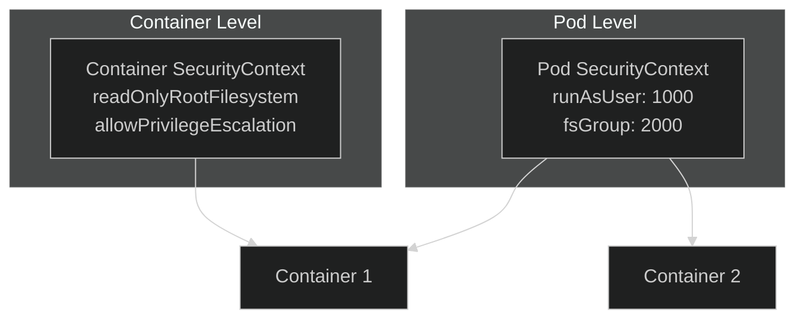

# Lab 11: Security Context & Service Accounts

## 🎯 Learning Objectives
- Understand and apply SecurityContext
- Create and use ServiceAccounts
- Pod security settings

---

## 📖 What is SecurityContext?



---

## 🔨 SecurityContext Exercises

### Exercise 1: runAsUser

**Task:** Create a pod running as non-root user.

<details>
<summary>✅ Solution</summary>

```yaml
apiVersion: v1
kind: Pod
metadata:
  name: security-pod
spec:
  securityContext:
    runAsUser: 1000
    runAsGroup: 3000
    fsGroup: 2000
  containers:
  - name: app
    image: busybox
    command: ["sh", "-c", "id && sleep 3600"]
```

```bash
kubectl apply -f security-pod.yaml
kubectl logs security-pod
# uid=1000 gid=3000 groups=2000
```
</details>

---

### Exercise 2: readOnlyRootFilesystem

<details>
<summary>✅ Solution</summary>

```yaml
apiVersion: v1
kind: Pod
metadata:
  name: readonly-pod
spec:
  containers:
  - name: app
    image: busybox
    command: ["sh", "-c", "sleep 3600"]
    securityContext:
      readOnlyRootFilesystem: true
    volumeMounts:
    - name: tmp
      mountPath: /tmp
  volumes:
  - name: tmp
    emptyDir: {}
```
</details>

---

### Exercise 3: Capabilities

<details>
<summary>✅ Solution</summary>

```yaml
apiVersion: v1
kind: Pod
metadata:
  name: cap-pod
spec:
  containers:
  - name: app
    image: busybox
    command: ["sleep", "3600"]
    securityContext:
      capabilities:
        add: ["NET_ADMIN", "SYS_TIME"]
        drop: ["ALL"]
```
</details>

---

### Exercise 4: allowPrivilegeEscalation

<details>
<summary>✅ Solution</summary>

```yaml
apiVersion: v1
kind: Pod
metadata:
  name: no-escalate-pod
spec:
  containers:
  - name: app
    image: busybox
    command: ["sleep", "3600"]
    securityContext:
      allowPrivilegeEscalation: false
      runAsNonRoot: true
      runAsUser: 1000
```
</details>

---

## 🔨 ServiceAccount Exercises

### Exercise 5: Create ServiceAccount

<details>
<summary>✅ Solution</summary>

```bash
kubectl create serviceaccount my-sa
```

Check:
```bash
kubectl get sa
kubectl describe sa my-sa
```
</details>

---

### Exercise 6: Use ServiceAccount in Pod

<details>
<summary>✅ Solution</summary>

```yaml
apiVersion: v1
kind: Pod
metadata:
  name: sa-pod
spec:
  serviceAccountName: my-sa
  containers:
  - name: app
    image: busybox
    command: ["sleep", "3600"]
```
</details>

---

### Exercise 7: Disable Token Mount

<details>
<summary>✅ Solution</summary>

```yaml
apiVersion: v1
kind: Pod
metadata:
  name: no-token-pod
spec:
  serviceAccountName: my-sa
  automountServiceAccountToken: false
  containers:
  - name: app
    image: busybox
    command: ["sleep", "3600"]
```
</details>

---

## 🎯 Exam Practice

### Scenario 1
> Create a pod running as user 1000, group 3000, with readOnlyRootFilesystem.

<details>
<summary>✅ Solution</summary>

```yaml
apiVersion: v1
kind: Pod
metadata:
  name: secure-pod
spec:
  securityContext:
    runAsUser: 1000
    runAsGroup: 3000
  containers:
  - name: app
    image: busybox
    command: ["sleep", "3600"]
    securityContext:
      readOnlyRootFilesystem: true
```
</details>

---

### Scenario 2
> Create ServiceAccount `backend-sa` and use it in a pod named `backend`.

<details>
<summary>✅ Solution</summary>

```bash
kubectl create sa backend-sa
```

```yaml
apiVersion: v1
kind: Pod
metadata:
  name: backend
spec:
  serviceAccountName: backend-sa
  containers:
  - name: app
    image: nginx
```
</details>

---

## 🧹 Cleanup

```bash
kubectl delete pod --all
kubectl delete sa my-sa backend-sa --ignore-not-found
```

---

## ✅ What We Learned

- [x] Pod and Container SecurityContext
- [x] runAsUser, runAsGroup, fsGroup
- [x] readOnlyRootFilesystem
- [x] Capabilities (add/drop)
- [x] ServiceAccount creation and usage

---

[⬅️ Lab 10](lab-10-network-policies.md) | [Lab 12: Ingress ➡️](lab-12-ingress.md)
