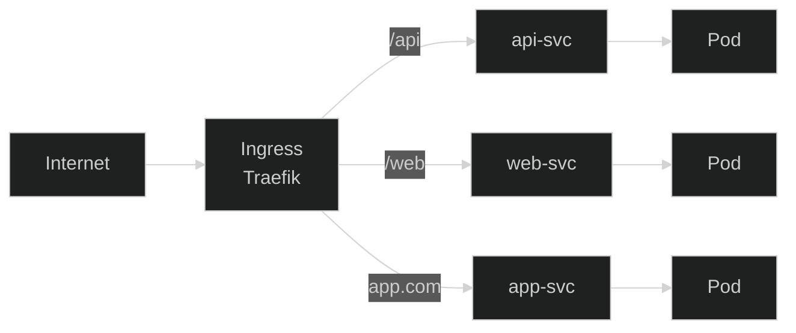

# Lab 12: Ingress (K3s Traefik)

## 🎯 Learning Objectives
- Understand Ingress
- K3s Traefik Ingress Controller
- Path-based and Host-based routing
- TLS configuration

---

## 📖 What is Ingress?



K3s comes with **Traefik** Ingress Controller by default!

---

## 🔨 Hands-on Exercises

### Setup: Create Test Apps

```bash
kubectl create deployment app1 --image=nginx --port=80
kubectl expose deployment app1 --port=80

kubectl create deployment app2 --image=httpd --port=80
kubectl expose deployment app2 --port=80
```

---

### Exercise 1: Simple Ingress

**Task:** Create path-based routing.

<details open>
<summary>✅ Solution</summary>

```yaml
apiVersion: networking.k8s.io/v1
kind: Ingress
metadata:
  name: simple-ingress
spec:
  rules:
  - http:
      paths:
      - path: /app1
        pathType: Prefix
        backend:
          service:
            name: app1
            port:
              number: 80
      - path: /app2
        pathType: Prefix
        backend:
          service:
            name: app2
            port:
              number: 80
```
</details>

---

### Exercise 2: Host-Based Routing

<details open>
<summary>✅ Solution</summary>

```yaml
apiVersion: networking.k8s.io/v1
kind: Ingress
metadata:
  name: host-ingress
spec:
  rules:
  - host: app1.local
    http:
      paths:
      - path: /
        pathType: Prefix
        backend:
          service:
            name: app1
            port:
              number: 80
  - host: app2.local
    http:
      paths:
      - path: /
        pathType: Prefix
        backend:
          service:
            name: app2
            port:
              number: 80
```

Test:
```bash
curl -H "Host: app1.local" http://<NODE_IP>
```
</details>

---

### Exercise 3: pathType Options

| pathType | Description |
|----------|-------------|
| `Prefix` | Prefix match: `/api` → `/api`, `/api/v1` |
| `Exact` | Exact match: `/api` → only `/api` |

---

### Exercise 4: Default Backend

<details open>
<summary>✅ Solution</summary>

```yaml
apiVersion: networking.k8s.io/v1
kind: Ingress
metadata:
  name: default-ingress
spec:
  defaultBackend:
    service:
      name: app1
      port:
        number: 80
  rules:
  - http:
      paths:
      - path: /special
        pathType: Prefix
        backend:
          service:
            name: app2
            port:
              number: 80
```
</details>

---

### Exercise 5: TLS Ingress

<details open>
<summary>✅ Solution</summary>

Create TLS secret:
```bash
openssl req -x509 -nodes -days 365 -newkey rsa:2048 \
  -keyout tls.key -out tls.crt -subj "/CN=myapp.local"

kubectl create secret tls myapp-tls --cert=tls.crt --key=tls.key
```

TLS Ingress:
```yaml
apiVersion: networking.k8s.io/v1
kind: Ingress
metadata:
  name: tls-ingress
spec:
  tls:
  - hosts:
    - myapp.local
    secretName: myapp-tls
  rules:
  - host: myapp.local
    http:
      paths:
      - path: /
        pathType: Prefix
        backend:
          service:
            name: app1
            port:
              number: 80
```
</details>

---

## 🎯 Exam Practice

### Scenario 1
> Create Ingress for path `/web` routing to `webapp` service on port 80.

<details open>
<summary>✅ Solution</summary>

```yaml
apiVersion: networking.k8s.io/v1
kind: Ingress
metadata:
  name: webapp-ingress
spec:
  rules:
  - http:
      paths:
      - path: /web
        pathType: Prefix
        backend:
          service:
            name: webapp
            port:
              number: 80
```
</details>

---

## 🧹 Cleanup

```bash
kubectl delete ingress --all
kubectl delete deployment app1 app2
kubectl delete svc app1 app2
kubectl delete secret myapp-tls --ignore-not-found
rm -f tls.key tls.crt
```

---

## ✅ What We Learned

- [x] Ingress resource creation
- [x] Path-based routing
- [x] Host-based routing
- [x] pathType (Prefix, Exact)
- [x] TLS configuration

---

[⬅️ Lab 11](lab-11-security.md) | [Lab 13: Debugging ➡️](lab-13-debugging.md)
