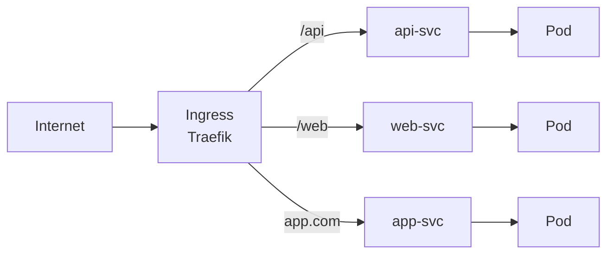
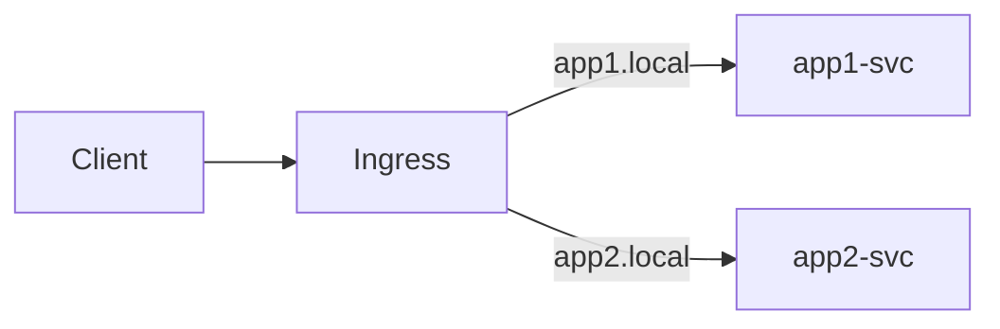

# Lab 12: Ingress (K3s Traefik)

## 🎯 Öğrenme Hedefleri
- Ingress nedir anlamak
- K3s Traefik Ingress Controller
- Path-based ve Host-based routing
- TLS yapılandırması

---

## 📖 Ingress Nedir?



| Kavram | Açıklama |
|--------|----------|
| **Ingress** | HTTP/HTTPS routing kuralları |
| **Ingress Controller** | Kuralları uygulayan bileşen (Traefik, Nginx) |

K3s varsayılan olarak **Traefik** Ingress Controller ile gelir!

---

## 🔨 Hazırlık

### K3s Traefik Kontrol

```bash
# Traefik pod'larını kontrol et
kubectl get pods -n kube-system | grep traefik

# Traefik service
kubectl get svc -n kube-system | grep traefik
```

### Test Uygulamaları Oluştur

```bash
# App 1
kubectl create deployment app1 --image=nginx --port=80
kubectl expose deployment app1 --port=80

# App 2
kubectl create deployment app2 --image=httpd --port=80
kubectl expose deployment app2 --port=80
```

---

## 🔨 Pratik Alıştırmalar

### Alıştırma 1: Basit Ingress

**Görev:** Path-based routing yapan Ingress oluştur.

<details>
<summary>✅ Çözüm</summary>

```yaml
apiVersion: networking.k8s.io/v1
kind: Ingress
metadata:
  name: simple-ingress
spec:
  rules:
  - http:
      paths:
      - path: /app1
        pathType: Prefix
        backend:
          service:
            name: app1
            port:
              number: 80
      - path: /app2
        pathType: Prefix
        backend:
          service:
            name: app2
            port:
              number: 80
```

```bash
kubectl apply -f simple-ingress.yaml
kubectl get ingress
```

Test:
```bash
# Node IP'sini bul
kubectl get nodes -o wide

# Test et
curl http://<NODE_IP>/app1
curl http://<NODE_IP>/app2
```
</details>

---

### Alıştırma 2: Host-Based Routing



**Görev:** Farklı hostname'lere göre yönlendirme yap.

<details>
<summary>✅ Çözüm</summary>

```yaml
apiVersion: networking.k8s.io/v1
kind: Ingress
metadata:
  name: host-ingress
spec:
  rules:
  - host: app1.local
    http:
      paths:
      - path: /
        pathType: Prefix
        backend:
          service:
            name: app1
            port:
              number: 80
  - host: app2.local
    http:
      paths:
      - path: /
        pathType: Prefix
        backend:
          service:
            name: app2
            port:
              number: 80
```

Test:
```bash
# /etc/hosts'a ekle (veya curl --header kullan)
curl -H "Host: app1.local" http://<NODE_IP>
curl -H "Host: app2.local" http://<NODE_IP>
```
</details>

---

### Alıştırma 3: pathType Farkları

| pathType | Açıklama | Örnek |
|----------|----------|-------|
| `Prefix` | Prefix match | `/api` → `/api`, `/api/v1` |
| `Exact` | Tam eşleşme | `/api` → sadece `/api` |
| `ImplementationSpecific` | Controller'a bağlı | - |

<details>
<summary>✅ Çözüm</summary>

```yaml
apiVersion: networking.k8s.io/v1
kind: Ingress
metadata:
  name: pathtype-ingress
spec:
  rules:
  - http:
      paths:
      - path: /exact
        pathType: Exact
        backend:
          service:
            name: app1
            port:
              number: 80
      - path: /prefix
        pathType: Prefix
        backend:
          service:
            name: app2
            port:
              number: 80
```
</details>

---

### Alıştırma 4: Default Backend

**Görev:** Eşleşmeyen istekler için default backend ayarla.

<details>
<summary>✅ Çözüm</summary>

```yaml
apiVersion: networking.k8s.io/v1
kind: Ingress
metadata:
  name: default-ingress
spec:
  defaultBackend:
    service:
      name: app1
      port:
        number: 80
  rules:
  - http:
      paths:
      - path: /special
        pathType: Prefix
        backend:
          service:
            name: app2
            port:
              number: 80
```
</details>

---

### Alıştırma 5: Ingress Annotations

K3s Traefik için bazı faydalı annotation'lar:

<details>
<summary>✅ Çözüm</summary>

```yaml
apiVersion: networking.k8s.io/v1
kind: Ingress
metadata:
  name: annotated-ingress
  annotations:
    # URL rewrite
    traefik.ingress.kubernetes.io/rewrite-target: /
    # Rate limiting
    traefik.ingress.kubernetes.io/rate-limit: "100"
spec:
  rules:
  - http:
      paths:
      - path: /api
        pathType: Prefix
        backend:
          service:
            name: app1
            port:
              number: 80
```
</details>

---

### Alıştırma 6: TLS Ingress

**Görev:** HTTPS için TLS secret oluştur ve Ingress'e ekle.

<details>
<summary>✅ Çözüm</summary>

TLS secret oluştur:
```bash
# Self-signed certificate (test için)
openssl req -x509 -nodes -days 365 -newkey rsa:2048 \
  -keyout tls.key -out tls.crt -subj "/CN=myapp.local"

kubectl create secret tls myapp-tls --cert=tls.crt --key=tls.key
```

TLS Ingress:
```yaml
apiVersion: networking.k8s.io/v1
kind: Ingress
metadata:
  name: tls-ingress
spec:
  tls:
  - hosts:
    - myapp.local
    secretName: myapp-tls
  rules:
  - host: myapp.local
    http:
      paths:
      - path: /
        pathType: Prefix
        backend:
          service:
            name: app1
            port:
              number: 80
```
</details>

---

## 🎯 Sınav Pratiği

### Senaryo 1 ⭐
> `webapp` deployment ve service zaten var. `/web` path'i için Ingress oluştur.

<details>
<summary>✅ Çözüm</summary>

```yaml
apiVersion: networking.k8s.io/v1
kind: Ingress
metadata:
  name: webapp-ingress
spec:
  rules:
  - http:
      paths:
      - path: /web
        pathType: Prefix
        backend:
          service:
            name: webapp
            port:
              number: 80
```
</details>

---

### Senaryo 2 ⭐
> `api.example.com` host'u için Ingress oluştur. Backend: `api-svc` port 8080.

<details>
<summary>✅ Çözüm</summary>

```yaml
apiVersion: networking.k8s.io/v1
kind: Ingress
metadata:
  name: api-ingress
spec:
  rules:
  - host: api.example.com
    http:
      paths:
      - path: /
        pathType: Prefix
        backend:
          service:
            name: api-svc
            port:
              number: 8080
```
</details>

---

## 🧹 Temizlik

```bash
kubectl delete ingress --all
kubectl delete deployment app1 app2
kubectl delete svc app1 app2
kubectl delete secret myapp-tls --ignore-not-found
rm -f tls.key tls.crt
```

---

## ✅ Öğrendiklerimiz

- [x] Ingress resource oluşturma
- [x] Path-based routing
- [x] Host-based routing
- [x] pathType (Prefix, Exact)
- [x] K3s Traefik Ingress Controller
- [x] TLS yapılandırması

---

[⬅️ Lab 11](lab-11-security.md) | [Lab 13: Debugging ➡️](lab-13-debugging.md)
