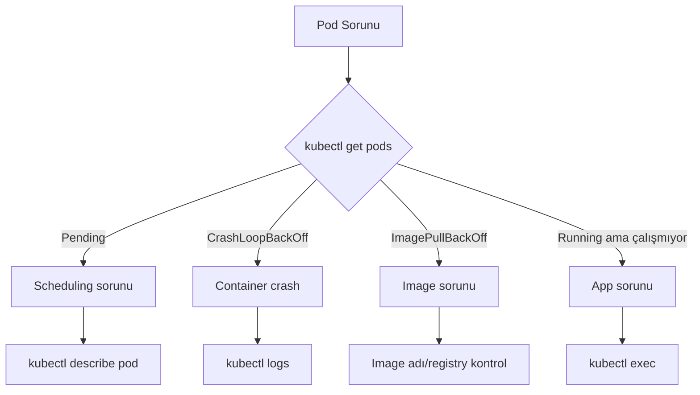

# Lab 13: Debugging & Troubleshooting

## 🎯 Öğrenme Hedefleri
- Pod sorunlarını tespit etmek
- Hata ayıklama komutları
- Common issues ve çözümleri

---

## 📖 Debugging Akışı



---

## 🔨 Pratik Alıştırmalar

### Alıştırma 1: Pod Durumlarını Anlama

| Status | Anlam | Çözüm |
|--------|-------|-------|
| `Pending` | Schedule edilemedi | Node resources, taints kontrol |
| `ContainerCreating` | Image çekiliyor | Bekle veya image kontrol |
| `Running` | Çalışıyor | - |
| `CrashLoopBackOff` | Container sürekli crash | Logs kontrol |
| `ImagePullBackOff` | Image çekilemedi | Image adı/registry kontrol |
| `Error` | Hata | describe/logs kontrol |

---

### Alıştırma 2: kubectl describe

**Görev:** Sorunlu pod'u incele.

```bash
# Hatalı pod oluştur
kubectl run broken --image=nginx:yanlis-tag
```

<details>
<summary>✅ Çözüm</summary>

```bash
kubectl describe pod broken
```

Events bölümüne bak:
```
Events:
  Type     Reason     Age   From               Message
  Warning  Failed     10s   kubelet            Failed to pull image "nginx:yanlis-tag"
  Warning  Failed     10s   kubelet            Error: ErrImagePull
```

Düzeltme:
```bash
kubectl set image pod/broken broken=nginx:latest
# veya sil ve yeniden oluştur
```
</details>

---

### Alıştırma 3: kubectl logs

**Görev:** Container loglarını incele.

```bash
# Crash eden pod oluştur
kubectl run crash-pod --image=busybox --command -- /bin/sh -c "exit 1"
```

<details>
<summary>✅ Çözüm</summary>

```bash
# Mevcut container logu
kubectl logs crash-pod

# Önceki (crashed) container logu
kubectl logs crash-pod --previous

# Canlı takip
kubectl logs -f crash-pod

# Son N satır
kubectl logs --tail=20 crash-pod

# Multi-container pod için
kubectl logs <pod> -c <container>
```
</details>

---

### Alıştırma 4: kubectl exec ile Debug

**Görev:** Container içinde debug yap.

<details>
<summary>✅ Çözüm</summary>

```bash
# Komutu çalıştır
kubectl exec <pod> -- ls -la /

# Interactive shell
kubectl exec -it <pod> -- /bin/sh

# Belirli container
kubectl exec -it <pod> -c <container> -- /bin/bash

# Network debug
kubectl exec <pod> -- curl -s localhost:80
kubectl exec <pod> -- wget -qO- google.com
kubectl exec <pod> -- nslookup kubernetes
```
</details>

---

### Alıştırma 5: Events İnceleme

<details>
<summary>✅ Çözüm</summary>

```bash
# Tüm events (son 1 saat)
kubectl get events --sort-by='.lastTimestamp'

# Warnings
kubectl get events --field-selector type=Warning

# Belirli pod
kubectl get events --field-selector involvedObject.name=<pod>
```
</details>

---

### Alıştırma 6: Resource Sorunları

**Görev:** Resource yetersizliğini tespit et.

<details>
<summary>✅ Çözüm</summary>

```bash
# Node kaynaklarını gör
kubectl describe nodes | grep -A5 "Allocated resources"

# Pod resource kullanımı (metrics-server gerekli)
kubectl top pods
kubectl top nodes
```

Pending pod için:
```bash
kubectl describe pod <pending-pod>
# Events: 0/1 nodes are available: insufficient memory
```
</details>

---

### Alıştırma 7: Network Debugging

**Görev:** Servis erişim sorununu debug et.

<details>
<summary>✅ Çözüm</summary>

```bash
# Service endpoints kontrol
kubectl get endpoints <service>

# DNS çözümleme test
kubectl run dns-test --image=busybox --rm -it --restart=Never -- nslookup <service>

# Servis erişim test
kubectl run test --image=busybox --rm -it --restart=Never -- wget -qO- <service>:<port>

# Pod IP'leri kontrol
kubectl get pods -o wide
```
</details>

---

### Alıştırma 8: Debug Container (Ephemeral)

**Görev:** Çalışan pod'a debug container ekle.

<details>
<summary>✅ Çözüm</summary>

```bash
# Distroless veya minimal image'lı pod debug
kubectl debug <pod> -it --image=busybox --target=<container>

# Node debug
kubectl debug node/<node> -it --image=busybox
```

Not: Kubernetes 1.25+ gerektirir.
</details>

---

## 📖 Common Issues Cheatsheet

### ImagePullBackOff
```bash
# Kontrol
kubectl describe pod <pod> | grep -A3 Events

# Çözümler
# 1. Image adı yanlış
# 2. Private registry - imagePullSecrets eksik
# 3. Tag mevcut değil
```

### CrashLoopBackOff
```bash
# Kontrol
kubectl logs <pod> --previous

# Çözümler
# 1. Command/args yanlış
# 2. App hatası
# 3. Liveness probe çok agresif
```

### Pending
```bash
# Kontrol
kubectl describe pod <pod>

# Çözümler
# 1. Insufficient resources
# 2. Node selector/affinity
# 3. Taints/tolerations
# 4. PVC binding bekliyor
```

---

## 🎯 Sınav Pratiği

### Senaryo 1 ⭐
> `web-pod` running ama web sayfası açılmıyor. Debug et.

<details>
<summary>✅ Çözüm</summary>

```bash
# 1. Pod durumu
kubectl get pod web-pod

# 2. Describe
kubectl describe pod web-pod

# 3. Logs
kubectl logs web-pod

# 4. Container içinden test
kubectl exec web-pod -- curl localhost:80

# 5. Service kontrol
kubectl get svc
kubectl get endpoints
```
</details>

---

### Senaryo 2 ⭐
> `api-pod` CrashLoopBackOff durumunda. Hatayı bul.

<details>
<summary>✅ Çözüm</summary>

```bash
# Önceki container logları
kubectl logs api-pod --previous

# Describe ile events
kubectl describe pod api-pod
```
</details>

---

## 🧹 Temizlik

```bash
kubectl delete pod broken crash-pod --ignore-not-found
```

---

## ✅ Öğrendiklerimiz

- [x] Pod durumlarını anlama
- [x] kubectl describe
- [x] kubectl logs (--previous, -f)
- [x] kubectl exec
- [x] kubectl get events
- [x] Common issues ve çözümleri

---

[⬅️ Lab 12](lab-12-ingress.md) | [Lab 14: Helm ➡️](lab-14-helm.md)
