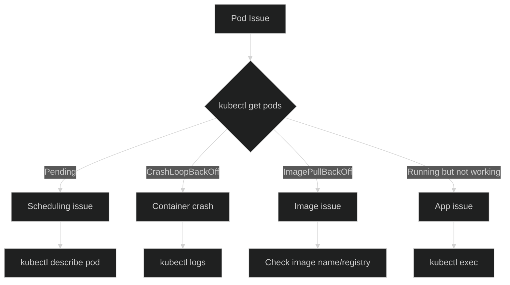

# Lab 13: Debugging & Troubleshooting

## 🎯 Learning Objectives
- Identify pod issues
- Debugging commands
- Common issues and solutions

---

## 📖 Debugging Flow



---

## 🔨 Hands-on Exercises

### Exercise 1: Pod States

| Status | Meaning | Solution |
|--------|---------|----------|
| `Pending` | Can't schedule | Check resources, taints |
| `ContainerCreating` | Pulling image | Wait or check image |
| `Running` | Working | - |
| `CrashLoopBackOff` | Keeps crashing | Check logs |
| `ImagePullBackOff` | Can't pull image | Check image name |
| `Error` | Error occurred | Check describe/logs |

---

### Exercise 2: kubectl describe

<details>
<summary>✅ Solution</summary>

```bash
# Create a broken pod
kubectl run broken --image=nginx:wrong-tag

kubectl describe pod broken
# Look at Events section
```
</details>

---

### Exercise 3: kubectl logs

<details>
<summary>✅ Solution</summary>

```bash
# Current logs
kubectl logs <pod>

# Previous (crashed) container
kubectl logs <pod> --previous

# Follow logs
kubectl logs -f <pod>

# Last N lines
kubectl logs --tail=20 <pod>

# Multi-container pod
kubectl logs <pod> -c <container>
```
</details>

---

### Exercise 4: kubectl exec

<details>
<summary>✅ Solution</summary>

```bash
# Run a command
kubectl exec <pod> -- ls -la /

# Interactive shell
kubectl exec -it <pod> -- /bin/sh

# Network debug
kubectl exec <pod> -- curl -s localhost:80
kubectl exec <pod> -- nslookup kubernetes
```
</details>

---

### Exercise 5: Events

<details>
<summary>✅ Solution</summary>

```bash
# All events
kubectl get events --sort-by='.lastTimestamp'

# Warnings only
kubectl get events --field-selector type=Warning

# Specific pod
kubectl get events --field-selector involvedObject.name=<pod>
```
</details>

---

### Exercise 6: Network Debugging

<details>
<summary>✅ Solution</summary>

```bash
# Check service endpoints
kubectl get endpoints <service>

# DNS test
kubectl run dns-test --image=busybox --rm -it --restart=Never -- nslookup <service>

# Service access test
kubectl run test --image=busybox --rm -it --restart=Never -- wget -qO- <service>:<port>
```
</details>

---

## 📖 Common Issues Cheatsheet

### ImagePullBackOff
```bash
# Check
kubectl describe pod <pod> | grep -A3 Events

# Solutions:
# 1. Wrong image name
# 2. Private registry - imagePullSecrets missing
# 3. Tag doesn't exist
```

### CrashLoopBackOff
```bash
# Check
kubectl logs <pod> --previous

# Solutions:
# 1. Wrong command/args
# 2. App error
# 3. Liveness probe too aggressive
```

### Pending
```bash
# Check
kubectl describe pod <pod>

# Solutions:
# 1. Insufficient resources
# 2. Node selector/affinity
# 3. Taints/tolerations
# 4. PVC not bound
```

---

## 🎯 Exam Practice

### Scenario 1
> `web-pod` is running but webpage not loading. Debug it.

<details>
<summary>✅ Solution</summary>

```bash
# 1. Pod status
kubectl get pod web-pod

# 2. Describe
kubectl describe pod web-pod

# 3. Logs
kubectl logs web-pod

# 4. Test from inside
kubectl exec web-pod -- curl localhost:80

# 5. Check service
kubectl get svc
kubectl get endpoints
```
</details>

---

## 🧹 Cleanup

```bash
kubectl delete pod broken --ignore-not-found
```

---

## ✅ What We Learned

- [x] Understanding pod states
- [x] kubectl describe
- [x] kubectl logs (--previous, -f)
- [x] kubectl exec
- [x] kubectl get events
- [x] Common issues and solutions

---

[⬅️ Lab 12](lab-12-ingress.md) | [Lab 14: Helm ➡️](lab-14-helm.md)
