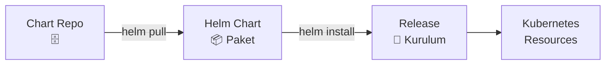
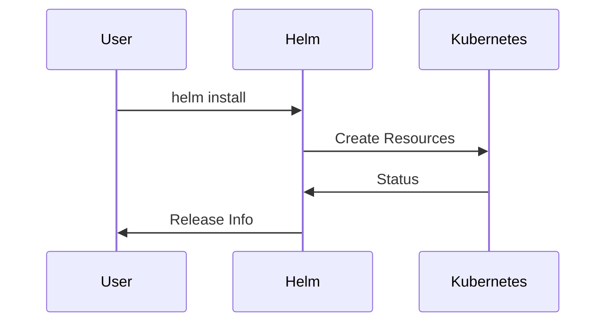

# Lab 14: Helm Basics

## 🎯 Öğrenme Hedefleri
- Helm nedir anlamak
- Chart kurulumu
- Release yönetimi
- Temel Helm komutları

---

## 📖 Helm Nedir?



| Kavram | Açıklama |
|--------|----------|
| **Chart** | Kubernetes uygulaması paketi |
| **Release** | Chart'ın bir kurulumu |
| **Repository** | Chart deposu |
| **Values** | Konfigürasyon değerleri |

---

## 🔨 Kurulum Kontrolü

```bash
# Helm versiyonu
helm version

# K3s ile helm kullanıma hazır
# Eğer kurulu değilse:
# curl https://raw.githubusercontent.com/helm/helm/main/scripts/get-helm-3 | bash
```

---

## 🔨 Pratik Alıştırmalar

### Alıştırma 1: Repository Ekleme

**Görev:** Bitnami repository'sini ekle.

<details>
<summary>✅ Çözüm</summary>

```bash
# Repo ekle
helm repo add bitnami https://charts.bitnami.com/bitnami

# Repo listele
helm repo list

# Repo güncelle
helm repo update
```
</details>

---

### Alıştırma 2: Chart Arama

**Görev:** Nginx chart'ını ara.

<details>
<summary>✅ Çözüm</summary>

```bash
# Hub'da ara
helm search hub nginx

# Eklenen repo'larda ara
helm search repo nginx

# Tüm versiyonları göster
helm search repo bitnami/nginx --versions
```
</details>

---

### Alıştırma 3: Chart Bilgisi

**Görev:** Chart detaylarını incele.

<details>
<summary>✅ Çözüm</summary>

```bash
# Chart bilgisi
helm show chart bitnami/nginx

# Values (konfigürasyon seçenekleri)
helm show values bitnami/nginx

# Tüm bilgi
helm show all bitnami/nginx
```
</details>

---

### Alıştırma 4: Chart Kurulumu



**Görev:** Nginx chart'ını kur.

<details>
<summary>✅ Çözüm</summary>

```bash
# Basit kurulum
helm install my-nginx bitnami/nginx

# Namespace belirterek
helm install my-nginx bitnami/nginx -n web --create-namespace

# Dry-run (test)
helm install my-nginx bitnami/nginx --dry-run
```

Kontrol:
```bash
kubectl get pods
kubectl get svc
```
</details>

---

### Alıştırma 5: Custom Values

**Görev:** Özel değerlerle kur.

<details>
<summary>✅ Çözüm</summary>

```bash
# CLI ile value
helm install my-nginx bitnami/nginx --set replicaCount=3

# Values dosyası ile
cat <<EOF > my-values.yaml
replicaCount: 2
service:
  type: ClusterIP
  port: 8080
EOF

helm install my-nginx bitnami/nginx -f my-values.yaml
```
</details>

---

### Alıştırma 6: Release Yönetimi

<details>
<summary>✅ Çözüm</summary>

```bash
# Release listele
helm list
helm list -A  # Tüm namespace'ler

# Release durumu
helm status my-nginx

# Release geçmişi
helm history my-nginx
```
</details>

---

### Alıştırma 7: Upgrade ve Rollback

**Görev:** Release'i güncelle ve geri al.

<details>
<summary>✅ Çözüm</summary>

```bash
# Upgrade
helm upgrade my-nginx bitnami/nginx --set replicaCount=5

# Geçmişi gör
helm history my-nginx

# Rollback
helm rollback my-nginx 1  # Revision 1'e dön
```
</details>

---

### Alıştırma 8: Release Silme

<details>
<summary>✅ Çözüm</summary>

```bash
# Sil
helm uninstall my-nginx

# Namespace ile
helm uninstall my-nginx -n web
```
</details>

---

### Alıştırma 9: Template Görüntüleme

**Görev:** Kurulmadan önce YAML'ları gör.

<details>
<summary>✅ Çözüm</summary>

```bash
# Template render
helm template my-nginx bitnami/nginx

# Dosyaya kaydet
helm template my-nginx bitnami/nginx > rendered.yaml
```
</details>

---

## 📖 Helm Komutları Özet

| Komut | Açıklama |
|-------|----------|
| `helm repo add` | Repository ekle |
| `helm repo update` | Repo güncelle |
| `helm search repo` | Chart ara |
| `helm show values` | Konfigürasyon seçenekleri |
| `helm install` | Chart kur |
| `helm upgrade` | Release güncelle |
| `helm rollback` | Geri al |
| `helm uninstall` | Sil |
| `helm list` | Release listele |
| `helm template` | YAML render |

---

## 🎯 Sınav Pratiği

### Senaryo 1 ⭐
> bitnami repo'sundan `redis` chart'ını `my-cache` adıyla kur.

<details>
<summary>✅ Çözüm</summary>

```bash
helm repo add bitnami https://charts.bitnami.com/bitnami
helm install my-cache bitnami/redis
```
</details>

---

### Senaryo 2 ⭐
> `my-cache` release'ini 3 replica ile upgrade et.

<details>
<summary>✅ Çözüm</summary>

```bash
helm upgrade my-cache bitnami/redis --set replica.replicaCount=3
```
</details>

---

## 🧹 Temizlik

```bash
helm uninstall my-nginx --ignore-not-found
helm uninstall my-cache --ignore-not-found
rm -f my-values.yaml rendered.yaml
```

---

## ✅ Öğrendiklerimiz

- [x] Helm repository yönetimi
- [x] Chart arama ve bilgi alma
- [x] helm install/upgrade/rollback/uninstall
- [x] Custom values
- [x] Release yönetimi

---

[⬅️ Lab 13](lab-13-debugging.md) | [🏠 Ana Sayfa](../README.md)
