# Lab 14: Helm Basics

## 🎯 Learning Objectives
- Understand Helm
- Install charts
- Manage releases
- Basic Helm commands

---

## 📖 What is Helm?

```mermaid
%%{init: {'theme': 'dark'}}%%
graph LR
    CHART[Helm Chart<br/>📦 Package] --> |helm install| REL[Release<br/>🚀 Installation]
    REL --> K8S[Kubernetes<br/>Resources]
    
    REPO[Chart Repo<br/>🗄️] --> |helm pull| CHART
```



| Concept | Description |
|---------|-------------|
| **Chart** | Kubernetes app package |
| **Release** | Chart installation |
| **Repository** | Chart storage |
| **Values** | Configuration |

---

## 🔨 Hands-on Exercises

### Exercise 1: Add Repository

<details>
<summary>✅ Solution</summary>

```bash
helm repo add bitnami https://charts.bitnami.com/bitnami
helm repo list
helm repo update
```
</details>

---

### Exercise 2: Search Charts

<details>
<summary>✅ Solution</summary>

```bash
helm search hub nginx
helm search repo nginx
helm search repo bitnami/nginx --versions
```
</details>

---

### Exercise 3: Chart Info

<details>
<summary>✅ Solution</summary>

```bash
helm show chart bitnami/nginx
helm show values bitnami/nginx
helm show all bitnami/nginx
```
</details>

---

### Exercise 4: Install Chart

<details>
<summary>✅ Solution</summary>

```bash
helm install my-nginx bitnami/nginx

# With namespace
helm install my-nginx bitnami/nginx -n web --create-namespace

# Dry-run
helm install my-nginx bitnami/nginx --dry-run
```
</details>

---

### Exercise 5: Custom Values

<details>
<summary>✅ Solution</summary>

```bash
# CLI value
helm install my-nginx bitnami/nginx --set replicaCount=3

# Values file
cat <<EOF > my-values.yaml
replicaCount: 2
service:
  type: ClusterIP
  port: 8080
EOF

helm install my-nginx bitnami/nginx -f my-values.yaml
```
</details>

---

### Exercise 6: Release Management

<details>
<summary>✅ Solution</summary>

```bash
helm list
helm list -A
helm status my-nginx
helm history my-nginx
```
</details>

---

### Exercise 7: Upgrade and Rollback

<details>
<summary>✅ Solution</summary>

```bash
helm upgrade my-nginx bitnami/nginx --set replicaCount=5
helm history my-nginx
helm rollback my-nginx 1
```
</details>

---

### Exercise 8: Uninstall

<details>
<summary>✅ Solution</summary>

```bash
helm uninstall my-nginx
helm uninstall my-nginx -n web
```
</details>

---

## 📖 Helm Commands Summary

| Command | Description |
|---------|-------------|
| `helm repo add` | Add repository |
| `helm repo update` | Update repo |
| `helm search repo` | Search charts |
| `helm show values` | Show config options |
| `helm install` | Install chart |
| `helm upgrade` | Upgrade release |
| `helm rollback` | Rollback |
| `helm uninstall` | Uninstall |
| `helm list` | List releases |
| `helm template` | Render YAML |

---

## 🎯 Exam Practice

### Scenario 1
> Install `redis` chart from bitnami as `my-cache`.

<details>
<summary>✅ Solution</summary>

```bash
helm repo add bitnami https://charts.bitnami.com/bitnami
helm install my-cache bitnami/redis
```
</details>

---

### Scenario 2
> Upgrade `my-cache` to 3 replicas.

<details>
<summary>✅ Solution</summary>

```bash
helm upgrade my-cache bitnami/redis --set replica.replicaCount=3
```
</details>

---

## 🧹 Cleanup

```bash
helm uninstall my-nginx --ignore-not-found
helm uninstall my-cache --ignore-not-found
rm -f my-values.yaml
```

---

## ✅ What We Learned

- [x] Helm repository management
- [x] Chart search and info
- [x] helm install/upgrade/rollback/uninstall
- [x] Custom values
- [x] Release management

---

[⬅️ Lab 13](lab-13-debugging.md) | [Lab 15: Deployment Strategies ➡️](lab-15-deployment-strategies.md)
