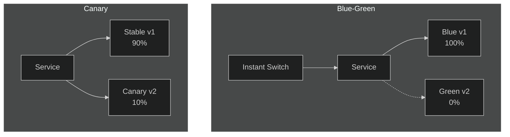

# Lab 15: Blue-Green & Canary Deployments

## 🎯 Learning Objectives
- Blue-Green deployment strategy
- Canary deployment strategy
- Traffic management with service selector

---

## 📖 Deployment Strategies



| Strategy | Description | Risk |
|----------|-------------|------|
| **Blue-Green** | Instant switch, old version standby | Low |
| **Canary** | Gradual rollout, test with small traffic | Very low |
| **Rolling** | Default K8s, gradual update | Medium |

---

## 🔨 Blue-Green Deployment

### Exercise 1: Blue Deployment

<details>
<summary>✅ Solution</summary>

```yaml
apiVersion: apps/v1
kind: Deployment
metadata:
  name: app-blue
spec:
  replicas: 3
  selector:
    matchLabels:
      app: myapp
      version: blue
  template:
    metadata:
      labels:
        app: myapp
        version: blue
    spec:
      containers:
      - name: app
        image: nginx:1.19
```
</details>

---

### Exercise 2: Service (Point to Blue)

<details>
<summary>✅ Solution</summary>

```yaml
apiVersion: v1
kind: Service
metadata:
  name: myapp-svc
spec:
  selector:
    app: myapp
    version: blue  # Points to blue
  ports:
  - port: 80
```
</details>

---

### Exercise 3: Green Deployment

<details>
<summary>✅ Solution</summary>

```yaml
apiVersion: apps/v1
kind: Deployment
metadata:
  name: app-green
spec:
  replicas: 3
  selector:
    matchLabels:
      app: myapp
      version: green
  template:
    metadata:
      labels:
        app: myapp
        version: green
    spec:
      containers:
      - name: app
        image: nginx:1.21
```
</details>

---

### Exercise 4: Switch Blue → Green

<details>
<summary>✅ Solution</summary>

```bash
# Patch service selector
kubectl patch svc myapp-svc -p '{"spec":{"selector":{"version":"green"}}}'
```

Instant switch! All traffic goes to green.
</details>

---

## 🔨 Canary Deployment

### Exercise 5: Canary Setup

10% traffic to canary.

<details>
<summary>✅ Solution</summary>

```yaml
# Stable: 9 replicas
apiVersion: apps/v1
kind: Deployment
metadata:
  name: app-stable
spec:
  replicas: 9
  selector:
    matchLabels:
      app: myapp
      track: stable
  template:
    metadata:
      labels:
        app: myapp
        track: stable
    spec:
      containers:
      - name: app
        image: nginx:1.19
---
# Canary: 1 replica
apiVersion: apps/v1
kind: Deployment
metadata:
  name: app-canary
spec:
  replicas: 1
  selector:
    matchLabels:
      app: myapp
      track: canary
  template:
    metadata:
      labels:
        app: myapp
        track: canary
    spec:
      containers:
      - name: app
        image: nginx:1.21
---
# Service selects both
apiVersion: v1
kind: Service
metadata:
  name: myapp-svc
spec:
  selector:
    app: myapp  # Selects both deployments
  ports:
  - port: 80
```

9 stable + 1 canary = 10% canary traffic
</details>

---

### Exercise 6: Scale Up Canary

<details>
<summary>✅ Solution</summary>

```bash
kubectl scale deployment app-stable --replicas=5
kubectl scale deployment app-canary --replicas=5
# Now 50/50 traffic
```
</details>

---

## 🎯 Exam Practice

### Scenario 1
> `web-blue` deployment exists. Create `web-green` and switch `web-svc` to green.

<details>
<summary>✅ Solution</summary>

```bash
kubectl create deployment web-green --image=nginx:1.21
kubectl label deployment web-green version=green
kubectl patch svc web-svc -p '{"spec":{"selector":{"version":"green"}}}'
```
</details>

---

## 🧹 Cleanup

```bash
kubectl delete deployment app-blue app-green app-stable app-canary --ignore-not-found
kubectl delete svc myapp-svc --ignore-not-found
```

---

## ✅ What We Learned

- [x] Blue-Green deployment
- [x] Traffic management with service selector
- [x] Canary deployment
- [x] Instant vs gradual rollout

---

[⬅️ Lab 14](lab-14-helm.md) | [Lab 16: Kustomize ➡️](lab-16-kustomize.md)
