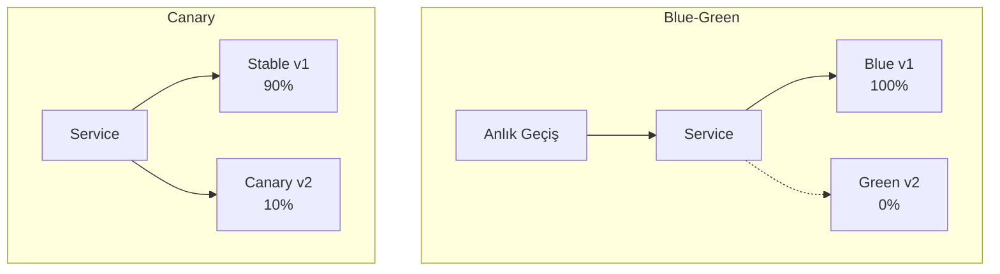
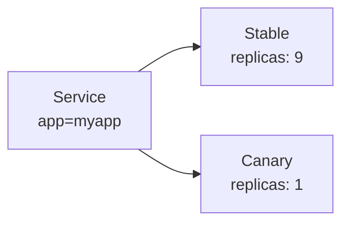

# Lab 15: Canary & Blue-Green Deployments

## 🎯 Öğrenme Hedefleri
- Blue-Green deployment stratejisi
- Canary deployment stratejisi
- Service selector ile traffic yönetimi

---

## 📖 Deployment Stratejileri



| Strateji | Açıklama | Risk |
|----------|----------|------|
| **Blue-Green** | Anlık geçiş, eski versiyon hazırda | Düşük |
| **Canary** | Kademeli geçiş, küçük trafikle test | Çok düşük |
| **Rolling** | Varsayılan K8s, kademeli güncelleme | Orta |

---

## 🔨 Blue-Green Deployment

### Alıştırma 1: Blue Deployment

**Görev:** Blue (v1) deployment oluştur.

<details>
<summary>✅ Çözüm</summary>

```yaml
# blue-deployment.yaml
apiVersion: apps/v1
kind: Deployment
metadata:
  name: app-blue
spec:
  replicas: 3
  selector:
    matchLabels:
      app: myapp
      version: blue
  template:
    metadata:
      labels:
        app: myapp
        version: blue
    spec:
      containers:
      - name: app
        image: nginx:1.19
        ports:
        - containerPort: 80
```

```bash
kubectl apply -f blue-deployment.yaml
```
</details>

---

### Alıştırma 2: Service (Blue'ya yönlendir)

<details>
<summary>✅ Çözüm</summary>

```yaml
# service.yaml
apiVersion: v1
kind: Service
metadata:
  name: myapp-svc
spec:
  selector:
    app: myapp
    version: blue  # Blue'ya yönlendir
  ports:
  - port: 80
    targetPort: 80
```

```bash
kubectl apply -f service.yaml
```
</details>

---

### Alıştırma 3: Green Deployment

**Görev:** Green (v2) deployment oluştur ama henüz traffic verme.

<details>
<summary>✅ Çözüm</summary>

```yaml
# green-deployment.yaml
apiVersion: apps/v1
kind: Deployment
metadata:
  name: app-green
spec:
  replicas: 3
  selector:
    matchLabels:
      app: myapp
      version: green
  template:
    metadata:
      labels:
        app: myapp
        version: green
    spec:
      containers:
      - name: app
        image: nginx:1.21
        ports:
        - containerPort: 80
```

```bash
kubectl apply -f green-deployment.yaml

# Her iki deployment çalışıyor
kubectl get pods -l app=myapp
```
</details>

---

### Alıştırma 4: Blue → Green Geçişi

**Görev:** Service selector'ı green'e çevir.

<details>
<summary>✅ Çözüm</summary>

```bash
# Service'i patch ile güncelle
kubectl patch svc myapp-svc -p '{"spec":{"selector":{"version":"green"}}}'

# veya edit
kubectl edit svc myapp-svc
# version: blue → version: green
```

Anlık geçiş! Tüm traffic artık green'e gidiyor.
</details>

---

### Alıştırma 5: Rollback (Green → Blue)

<details>
<summary>✅ Çözüm</summary>

```bash
kubectl patch svc myapp-svc -p '{"spec":{"selector":{"version":"blue"}}}'
```
</details>

---

## 🔨 Canary Deployment

### Alıştırma 6: Canary Setup



**Görev:** %10 traffic canary'ye gidecek şekilde ayarla.

<details>
<summary>✅ Çözüm</summary>

```yaml
# stable-deployment.yaml
apiVersion: apps/v1
kind: Deployment
metadata:
  name: app-stable
spec:
  replicas: 9
  selector:
    matchLabels:
      app: myapp
      track: stable
  template:
    metadata:
      labels:
        app: myapp
        track: stable
    spec:
      containers:
      - name: app
        image: nginx:1.19
---
# canary-deployment.yaml
apiVersion: apps/v1
kind: Deployment
metadata:
  name: app-canary
spec:
  replicas: 1
  selector:
    matchLabels:
      app: myapp
      track: canary
  template:
    metadata:
      labels:
        app: myapp
        track: canary
    spec:
      containers:
      - name: app
        image: nginx:1.21
---
# service.yaml (sadece app=myapp seç)
apiVersion: v1
kind: Service
metadata:
  name: myapp-svc
spec:
  selector:
    app: myapp  # Her iki deployment'ı seçer
  ports:
  - port: 80
```

9 stable + 1 canary = %10 canary traffic
</details>

---

### Alıştırma 7: Canary Scale Up

**Görev:** Canary başarılıysa %50'ye çıkar.

<details>
<summary>✅ Çözüm</summary>

```bash
kubectl scale deployment app-stable --replicas=5
kubectl scale deployment app-canary --replicas=5
```
</details>

---

## 🎯 Sınav Pratiği

### Senaryo 1 ⭐
> Mevcut `web-blue` deployment var. `web-green` oluştur ve `web-svc` service'ini green'e yönlendir.

<details>
<summary>✅ Çözüm</summary>

```bash
# Green deployment
kubectl create deployment web-green --image=nginx:1.21

# Label ekle
kubectl label deployment web-green version=green

# Service selector güncelle
kubectl patch svc web-svc -p '{"spec":{"selector":{"version":"green"}}}'
```
</details>

---

## 🧹 Temizlik

```bash
kubectl delete deployment app-blue app-green app-stable app-canary --ignore-not-found
kubectl delete svc myapp-svc --ignore-not-found
```

---

## ✅ Öğrendiklerimiz

- [x] Blue-Green deployment
- [x] Service selector ile traffic yönetimi
- [x] Canary deployment
- [x] Anlık vs kademeli geçiş

---

[⬅️ Lab 14](lab-14-helm.md) | [Lab 16: Kustomize ➡️](lab-16-kustomize.md)
