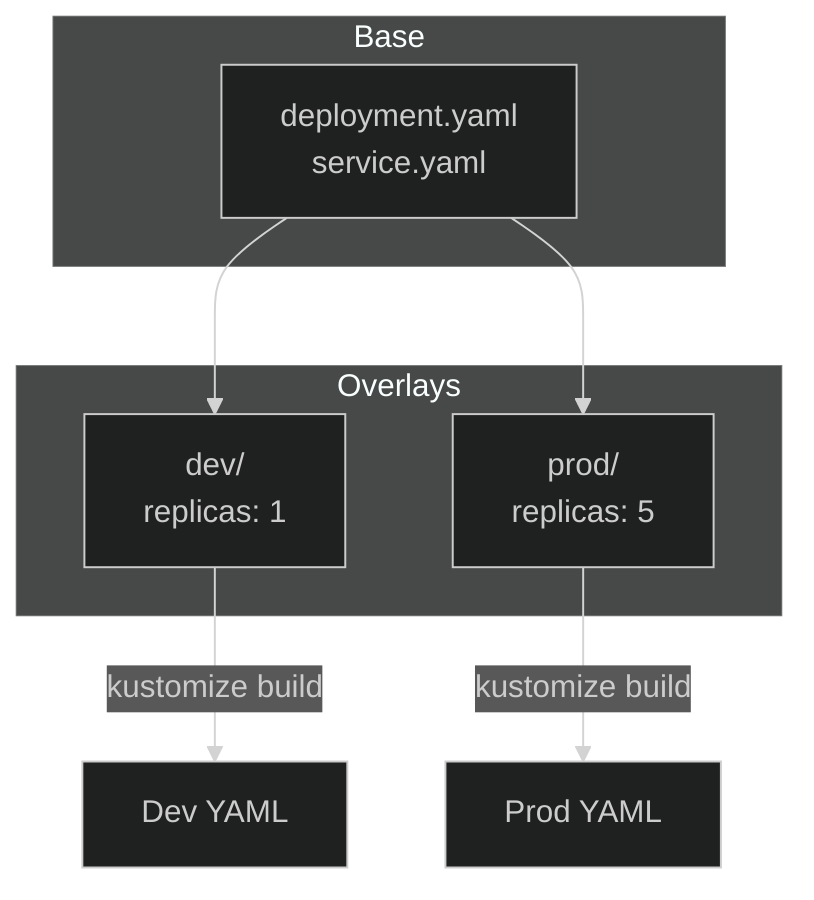

# Lab 16: Kustomize

## 🎯 Learning Objectives
- Understand Kustomize
- Base and overlay structure
- kubectl kustomize
- Patches and transformations

---

## 📖 What is Kustomize?



**Kustomize** customizes YAML without templates:
- ✅ Built into kubectl (`kubectl apply -k`)
- ✅ Alternative to Helm
- ✅ Base + Overlay structure

---

## 🔨 Hands-on Exercises

### Setup: Directory Structure

```bash
mkdir -p kustomize-demo/{base,overlays/dev,overlays/prod}
cd kustomize-demo
```

---

### Exercise 1: Create Base

<details>
<summary>✅ Solution</summary>

```bash
# base/deployment.yaml
cat <<EOF > base/deployment.yaml
apiVersion: apps/v1
kind: Deployment
metadata:
  name: myapp
spec:
  replicas: 1
  selector:
    matchLabels:
      app: myapp
  template:
    metadata:
      labels:
        app: myapp
    spec:
      containers:
      - name: app
        image: nginx:1.19
EOF

# base/kustomization.yaml
cat <<EOF > base/kustomization.yaml
apiVersion: kustomize.config.k8s.io/v1beta1
kind: Kustomization
resources:
- deployment.yaml
EOF
```
</details>

---

### Exercise 2: Dev Overlay

<details>
<summary>✅ Solution</summary>

```bash
cat <<EOF > overlays/dev/kustomization.yaml
apiVersion: kustomize.config.k8s.io/v1beta1
kind: Kustomization

resources:
- ../../base

namePrefix: dev-

replicas:
- name: myapp
  count: 1

commonLabels:
  env: development
EOF
```
</details>

---

### Exercise 3: Prod Overlay

<details>
<summary>✅ Solution</summary>

```bash
cat <<EOF > overlays/prod/kustomization.yaml
apiVersion: kustomize.config.k8s.io/v1beta1
kind: Kustomization

resources:
- ../../base

namePrefix: prod-

replicas:
- name: myapp
  count: 5

commonLabels:
  env: production

images:
- name: nginx
  newTag: "1.21"
EOF
```
</details>

---

### Exercise 4: Build and Preview

<details>
<summary>✅ Solution</summary>

```bash
# Preview dev
kubectl kustomize overlays/dev

# Preview prod
kubectl kustomize overlays/prod

# Save to file
kubectl kustomize overlays/prod > prod-manifests.yaml
```
</details>

---

### Exercise 5: Apply with Kustomize

<details>
<summary>✅ Solution</summary>

```bash
# Apply with -k flag
kubectl apply -k overlays/dev

# Check
kubectl get all -l env=development
```
</details>

---

### Exercise 6: Patches

<details>
<summary>✅ Solution</summary>

```bash
# overlays/prod/memory-patch.yaml
cat <<EOF > overlays/prod/memory-patch.yaml
apiVersion: apps/v1
kind: Deployment
metadata:
  name: myapp
spec:
  template:
    spec:
      containers:
      - name: app
        resources:
          limits:
            memory: "256Mi"
EOF

# Add to kustomization.yaml
cat <<EOF >> overlays/prod/kustomization.yaml

patches:
- path: memory-patch.yaml
EOF
```
</details>

---

## 📖 Kustomization.yaml Options

| Option | Description |
|--------|-------------|
| `resources` | Base YAML files |
| `namePrefix` | Add prefix to all names |
| `nameSuffix` | Add suffix to all names |
| `namespace` | Set namespace |
| `commonLabels` | Add labels to all resources |
| `images` | Change image tags |
| `replicas` | Change replica count |
| `patches` | Strategic merge patches |
| `configMapGenerator` | Generate ConfigMaps |

---

## 🎯 Exam Practice

### Scenario 1
> Apply `base/` with namespace `production`.

<details>
<summary>✅ Solution</summary>

```bash
cat <<EOF > overlay/kustomization.yaml
resources:
- ../base
namespace: production
EOF

kubectl apply -k overlay/
```
</details>

---

## 🧹 Cleanup

```bash
kubectl delete -k overlays/dev --ignore-not-found
kubectl delete -k overlays/prod --ignore-not-found
cd .. && rm -rf kustomize-demo
```

---

## ✅ What We Learned

- [x] Base and overlay structure
- [x] kustomization.yaml
- [x] kubectl kustomize / kubectl apply -k
- [x] Patches
- [x] ConfigMap generators

---

[⬅️ Lab 15](lab-15-deployment-strategies.md) | [Lab 17: Dockerfile ➡️](lab-17-dockerfile.md)
