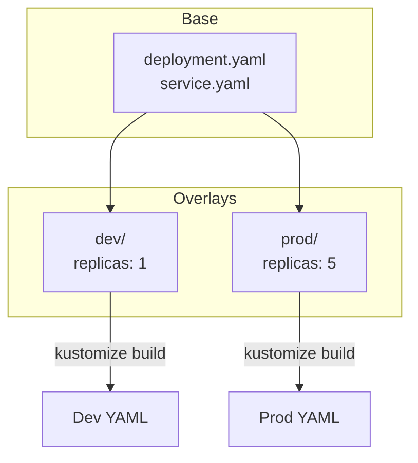

# Lab 16: Kustomize

## 🎯 Öğrenme Hedefleri
- Kustomize nedir anlamak
- Base ve overlay yapısı
- kubectl kustomize kullanımı
- Patches ve transformations

---

## 📖 Kustomize Nedir?



**Kustomize**, YAML dosyalarını template olmadan özelleştirmeye yarar:
- ✅ kubectl'e entegre (`kubectl apply -k`)
- ✅ Helm'e alternatif
- ✅ Base + Overlay yapısı

---

## 🔨 Pratik Alıştırmalar

### Hazırlık: Klasör Yapısı

```bash
mkdir -p kustomize-demo/{base,overlays/dev,overlays/prod}
cd kustomize-demo
```

---

### Alıştırma 1: Base Oluştur

**Görev:** Base deployment ve service oluştur.

<details>
<summary>✅ Çözüm</summary>

```bash
# base/deployment.yaml
cat <<EOF > base/deployment.yaml
apiVersion: apps/v1
kind: Deployment
metadata:
  name: myapp
spec:
  replicas: 1
  selector:
    matchLabels:
      app: myapp
  template:
    metadata:
      labels:
        app: myapp
    spec:
      containers:
      - name: app
        image: nginx:1.19
        ports:
        - containerPort: 80
EOF

# base/service.yaml
cat <<EOF > base/service.yaml
apiVersion: v1
kind: Service
metadata:
  name: myapp-svc
spec:
  selector:
    app: myapp
  ports:
  - port: 80
EOF

# base/kustomization.yaml
cat <<EOF > base/kustomization.yaml
apiVersion: kustomize.config.k8s.io/v1beta1
kind: Kustomization
resources:
- deployment.yaml
- service.yaml
EOF
```
</details>

---

### Alıştırma 2: Dev Overlay

**Görev:** Dev ortamı için overlay oluştur (1 replica, dev- prefix).

<details>
<summary>✅ Çözüm</summary>

```bash
cat <<EOF > overlays/dev/kustomization.yaml
apiVersion: kustomize.config.k8s.io/v1beta1
kind: Kustomization

resources:
- ../../base

namePrefix: dev-

replicas:
- name: myapp
  count: 1

commonLabels:
  env: development
EOF
```
</details>

---

### Alıştırma 3: Prod Overlay

**Görev:** Prod ortamı için overlay oluştur (5 replica, prod- prefix).

<details>
<summary>✅ Çözüm</summary>

```bash
cat <<EOF > overlays/prod/kustomization.yaml
apiVersion: kustomize.config.k8s.io/v1beta1
kind: Kustomization

resources:
- ../../base

namePrefix: prod-

replicas:
- name: myapp
  count: 5

commonLabels:
  env: production

images:
- name: nginx
  newTag: "1.21"
EOF
```
</details>

---

### Alıştırma 4: Kustomize Build

**Görev:** Oluşan YAML'ları önizle.

<details>
<summary>✅ Çözüm</summary>

```bash
# Dev overlay önizle
kubectl kustomize overlays/dev

# Prod overlay önizle
kubectl kustomize overlays/prod

# Dosyaya kaydet
kubectl kustomize overlays/prod > prod-manifests.yaml
```
</details>

---

### Alıştırma 5: Kustomize Apply

**Görev:** Dev ortamını deploy et.

<details>
<summary>✅ Çözüm</summary>

```bash
# -k flag ile apply
kubectl apply -k overlays/dev

# Kontrol
kubectl get all -l env=development
```
</details>

---

### Alıştırma 6: Patch Kullanımı

**Görev:** Specific değişiklikler için patch ekle.

<details>
<summary>✅ Çözüm</summary>

```bash
# overlays/prod/memory-patch.yaml
cat <<EOF > overlays/prod/memory-patch.yaml
apiVersion: apps/v1
kind: Deployment
metadata:
  name: myapp
spec:
  template:
    spec:
      containers:
      - name: app
        resources:
          limits:
            memory: "256Mi"
          requests:
            memory: "128Mi"
EOF

# kustomization.yaml güncelle
cat <<EOF > overlays/prod/kustomization.yaml
apiVersion: kustomize.config.k8s.io/v1beta1
kind: Kustomization

resources:
- ../../base

namePrefix: prod-

replicas:
- name: myapp
  count: 5

patches:
- path: memory-patch.yaml

commonLabels:
  env: production

images:
- name: nginx
  newTag: "1.21"
EOF
```

```bash
kubectl kustomize overlays/prod
```
</details>

---

### Alıştırma 7: ConfigMap Generator

**Görev:** Kustomize ile ConfigMap oluştur.

<details>
<summary>✅ Çözüm</summary>

```bash
# base/kustomization.yaml güncelle
cat <<EOF > base/kustomization.yaml
apiVersion: kustomize.config.k8s.io/v1beta1
kind: Kustomization
resources:
- deployment.yaml
- service.yaml

configMapGenerator:
- name: app-config
  literals:
  - APP_ENV=default
  - LOG_LEVEL=info
EOF
```
</details>

---

### Alıştırma 8: Secret Generator

<details>
<summary>✅ Çözüm</summary>

```bash
cat <<EOF >> base/kustomization.yaml

secretGenerator:
- name: app-secrets
  literals:
  - DB_PASSWORD=secret123
EOF
```

ConfigMap/Secret otomatik hash suffix alır (değişiklik = yeni versiyon).
</details>

---

## 📖 Kustomization.yaml Özellikleri

| Özellik | Açıklama |
|---------|----------|
| `resources` | Base YAML dosyaları |
| `namePrefix` | Tüm isimlere prefix |
| `nameSuffix` | Tüm isimlere suffix |
| `namespace` | Namespace ayarla |
| `commonLabels` | Tüm kaynaklara label |
| `commonAnnotations` | Tüm kaynaklara annotation |
| `images` | Image tag değiştir |
| `replicas` | Replica sayısı değiştir |
| `patches` | Strategic merge patch |
| `configMapGenerator` | ConfigMap oluştur |
| `secretGenerator` | Secret oluştur |

---

## 🎯 Sınav Pratiği

### Senaryo 1 ⭐
> Mevcut `base/` klasöründeki deployment'a namespace ekleyerek deploy et.

<details>
<summary>✅ Çözüm</summary>

```bash
# overlay/kustomization.yaml
cat <<EOF > overlay/kustomization.yaml
resources:
- ../base
namespace: production
EOF

kubectl apply -k overlay/
```
</details>

---

## 🧹 Temizlik

```bash
kubectl delete -k overlays/dev --ignore-not-found
kubectl delete -k overlays/prod --ignore-not-found
cd .. && rm -rf kustomize-demo
```

---

## ✅ Öğrendiklerimiz

- [x] Base ve overlay yapısı
- [x] kustomization.yaml yazma
- [x] kubectl kustomize / kubectl apply -k
- [x] Patches
- [x] ConfigMap/Secret generators

---

[⬅️ Lab 15](lab-15-deployment-strategies.md) | [Lab 17: Dockerfile ➡️](lab-17-dockerfile.md)
