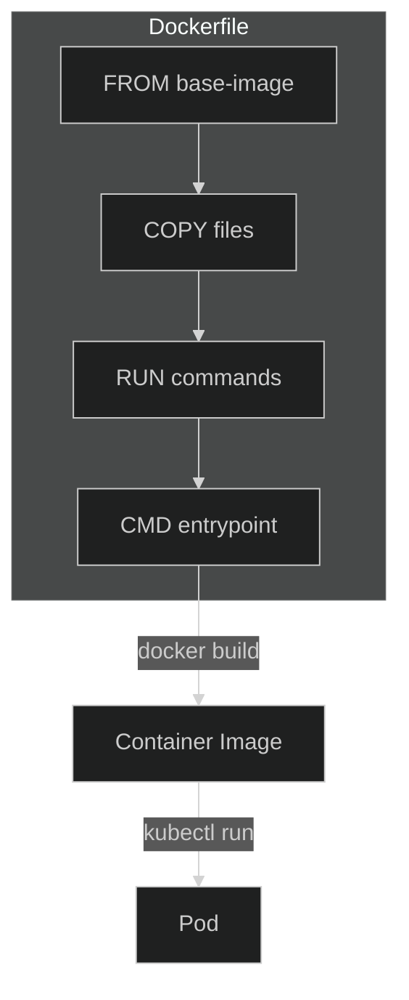
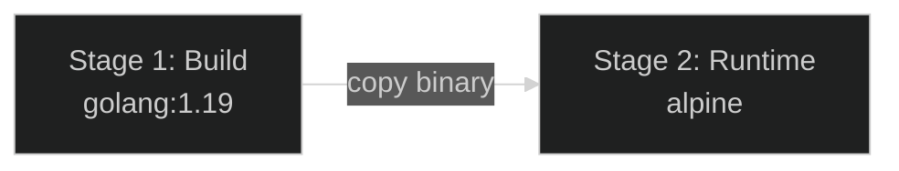

# Lab 17: Dockerfile & Container Basics

## 🎯 Learning Objectives
- Write Dockerfiles
- Build container images
- Multi-stage builds
- Security best practices

---

## 📖 Container Structure



---

## 🔨 Hands-on Exercises

### Exercise 1: Simple Dockerfile

<details open>
<summary>✅ Solution</summary>

```bash
mkdir docker-demo && cd docker-demo

# index.html
cat <<EOF > index.html
<!DOCTYPE html>
<html>
<head><title>CKAD App</title></head>
<body><h1>Hello CKAD!</h1></body>
</html>
EOF

# Dockerfile
cat <<EOF > Dockerfile
FROM nginx:alpine
COPY index.html /usr/share/nginx/html/
EXPOSE 80
CMD ["nginx", "-g", "daemon off;"]
EOF
```
</details>

---

### Exercise 2: Dockerfile Directives

| Directive | Description |
|-----------|-------------|
| `FROM` | Base image |
| `WORKDIR` | Working directory |
| `COPY` | Copy files |
| `ADD` | Copy files (tar extract, URL) |
| `RUN` | Build-time command |
| `CMD` | Default command |
| `ENTRYPOINT` | Fixed command |
| `ENV` | Environment variable |
| `EXPOSE` | Port documentation |
| `USER` | Run as user |
| `ARG` | Build argument |

---

### Exercise 3: Python App Dockerfile

<details open>
<summary>✅ Solution</summary>

```dockerfile
FROM python:3.9-slim

WORKDIR /app

COPY requirements.txt .
RUN pip install --no-cache-dir -r requirements.txt

COPY app.py .

EXPOSE 5000

USER 1000

CMD ["python", "app.py"]
```
</details>

---

### Exercise 4: Multi-Stage Build



<details open>
<summary>✅ Solution</summary>

```dockerfile
# Build stage
FROM golang:1.19 AS builder
WORKDIR /app
COPY main.go .
RUN CGO_ENABLED=0 go build -o myapp main.go

# Runtime stage
FROM alpine:3.18
WORKDIR /app
COPY --from=builder /app/myapp .
USER 1000
CMD ["./myapp"]
```

Multi-stage benefits:
- Smaller final image
- Build tools not in runtime
- Better security
</details>

---

### Exercise 5: Security Best Practices

<details open>
<summary>✅ Solution</summary>

```dockerfile
# ✅ Good Dockerfile
FROM python:3.9-slim

# Non-root user
RUN useradd -r -u 1000 appuser

WORKDIR /app

# Only necessary files
COPY requirements.txt .
RUN pip install --no-cache-dir -r requirements.txt

COPY --chown=appuser:appuser app.py .

USER appuser

EXPOSE 5000

CMD ["python", "app.py"]
```

Best practices:
- ✅ Use non-root user
- ✅ Minimal base image (alpine, slim)
- ✅ `--no-cache` with pip/apt
- ✅ Specific version tags
- ❌ Don't use `latest` tag
- ❌ Don't run as root
</details>

---

### Exercise 6: .dockerignore

<details open>
<summary>✅ Solution</summary>

```bash
cat <<EOF > .dockerignore
.git
.gitignore
Dockerfile
*.md
__pycache__
*.pyc
.env
node_modules
EOF
```
</details>

---

### Exercise 7: K3s Usage (containerd)

K3s uses containerd. To import images:

<details open>
<summary>✅ Solution</summary>

```bash
# Build with Docker, export as tar
docker build -t myapp:v1 .
docker save myapp:v1 -o myapp.tar

# Import to K3s
sudo k3s ctr images import myapp.tar

# Use in pod
kubectl run myapp --image=myapp:v1 --image-pull-policy=Never
```
</details>

---

## 🎯 Exam Practice

### Scenario 1
> Fix this Dockerfile:
```dockerfile
FROM ubuntu:latest
COPY . .
RUN apt-get install python3
CMD python3 app.py
```

<details open>
<summary>✅ Solution</summary>

```dockerfile
FROM python:3.9-slim
WORKDIR /app
COPY requirements.txt .
RUN pip install --no-cache-dir -r requirements.txt
COPY app.py .
USER 1000
CMD ["python3", "app.py"]
```

Issues fixed:
- `ubuntu:latest` → specific slim image
- Missing `apt-get update`
- Missing `WORKDIR`
- Missing non-root user
- `CMD` should use exec form
</details>

---

## 🧹 Cleanup

```bash
cd .. && rm -rf docker-demo
```

---

## ✅ What We Learned

- [x] Dockerfile directives
- [x] Multi-stage builds
- [x] Security best practices
- [x] K3s containerd integration
- [x] .dockerignore

---

[⬅️ Lab 16](lab-16-kustomize.md) | [🏠 Home](../README.md)
