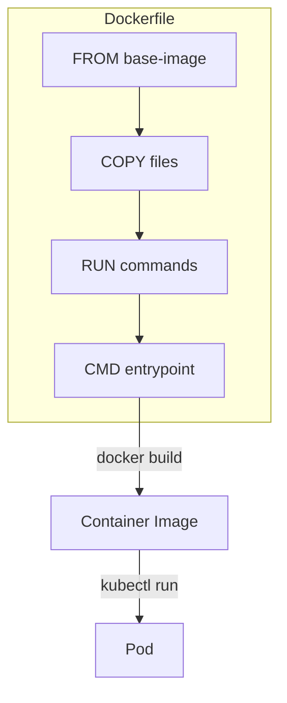
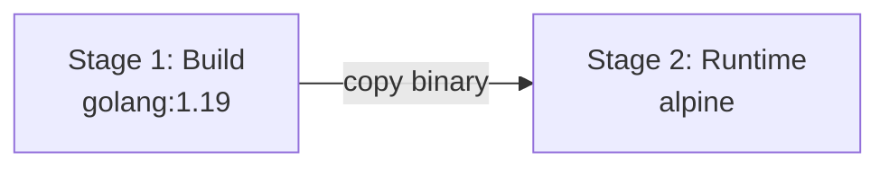

# Lab 17: Dockerfile & Container Basics

## 🎯 Öğrenme Hedefleri
- Dockerfile yazmak
- Container image build etmek
- Multi-stage builds
- Image güvenlik best practices

---

## 📖 Container Yapısı



---

## 🔨 Pratik Alıştırmalar

### Alıştırma 1: Basit Dockerfile

**Görev:** Nginx tabanlı static web site Dockerfile'ı yaz.

<details>
<summary>✅ Çözüm</summary>

```bash
mkdir -p docker-demo && cd docker-demo

# index.html
cat <<EOF > index.html
<!DOCTYPE html>
<html>
<head><title>CKAD App</title></head>
<body><h1>Merhaba CKAD!</h1></body>
</html>
EOF

# Dockerfile
cat <<EOF > Dockerfile
FROM nginx:alpine
COPY index.html /usr/share/nginx/html/
EXPOSE 80
CMD ["nginx", "-g", "daemon off;"]
EOF
```
</details>

---

### Alıştırma 2: Build ve Run (Docker)

<details>
<summary>✅ Çözüm</summary>

```bash
# Build
docker build -t myapp:v1 .

# Run
docker run -d -p 8080:80 myapp:v1

# Test
curl localhost:8080

# Stop
docker stop $(docker ps -q --filter ancestor=myapp:v1)
```

⚠️ K3s'te containerd kullanılır, docker komutu olmayabilir.
</details>

---

### Alıştırma 3: Dockerfile Direktifleri

| Direktif | Açıklama |
|----------|----------|
| `FROM` | Base image |
| `WORKDIR` | Çalışma dizini |
| `COPY` | Dosya kopyala |
| `ADD` | Dosya kopyala (tar extract, URL) |
| `RUN` | Build-time komut |
| `CMD` | Default komut |
| `ENTRYPOINT` | Sabit komut |
| `ENV` | Environment variable |
| `EXPOSE` | Port dokümantasyonu |
| `USER` | Çalışacak kullanıcı |
| `ARG` | Build argümanı |

---

### Alıştırma 4: Python App Dockerfile

<details>
<summary>✅ Çözüm</summary>

```bash
# app.py
cat <<EOF > app.py
from flask import Flask
app = Flask(__name__)

@app.route('/')
def hello():
    return "Hello CKAD!"

if __name__ == '__main__':
    app.run(host='0.0.0.0', port=5000)
EOF

# requirements.txt
cat <<EOF > requirements.txt
flask==2.0.1
EOF

# Dockerfile
cat <<EOF > Dockerfile.python
FROM python:3.9-slim

WORKDIR /app

COPY requirements.txt .
RUN pip install --no-cache-dir -r requirements.txt

COPY app.py .

EXPOSE 5000

USER 1000

CMD ["python", "app.py"]
EOF
```
</details>

---

### Alıştırma 5: Multi-Stage Build

**Görev:** Build ve runtime'ı ayır (küçük image).



<details>
<summary>✅ Çözüm</summary>

```dockerfile
# Go örneği
FROM golang:1.19 AS builder
WORKDIR /app
COPY main.go .
RUN CGO_ENABLED=0 go build -o myapp main.go

FROM alpine:3.18
WORKDIR /app
COPY --from=builder /app/myapp .
USER 1000
CMD ["./myapp"]
```

Multi-stage avantajları:
- Küçük final image
- Build tools runtime'da yok
- Güvenlik artışı
</details>

---

### Alıştırma 6: Security Best Practices

<details>
<summary>✅ Çözüm</summary>

```dockerfile
# ✅ İyi Dockerfile
FROM python:3.9-slim

# Non-root user
RUN useradd -r -u 1000 appuser

WORKDIR /app

# Sadece gerekli dosyalar
COPY requirements.txt .
RUN pip install --no-cache-dir -r requirements.txt

COPY --chown=appuser:appuser app.py .

USER appuser

EXPOSE 5000

CMD ["python", "app.py"]
```

Best practices:
- ✅ Non-root user kullan
- ✅ Minimal base image (alpine, slim)
- ✅ `--no-cache` ile pip/apt
- ✅ Specific version tag (`:3.9-slim`)
- ❌ `latest` tag kullanma
- ❌ Root olarak çalıştırma
</details>

---

### Alıştırma 7: K3s'te Kullanım (containerd)

K3s containerd kullanır. Image'ları import etmek için:

<details>
<summary>✅ Çözüm</summary>

```bash
# Docker ile build, tar olarak export
docker build -t myapp:v1 .
docker save myapp:v1 -o myapp.tar

# K3s'e import
sudo k3s ctr images import myapp.tar

# Kontrol
sudo k3s ctr images list | grep myapp

# Pod'da kullan
kubectl run myapp --image=myapp:v1 --image-pull-policy=Never
```
</details>

---

### Alıştırma 8: .dockerignore

<details>
<summary>✅ Çözüm</summary>

```bash
cat <<EOF > .dockerignore
.git
.gitignore
Dockerfile
*.md
__pycache__
*.pyc
.env
node_modules
EOF
```

Build context'i küçültür, hassas dosyaları hariç tutar.
</details>

---

## 🎯 Sınav Pratiği

### Senaryo 1 ⭐
> Aşağıdaki Dockerfile'daki hataları düzelt:
```dockerfile
FROM ubuntu:latest
COPY . .
RUN apt-get install python3
CMD python3 app.py
```

<details>
<summary>✅ Çözüm</summary>

```dockerfile
FROM python:3.9-slim
WORKDIR /app
COPY requirements.txt .
RUN pip install --no-cache-dir -r requirements.txt
COPY app.py .
USER 1000
CMD ["python3", "app.py"]
```

Hatalar:
- `ubuntu:latest` → specific version + slim
- `apt-get update` eksik
- `WORKDIR` eksik
- Non-root user eksik
- `CMD` exec form kullan
</details>

---

## 🧹 Temizlik

```bash
cd .. && rm -rf docker-demo
```

---

## ✅ Öğrendiklerimiz

- [x] Dockerfile direktifleri
- [x] Multi-stage builds
- [x] Security best practices
- [x] K3s containerd entegrasyonu
- [x] .dockerignore

---

[⬅️ Lab 16](lab-16-kustomize.md) | [🏠 Ana Sayfa](../README.md)
