# 🎯 CKAD Practice Labs


Hands-on lab exercises to prepare for the **Certified Kubernetes Application Developer (CKAD)** exam.

> 🖥️ These labs are optimized for **k3s** environment.

---

## 🆕 New to Kubernetes?

Start with the basics: **[Kubernetes Learning Guide](docs/00-intro.md)**

---

## 📊 CKAD Exam Info

- ⏱️ **Duration:** 2 hours
- 📝 **Questions:** ~15-20
- 🎯 **Passing Score:** 66%
- 💻 **Format:** Hands-on (Terminal)
- 📚 **Resources:** kubernetes.io access ALLOWED

---

## 📋 Lab List (17 Labs, 100+ Exercises)

### 🟢 Week 1: Core Concepts

- **Lab 01:** [Pod Basics](labs/lab-01-pod-basics.md) - Create and manage Pods
- **Lab 02:** [Multi-Container Pods](labs/lab-02-multi-container-pods.md) - Sidecar, Init containers
- **Lab 03:** [Deployments](labs/lab-03-deployments.md) - Scaling, Rolling updates
- **Lab 04:** [Services](labs/lab-04-services.md) - ClusterIP, NodePort, LoadBalancer

### 🟡 Week 2: Configuration

- **Lab 05:** [ConfigMaps & Secrets](labs/lab-05-configmaps-secrets.md) - External configuration
- **Lab 06:** [Volumes](labs/lab-06-volumes.md) - PV, PVC, Storage
- **Lab 09:** [Resource Limits](labs/lab-09-resource-limits.md) - CPU/Memory management

### 🟠 Week 3: Advanced

- **Lab 07:** [Jobs & CronJobs](labs/lab-07-jobs-cronjobs.md) - Batch processing
- **Lab 08:** [Probes](labs/lab-08-probes.md) - Liveness, Readiness
- **Lab 10:** [Network Policies](labs/lab-10-network-policies.md) - Pod firewall rules
- **Lab 11:** [Security](labs/lab-11-security.md) - SecurityContext, ServiceAccounts

### 🔴 Week 4: Tools

- **Lab 12:** [Ingress](labs/lab-12-ingress.md) - HTTP/HTTPS routing
- **Lab 13:** [Debugging](labs/lab-13-debugging.md) - Troubleshooting pods
- **Lab 14:** [Helm](labs/lab-14-helm.md) - Package management
- **Lab 15:** [Deployment Strategies](labs/lab-15-deployment-strategies.md) - Blue-Green, Canary
- **Lab 16:** [Kustomize](labs/lab-16-kustomize.md) - Configuration overlays
- **Lab 17:** [Dockerfile](labs/lab-17-dockerfile.md) - Container images

---

## 🎯 Exam Day Cheatsheet

```bash
# Aliases
alias k=kubectl
export do="--dry-run=client -o yaml"
export now="--force --grace-period=0"

# Quick commands
k run nginx --image=nginx $do > pod.yaml
k create deploy web --image=nginx --replicas=3
k expose deploy web --port=80
k create cm myconfig --from-literal=key=value
k create secret generic mysecret --from-literal=pass=123
```

---

## 📊 Repository Stats

- 📚 **Total Labs:** 17
- 📝 **Exercises:** 100+
- 📊 **Diagrams:** 30+
- 📋 **Curriculum Coverage:** 100%

---

## 📚 Additional Resources

- [Kubernetes Docs](https://kubernetes.io/docs/) - Accessible during exam!
- [kubectl Cheat Sheet](https://kubernetes.io/docs/reference/kubectl/cheatsheet/)
- [Killer Shell](https://killer.sh/ckad) - Real exam simulator
- [KillerCoda](https://killercoda.com/ckad) - Free scenarios

---

⭐ **If this repo helped you, please give it a star!**

📝 **Contributing:** Pull requests are welcome!


---


# Kubernetes Learning Guide

## 🎯 Who Is This For?

This repo is for anyone who wants to **learn Kubernetes from scratch** and **prepare for the CKAD exam**.

### Prerequisites
- ✅ Basic Linux terminal knowledge (`cd`, `ls`, `cat`, `vim`)
- ✅ Know what Docker is (don't need to have used it)
- ✅ A running K3s cluster (setup instructions below)

### Target Audience
- 🎓 Kubernetes beginners
- 📚 CKAD exam candidates
- 💼 DevOps/Cloud career seekers

---

## 🧠 Kubernetes Philosophy

### The Problem: Who Will Manage the Containers?

```mermaid
%%{init: {'theme': 'dark'}}%%
graph LR
    subgraph "Docker World"
        D1[Container 1]
        D2[Container 2]
        D3[Container 3]
        D4[Container 4]
    end
    
    Q[❓ Who manages?<br/>❓ What if one dies?<br/>❓ How to scale?<br/>❓ Networking?]
```



Docker is great, but...
- How do you manage 100 containers?
- If one crashes, does it auto-restart?
- How does it scale when traffic increases?
- How do containers find each other?

### The Solution: Kubernetes (Container Orchestrator)


**Kubernetes Core Principle:**
> "Desired State" → Kubernetes makes it happen and maintains it

You: "I want 3 nginx pods"
Kubernetes: "Done. If one dies, I'll create a new one."

---

## 🏗️ Kubernetes Architecture (Simplified)


### Simple Explanation

| Component | Role | Real-World Analogy |
|-----------|------|-------------------|
| **API Server** | Receives all requests | Company reception |
| **etcd** | Stores all data | Company database |
| **Scheduler** | Places pods on nodes | HR department |
| **Controller Manager** | Ensures everything works | Manager |
| **Kubelet** | Runs pods on node | Employee |
| **Kube Proxy** | Manages network traffic | IT department |

---

## 📦 Kubernetes Resources

Everything in Kubernetes is a "resource". Here's what you'll learn:


### Resource Hierarchy

```
Deployment
    └── ReplicaSet
            └── Pod
                    └── Container(s)
                            └── Image
```

---

## 🛠️ K3s Setup

K3s is a lightweight Kubernetes distribution. Perfect for learning!

### Linux Installation
```bash
# Install K3s (one command!)
curl -sfL https://get.k3s.io | sh -

# Check status
sudo systemctl status k3s

# Configure kubectl
mkdir -p ~/.kube
sudo cp /etc/rancher/k3s/k3s.yaml ~/.kube/config
sudo chown $(id -u):$(id -g) ~/.kube/config

# Test
kubectl get nodes
```

### WSL2 Installation
```bash
# WSL2 needs systemd
# Edit /etc/wsl.conf:
sudo nano /etc/wsl.conf
# Add:
# [boot]
# systemd=true

# Restart WSL (in PowerShell):
# wsl --shutdown

# Then install K3s
curl -sfL https://get.k3s.io | sh -
```

---

## 📚 Learning Path


### Week 1: Learn the Basics
1. **Lab 01** - What is a Pod? How to create one?
2. **Lab 02** - Multiple containers
3. **Lab 03** - Deployment for pod management
4. **Lab 04** - Service for access

### Week 2: Configuration
5. **Lab 05** - ConfigMap and Secret
6. **Lab 06** - Persistent storage (Volume)
7. **Lab 09** - CPU/Memory limits

### Week 3: Advanced Topics
8. **Lab 07** - Job and CronJob
9. **Lab 08** - Health checks (Probes)
10. **Lab 10** - Network security
11. **Lab 11** - Security settings

### Week 4: Tools and Deployment
12. **Lab 12** - Ingress (HTTP traffic)
13. **Lab 13** - Debugging
14. **Lab 14** - Helm (package management)
15. **Lab 15** - Blue-Green/Canary
16. **Lab 16** - Kustomize
17. **Lab 17** - Dockerfile

---

## 💡 Success Tips

### To Pass the Exam

1. **Practice, Practice, Practice** - Theory isn't enough
2. **Master kubectl** - Everything is CLI
3. **Don't memorize YAML** - Use `--dry-run=client -o yaml`
4. **Time management** - 2 hours, 15-20 questions
5. **Use kubernetes.io** - You have access during the exam!

### Learn the Aliases
```bash
alias k=kubectl
export do="--dry-run=client -o yaml"
export now="--force --grace-period=0"
```

---

## 🚀 Let's Begin!

➡️ [Lab 01: Pod Basics](labs/lab-01-pod-basics.md)

---

⭐ If this repo is helpful, don't forget to star it!


---


# Lab 01: Pod Basics

## 🎯 Learning Objectives
- Understand what a Pod is
- Create Pods (imperative and declarative)
- List and inspect Pods
- Delete Pods

---

## 📖 What is a Pod?


### 🤔 Why is Pod Important?

A **Pod** is the fundamental building block of Kubernetes. What a "container" is in Docker, a "Pod" is in Kubernetes.

| Concept | Docker | Kubernetes |
|---------|--------|------------|
| Smallest unit | Container | Pod |
| Run command | `docker run` | `kubectl run` |
| Network | Container network | Pod network |

### 💡 Real-World Example

Think of a website:
- **Container 1:** Web server (nginx)
- **Container 2:** Log collector (fluentd)
- **Shared Volume:** Log files

These run in the same Pod because:
- They share the same lifecycle
- They communicate closely
- They share data

### 🔑 Key Pod Properties

| Property | Description |
|----------|-------------|
| **IP Address** | Each Pod gets its own cluster IP |
| **Shared Network** | Containers in a Pod talk via `localhost` |
| **Ephemeral** | If a Pod dies, a new one is created (not the same one) |
| **Disposable** | Don't create Pods directly, use Deployment! |

---

## 🗺️ Big Picture: Where Does Pod Fit?


> ⚠️ **Important:** In the real world, we don't create Pods directly! We use Deployments (Lab 03). But you can't understand Deployments without understanding Pods.

---

## 🔨 Hands-on Exercises

### Exercise 1: Create Your First Pod

**Task:** Create a pod named `my-first-pod` using the `nginx` image.

**What does this do?** We're starting a web server. nginx is one of the most popular web servers.

<details open>
<summary>💡 Hint</summary>

```bash
kubectl run <pod-name> --image=<image-name>
```
</details>

<details open>
<summary>✅ Solution</summary>

```bash
kubectl run my-first-pod --image=nginx
```

**What happened?**
1. Kubernetes pulled the nginx image from Docker Hub
2. Created a container
3. Put the container in a Pod
4. Scheduled the Pod on a Node

Check:
```bash
kubectl get pods
```
</details>

---

### Exercise 2: Watch Pod Status

**Task:** Watch the Pod transition to `Running` state.

<details open>
<summary>✅ Solution</summary>

```bash
# Watch mode (Ctrl+C to exit)
kubectl get pods -w
```

**Pod States (Lifecycle):**
```
Pending → ContainerCreating → Running
   ↓              ↓              ↓
Queued       Image is       Working!
             being pulled
```

If there's an error:
- `ImagePullBackOff` → Wrong image name
- `CrashLoopBackOff` → Container keeps crashing
- `Error` → Something is wrong

</details>

---

### Exercise 3: Inspect Pod Details

**Task:** Get detailed information about `my-first-pod`.

**What's this for?** This is the most important command for debugging!

<details open>
<summary>✅ Solution</summary>

```bash
kubectl describe pod my-first-pod
```

**Important sections to look at:**

| Section | Description |
|---------|-------------|
| **Node** | Which server is the Pod running on |
| **IP** | Pod's cluster-internal IP address |
| **Containers** | Container status and restart count |
| **Events** | Recent events (for finding errors!) |

</details>

---

### Exercise 4: Create Pod with YAML

**Task:** Create a pod YAML file with these specs:
- Name: `redis-pod`
- Image: `redis:alpine`
- Label: `app=cache`

**What's this for?** YAML = Infrastructure as Code. Keep all settings in a file, use version control.

<details open>
<summary>💡 Hint - Exam Trick!</summary>

You don't need to memorize YAML! Kubernetes gives you a template:

```bash
kubectl run redis-pod --image=redis:alpine --labels=app=cache --dry-run=client -o yaml
```

`--dry-run=client` → Don't actually create, just show YAML
`-o yaml` → Output in YAML format
</details>

<details open>
<summary>✅ Solution</summary>

```bash
# 1. Generate YAML template
kubectl run redis-pod --image=redis:alpine --labels=app=cache --dry-run=client -o yaml > redis-pod.yaml

# 2. Inspect the file
cat redis-pod.yaml

# 3. Apply
kubectl apply -f redis-pod.yaml
```

**YAML Explained:**
```yaml
apiVersion: v1          # API version
kind: Pod               # Resource type
metadata:
  name: redis-pod       # Pod name
  labels:
    app: cache          # Label (for filtering)
spec:
  containers:
  - name: redis         # Container name
    image: redis:alpine # Image to use
```
</details>

---

### Exercise 5: View Pod Logs

**Task:** View logs from `my-first-pod`.

**What's this for?** What's happening inside the container? Any errors? Logs will tell you.

<details open>
<summary>✅ Solution</summary>

```bash
# Current logs
kubectl logs my-first-pod

# Follow logs live (Ctrl+C to exit)
kubectl logs -f my-first-pod

# Last 10 lines
kubectl logs --tail=10 my-first-pod

# Previous (crashed) container logs
kubectl logs my-first-pod --previous
```
</details>

---

### Exercise 6: Execute Commands in Pod

**Task:** Open a shell in `my-first-pod` and run `hostname`.

**What's this for?** Debug inside the container, check files, test network.

<details open>
<summary>✅ Solution</summary>

```bash
# Run a single command
kubectl exec my-first-pod -- hostname

# Open interactive shell
kubectl exec -it my-first-pod -- /bin/sh

# Commands to try inside:
# ls -la
# cat /etc/nginx/nginx.conf
# curl localhost:80
# exit
```

**What does -it mean?**
- `-i` = interactive (stdin open)
- `-t` = TTY (terminal)
</details>

---

### Exercise 7: Filter with Labels

**Task:** List pods with label `app=cache`.

**What's this for?** Labels are Kubernetes' "search engine". Find what you want among thousands of pods!

<details open>
<summary>✅ Solution</summary>

```bash
# Filter by label
kubectl get pods -l app=cache

# Show all labels
kubectl get pods --show-labels

# Add a label
kubectl label pod my-first-pod env=dev

# Remove a label (- at the end)
kubectl label pod my-first-pod env-
```
</details>

---

### Exercise 8: Delete Pods

**Task:** Delete the pods you created.

<details open>
<summary>✅ Solution</summary>

```bash
# Delete single pod
kubectl delete pod my-first-pod

# Delete using YAML (deletes what you created)
kubectl delete -f redis-pod.yaml

# Delete by label
kubectl delete pods -l app=cache

# Delete all (CAREFUL!)
kubectl delete pods --all

# Quick delete (for exam)
kubectl delete pod my-first-pod --force --grace-period=0
```
</details>

---

## 🎯 Exam Practice

Solve these scenarios with a timer! Target: < 2 minutes each

### Scenario 1
> Create a pod named `test-pod` using `busybox` image. The pod should run `sleep 3600` command.

<details open>
<summary>✅ Solution</summary>

```bash
kubectl run test-pod --image=busybox --command -- sleep 3600
```
</details>

---

### Scenario 2
> Create a pod named `webapp` using `nginx:1.21` image with label `tier=frontend`.

<details open>
<summary>✅ Solution</summary>

```bash
kubectl run webapp --image=nginx:1.21 --labels=tier=frontend
```
</details>

---

### Scenario 3
> Find which node the `webapp` pod is running on.

<details open>
<summary>✅ Solution</summary>

```bash
kubectl get pod webapp -o wide
# or
kubectl describe pod webapp | grep Node
```
</details>

---

## ❌ Common Mistakes

| Error | Symptom | Solution |
|-------|---------|----------|
| Wrong image name | `ImagePullBackOff` | Check image name |
| Wrong command | `CrashLoopBackOff` | Check with `kubectl logs` |
| Port conflict | `Error` | Use different port |
| YAML syntax error | `error parsing` | Check YAML indentation |

---

## 🧹 Cleanup

```bash
kubectl delete pod --all
rm -f redis-pod.yaml
```

---

## ✅ What We Learned

- [x] Pod = Kubernetes' smallest unit
- [x] `kubectl run` to create pods
- [x] `kubectl get pods` to list
- [x] `kubectl describe` for details
- [x] `kubectl logs` for logs
- [x] `kubectl exec` to run commands inside
- [x] `--dry-run=client -o yaml` for YAML generation (exam trick!)
- [x] Label filtering

---

## 🔗 Next Steps

You understand Pods. But is a single Pod enough? What if the Pod dies?

➡️ [Lab 02: Multi-Container Pods](lab-02-multi-container-pods.md) - Put multiple containers in a Pod

➡️ [Lab 03: Deployments](lab-03-deployments.md) - Manage Pods automatically, recreate if they die

---

[⬅️ Home](../README.md) | [Lab 02: Multi-Container Pods ➡️](lab-02-multi-container-pods.md)


---


# Lab 02: Multi-Container Pods

## 🎯 Learning Objectives
- Understand multi-container pod patterns
- Implement Sidecar pattern
- Use Init Containers
- Communication between containers

---

## 📖 Multi-Container Patterns


| Pattern | Use Case |
|---------|----------|
| **Sidecar** | Log collection, sync, proxy |
| **Ambassador** | Connection to external services |
| **Adapter** | Data format conversion |

---

## 🔨 Hands-on Exercises

### Exercise 1: Two-Container Pod

**Task:** Create a pod with these specs:
- Pod name: `two-containers`
- Container 1: `nginx` (name: web)
- Container 2: `busybox` (name: sidecar), runs `sleep 3600`

<details open>
<summary>✅ Solution</summary>

```yaml
apiVersion: v1
kind: Pod
metadata:
  name: two-containers
spec:
  containers:
  - name: web
    image: nginx
    ports:
    - containerPort: 80
  - name: sidecar
    image: busybox
    command: ["sleep", "3600"]
```

```bash
kubectl apply -f two-containers.yaml
kubectl get pods two-containers
```
</details>

---

### Exercise 2: Access Specific Container

**Task:** Connect to the `sidecar` container in `two-containers` pod.

<details open>
<summary>✅ Solution</summary>

```bash
# Exec into specific container
kubectl exec -it two-containers -c sidecar -- /bin/sh

# Logs from specific container
kubectl logs two-containers -c web
kubectl logs two-containers -c sidecar
```
</details>

---

### Exercise 3: Sidecar with Shared Volume

**Task:** Main container writes logs, sidecar reads them.


<details open>
<summary>✅ Solution</summary>

```yaml
apiVersion: v1
kind: Pod
metadata:
  name: sidecar-pod
spec:
  containers:
  - name: web
    image: nginx
    volumeMounts:
    - name: logs
      mountPath: /var/log/nginx
  
  - name: log-reader
    image: busybox
    command: ["sh", "-c", "tail -f /logs/access.log 2>/dev/null || sleep 3600"]
    volumeMounts:
    - name: logs
      mountPath: /logs
  
  volumes:
  - name: logs
    emptyDir: {}
```
</details>

---

### Exercise 4: Init Container


**Task:** Add an init container that prepares a file before main container starts.

<details open>
<summary>✅ Solution</summary>

```yaml
apiVersion: v1
kind: Pod
metadata:
  name: init-pod
spec:
  initContainers:
  - name: init-download
    image: busybox
    command: ['sh', '-c', 'echo "Ready: $(date)" > /work/status.txt']
    volumeMounts:
    - name: workdir
      mountPath: /work
  
  containers:
  - name: main-app
    image: busybox
    command: ['sh', '-c', 'cat /work/status.txt && sleep 3600']
    volumeMounts:
    - name: workdir
      mountPath: /work
  
  volumes:
  - name: workdir
    emptyDir: {}
```
</details>

---

### Exercise 5: Multiple Init Containers

**Task:** Create two init containers that run sequentially.

<details open>
<summary>✅ Solution</summary>

```yaml
apiVersion: v1
kind: Pod
metadata:
  name: multi-init-pod
spec:
  initContainers:
  - name: init-1
    image: busybox
    command: ['sh', '-c', 'echo "Step 1" && sleep 2']
  
  - name: init-2
    image: busybox
    command: ['sh', '-c', 'echo "Step 2" && sleep 2']
  
  containers:
  - name: main
    image: nginx
```

Init containers run sequentially. One must finish before the next starts.
</details>

---

### Exercise 6: Inter-Container Networking

**Task:** Test that containers in the same pod can communicate via localhost.

<details open>
<summary>✅ Solution</summary>

```yaml
apiVersion: v1
kind: Pod
metadata:
  name: network-test
spec:
  containers:
  - name: web
    image: nginx
  - name: tester
    image: curlimages/curl
    command: ["sleep", "3600"]
```

```bash
kubectl apply -f network-test.yaml

# Access web from tester (localhost)
kubectl exec network-test -c tester -- curl -s localhost:80
```

Containers in the same pod communicate via `localhost`!
</details>

---

## 🎯 Exam Practice

### Scenario 1
> Create a pod named `log-app`:
> - Container 1: `nginx` (name: app)
> - Container 2: `busybox` (name: logger), runs `sleep 3600`

<details open>
<summary>✅ Solution</summary>

```yaml
apiVersion: v1
kind: Pod
metadata:
  name: log-app
spec:
  containers:
  - name: app
    image: nginx
  - name: logger
    image: busybox
    command: ["sleep", "3600"]
```
</details>

---

### Scenario 2
> Create a pod with init container. Init container runs `wget -O /data/index.html http://info.cern.ch`. Main container is nginx and serves this file.

<details open>
<summary>✅ Solution</summary>

```yaml
apiVersion: v1
kind: Pod
metadata:
  name: web-init
spec:
  initContainers:
  - name: downloader
    image: busybox
    command: ['wget', '-O', '/data/index.html', 'http://info.cern.ch']
    volumeMounts:
    - name: html
      mountPath: /data
  
  containers:
  - name: nginx
    image: nginx
    volumeMounts:
    - name: html
      mountPath: /usr/share/nginx/html
  
  volumes:
  - name: html
    emptyDir: {}
```
</details>

---

## 🧹 Cleanup

```bash
kubectl delete pod two-containers sidecar-pod init-pod multi-init-pod network-test --ignore-not-found
```

---

## ✅ What We Learned

- [x] Multi-container pod creation
- [x] Sidecar pattern
- [x] Init containers
- [x] Shared volumes between containers
- [x] `-c` flag for container selection
- [x] Localhost communication between containers

---

[⬅️ Lab 01: Pod Basics](lab-01-pod-basics.md) | [Lab 03: Deployments ➡️](lab-03-deployments.md)


---


# Lab 03: Deployments

## 🎯 Learning Objectives
- Understand what a Deployment is and why it's used
- Create and manage Deployments
- Rolling Update and Rollback
- Scaling

---

## 📖 What is a Deployment?


Deployment provides:
- ✅ Automatic pod recreation
- ✅ Rolling updates (zero-downtime)
- ✅ Rollback capability
- ✅ Scaling

---

## 🔨 Hands-on Exercises

### Exercise 1: Create Deployment

**Task:** Create a deployment named `web-deploy` using `nginx` image with 3 replicas.

<details open>
<summary>✅ Solution</summary>

```bash
kubectl create deployment web-deploy --image=nginx --replicas=3
```

Check:
```bash
kubectl get deployments
kubectl get replicasets
kubectl get pods
```
</details>

---

### Exercise 2: Deployment YAML

**Task:** Create a deployment using a YAML file.

<details open>
<summary>✅ Solution</summary>

```bash
# Generate template
kubectl create deployment api-deploy --image=nginx:1.20 --replicas=2 --dry-run=client -o yaml > api-deploy.yaml
```

```yaml
apiVersion: apps/v1
kind: Deployment
metadata:
  name: api-deploy
spec:
  replicas: 2
  selector:
    matchLabels:
      app: api-deploy
  template:
    metadata:
      labels:
        app: api-deploy
    spec:
      containers:
      - name: nginx
        image: nginx:1.20
```

```bash
kubectl apply -f api-deploy.yaml
```
</details>

---

### Exercise 3: Scaling


**Task:** Scale `web-deploy` to 5 replicas.

<details open>
<summary>✅ Solution</summary>

```bash
kubectl scale deployment web-deploy --replicas=5

# Check
kubectl get deployment web-deploy
kubectl get pods -l app=web-deploy
```
</details>

---

### Exercise 4: Rolling Update


**Task:** Update `web-deploy` image to `nginx:1.21`.

<details open>
<summary>✅ Solution</summary>

```bash
# Update image
kubectl set image deployment/web-deploy nginx=nginx:1.21

# Watch rollout status
kubectl rollout status deployment/web-deploy
```
</details>

---

### Exercise 5: Rollout History

**Task:** View deployment update history.

<details open>
<summary>✅ Solution</summary>

```bash
# View history
kubectl rollout history deployment/web-deploy

# Specific revision details
kubectl rollout history deployment/web-deploy --revision=1
```
</details>

---

### Exercise 6: Rollback

**Task:** Rollback deployment to previous version.

<details open>
<summary>✅ Solution</summary>

```bash
# Rollback to previous
kubectl rollout undo deployment/web-deploy

# Rollback to specific revision
kubectl rollout undo deployment/web-deploy --to-revision=1

# Check status
kubectl rollout status deployment/web-deploy
```
</details>

---

### Exercise 7: Deployment Strategies

**RollingUpdate** (default):
```yaml
spec:
  strategy:
    type: RollingUpdate
    rollingUpdate:
      maxSurge: 1        # How many extra pods
      maxUnavailable: 1  # How many pods can be unavailable
```

**Recreate** (delete all, create new):
```yaml
spec:
  strategy:
    type: Recreate
```

---

### Exercise 8: Pause and Resume

**Task:** Pause rollout, make multiple changes, then resume.

<details open>
<summary>✅ Solution</summary>

```bash
# Pause
kubectl rollout pause deployment/web-deploy

# Make changes (rollout won't start)
kubectl set image deployment/web-deploy nginx=nginx:1.22
kubectl set resources deployment/web-deploy -c nginx --limits=memory=256Mi

# Resume (single rollout)
kubectl rollout resume deployment/web-deploy
```
</details>

---

## 🎯 Exam Practice

### Scenario 1
> Create a deployment named `frontend` using `httpd:2.4` image with 4 replicas.

<details open>
<summary>✅ Solution</summary>

```bash
kubectl create deployment frontend --image=httpd:2.4 --replicas=4
```
</details>

---

### Scenario 2
> Update `frontend` image to `httpd:alpine`. Then rollback to revision 1.

<details open>
<summary>✅ Solution</summary>

```bash
kubectl set image deployment/frontend httpd=httpd:alpine
kubectl rollout status deployment/frontend
kubectl rollout undo deployment/frontend --to-revision=1
```
</details>

---

### Scenario 3
> Create a redis deployment named `backend` with 2 replicas. Then scale to 6 replicas.

<details open>
<summary>✅ Solution</summary>

```bash
kubectl create deployment backend --image=redis --replicas=2
kubectl scale deployment backend --replicas=6
```
</details>

---

## 🧹 Cleanup

```bash
kubectl delete deployment --all
```

---

## ✅ What We Learned

- [x] Deployment creation
- [x] ReplicaSet relationship
- [x] Scaling
- [x] Rolling update
- [x] Rollback
- [x] Deployment strategies

---

[⬅️ Lab 02](lab-02-multi-container-pods.md) | [Lab 04: Services ➡️](lab-04-services.md)


---


# Lab 04: Services

## 🎯 Learning Objectives
- Understand what a Service is
- Service types (ClusterIP, NodePort, LoadBalancer)
- Service discovery and DNS
- Expose deployments

---

## 📖 What is a Service?


| Type | Access | Use Case |
|------|--------|----------|
| **ClusterIP** | Internal only | Pod-to-pod communication |
| **NodePort** | `NodeIP:Port` | Development, testing |
| **LoadBalancer** | External IP | Production (cloud) |

---

## 🔨 Hands-on Exercises

### Exercise 1: Create Deployment for Testing

```bash
kubectl create deployment web --image=nginx --replicas=3
```

---

### Exercise 2: ClusterIP Service

**Task:** Expose `web` deployment with ClusterIP service.

<details open>
<summary>✅ Solution</summary>

```bash
kubectl expose deployment web --port=80 --type=ClusterIP
```

Check:
```bash
kubectl get svc web
kubectl describe svc web
kubectl get endpoints web
```
</details>

---

### Exercise 3: NodePort Service

**Task:** Create a NodePort service for `web` deployment.

<details open>
<summary>✅ Solution</summary>

```bash
kubectl expose deployment web --port=80 --type=NodePort --name=web-nodeport
```

```bash
kubectl get svc web-nodeport
# Note the NodePort (e.g., 32000)

# Access from outside
curl http://<NODE_IP>:<NODE_PORT>
```
</details>

---

### Exercise 4: Service YAML

<details open>
<summary>✅ Solution</summary>

```yaml
apiVersion: v1
kind: Service
metadata:
  name: web-svc
spec:
  type: ClusterIP
  selector:
    app: web      # Must match pod labels
  ports:
  - port: 80      # Service port
    targetPort: 80 # Container port
```
</details>

---

### Exercise 5: Service DNS

**Task:** Test service DNS resolution.


<details open>
<summary>✅ Solution</summary>

```bash
# Create a test pod
kubectl run test-dns --image=busybox --rm -it --restart=Never -- nslookup web

# Full DNS name
# <service>.<namespace>.svc.cluster.local
# web.default.svc.cluster.local
```
</details>

---

### Exercise 6: Endpoints

**Task:** View service endpoints.

<details open>
<summary>✅ Solution</summary>

```bash
kubectl get endpoints web

# Shows pod IPs that match the selector
# When pods scale, endpoints update automatically
```
</details>

---

### Exercise 7: LoadBalancer (K3s)

K3s has built-in LoadBalancer support (ServiceLB).

<details open>
<summary>✅ Solution</summary>

```bash
kubectl expose deployment web --port=80 --type=LoadBalancer --name=web-lb

kubectl get svc web-lb
# EXTERNAL-IP will show node IP in K3s
```
</details>

---

### Exercise 8: Multi-Port Service

**Task:** Create a service with multiple ports.

<details open>
<summary>✅ Solution</summary>

```yaml
apiVersion: v1
kind: Service
metadata:
  name: multi-port-svc
spec:
  selector:
    app: myapp
  ports:
  - name: http
    port: 80
    targetPort: 80
  - name: https
    port: 443
    targetPort: 443
```
</details>

---

## 🎯 Exam Practice

### Scenario 1
> Create a ClusterIP service named `backend-svc` for pods with label `app=backend`, port 8080.

<details open>
<summary>✅ Solution</summary>

```yaml
apiVersion: v1
kind: Service
metadata:
  name: backend-svc
spec:
  selector:
    app: backend
  ports:
  - port: 8080
```
</details>

---

### Scenario 2
> Expose deployment `api` on NodePort 30080.

<details open>
<summary>✅ Solution</summary>

```yaml
apiVersion: v1
kind: Service
metadata:
  name: api-svc
spec:
  type: NodePort
  selector:
    app: api
  ports:
  - port: 80
    nodePort: 30080
```
</details>

---

## 🧹 Cleanup

```bash
kubectl delete deployment web
kubectl delete svc web web-nodeport web-lb multi-port-svc --ignore-not-found
```

---

## ✅ What We Learned

- [x] Service types (ClusterIP, NodePort, LoadBalancer)
- [x] `kubectl expose` command
- [x] Service selectors and endpoints
- [x] DNS resolution in Kubernetes
- [x] Multi-port services

---

[⬅️ Lab 03](lab-03-deployments.md) | [Lab 05: ConfigMaps & Secrets ➡️](lab-05-configmaps-secrets.md)


---


# Lab 05: ConfigMaps & Secrets

## 🎯 Learning Objectives
- Create and use ConfigMaps
- Create and use Secrets
- Environment variables from ConfigMaps/Secrets
- Mount as volumes

---

## 📖 ConfigMap vs Secret


| Feature | ConfigMap | Secret |
|---------|-----------|--------|
| **Data Type** | Plain text | Base64 encoded |
| **Use Case** | Config files, env vars | Passwords, tokens, keys |
| **Visibility** | Visible in `kubectl get` | Hidden by default |

---

## 🔨 ConfigMap Exercises

### Exercise 1: Create ConfigMap (literal)

**Task:** Create a ConfigMap named `app-config` with key `APP_ENV=production`.

<details open>
<summary>✅ Solution</summary>

```bash
kubectl create configmap app-config --from-literal=APP_ENV=production --from-literal=LOG_LEVEL=info
```

Check:
```bash
kubectl get cm app-config
kubectl describe cm app-config
```
</details>

---

### Exercise 2: Create ConfigMap (from file)

<details open>
<summary>✅ Solution</summary>

```bash
# Create a config file
echo "database_host=db.example.com
database_port=5432" > config.txt

kubectl create configmap file-config --from-file=config.txt
```
</details>

---

### Exercise 3: ConfigMap as Environment Variables

**Task:** Use ConfigMap values as environment variables in a pod.

<details open>
<summary>✅ Solution</summary>

```yaml
apiVersion: v1
kind: Pod
metadata:
  name: cm-env-pod
spec:
  containers:
  - name: app
    image: busybox
    command: ["sh", "-c", "echo $APP_ENV && sleep 3600"]
    envFrom:
    - configMapRef:
        name: app-config
```

Or specific keys:
```yaml
env:
- name: MY_APP_ENV
  valueFrom:
    configMapKeyRef:
      name: app-config
      key: APP_ENV
```
</details>

---

### Exercise 4: ConfigMap as Volume

**Task:** Mount ConfigMap as a file.

<details open>
<summary>✅ Solution</summary>

```yaml
apiVersion: v1
kind: Pod
metadata:
  name: cm-vol-pod
spec:
  containers:
  - name: app
    image: busybox
    command: ["sh", "-c", "cat /config/config.txt && sleep 3600"]
    volumeMounts:
    - name: config-volume
      mountPath: /config
  volumes:
  - name: config-volume
    configMap:
      name: file-config
```
</details>

---

## 🔨 Secret Exercises

### Exercise 5: Create Secret

**Task:** Create a Secret named `db-secret` with `DB_PASSWORD=mysecret123`.

<details open>
<summary>✅ Solution</summary>

```bash
kubectl create secret generic db-secret --from-literal=DB_PASSWORD=mysecret123
```

Check:
```bash
kubectl get secret db-secret
kubectl describe secret db-secret  # Values hidden
kubectl get secret db-secret -o yaml  # Base64 encoded
```
</details>

---

### Exercise 6: Decode Secret

<details open>
<summary>✅ Solution</summary>

```bash
# Get base64 value
kubectl get secret db-secret -o jsonpath='{.data.DB_PASSWORD}'

# Decode
kubectl get secret db-secret -o jsonpath='{.data.DB_PASSWORD}' | base64 -d
```
</details>

---

### Exercise 7: Secret as Environment Variable

<details open>
<summary>✅ Solution</summary>

```yaml
apiVersion: v1
kind: Pod
metadata:
  name: secret-env-pod
spec:
  containers:
  - name: app
    image: busybox
    command: ["sh", "-c", "echo $DB_PASSWORD && sleep 3600"]
    env:
    - name: DB_PASSWORD
      valueFrom:
        secretKeyRef:
          name: db-secret
          key: DB_PASSWORD
```
</details>

---

### Exercise 8: Secret as Volume

<details open>
<summary>✅ Solution</summary>

```yaml
apiVersion: v1
kind: Pod
metadata:
  name: secret-vol-pod
spec:
  containers:
  - name: app
    image: busybox
    command: ["sh", "-c", "cat /secrets/DB_PASSWORD && sleep 3600"]
    volumeMounts:
    - name: secret-volume
      mountPath: /secrets
      readOnly: true
  volumes:
  - name: secret-volume
    secret:
      secretName: db-secret
```
</details>

---

## 🎯 Exam Practice

### Scenario 1
> Create ConfigMap `webapp-config` with `THEME=dark` and `CACHE_TTL=3600`.

<details open>
<summary>✅ Solution</summary>

```bash
kubectl create cm webapp-config --from-literal=THEME=dark --from-literal=CACHE_TTL=3600
```
</details>

---

### Scenario 2
> Create a pod that uses `webapp-config` as environment variables.

<details open>
<summary>✅ Solution</summary>

```yaml
apiVersion: v1
kind: Pod
metadata:
  name: webapp
spec:
  containers:
  - name: app
    image: nginx
    envFrom:
    - configMapRef:
        name: webapp-config
```
</details>

---

## 🧹 Cleanup

```bash
kubectl delete pod --all
kubectl delete cm app-config file-config webapp-config --ignore-not-found
kubectl delete secret db-secret --ignore-not-found
rm -f config.txt
```

---

## ✅ What We Learned

- [x] Create ConfigMaps (literal, file)
- [x] Create Secrets
- [x] Use as environment variables
- [x] Mount as volumes
- [x] Base64 encoding/decoding

---

[⬅️ Lab 04](lab-04-services.md) | [Lab 06: Volumes ➡️](lab-06-volumes.md)


---


# Lab 06: Volumes & PersistentVolumes

## 🎯 Learning Objectives
- Understand volume types
- Use emptyDir and hostPath
- Create PersistentVolume and PersistentVolumeClaim
- K3s local-path provisioner

---

## 📖 Volume Types


| Type | Lifetime | Use Case |
|------|----------|----------|
| **emptyDir** | Pod lifetime | Temp files, cache |
| **hostPath** | Node lifetime | Testing only |
| **PV/PVC** | Independent | Production data |

---

## 🔨 Hands-on Exercises

### Exercise 1: emptyDir

**Task:** Create a pod with emptyDir volume shared between containers.

<details open>
<summary>✅ Solution</summary>

```yaml
apiVersion: v1
kind: Pod
metadata:
  name: emptydir-pod
spec:
  containers:
  - name: writer
    image: busybox
    command: ["sh", "-c", "echo 'Hello' > /data/file.txt && sleep 3600"]
    volumeMounts:
    - name: shared-data
      mountPath: /data
  
  - name: reader
    image: busybox
    command: ["sh", "-c", "cat /data/file.txt && sleep 3600"]
    volumeMounts:
    - name: shared-data
      mountPath: /data
  
  volumes:
  - name: shared-data
    emptyDir: {}
```
</details>

---

### Exercise 2: hostPath

**Task:** Mount node's `/tmp` directory into a pod.

<details open>
<summary>✅ Solution</summary>

```yaml
apiVersion: v1
kind: Pod
metadata:
  name: hostpath-pod
spec:
  containers:
  - name: app
    image: busybox
    command: ["sleep", "3600"]
    volumeMounts:
    - name: host-volume
      mountPath: /host-data
  volumes:
  - name: host-volume
    hostPath:
      path: /tmp
      type: Directory
```

⚠️ **Warning:** hostPath is not recommended for production!
</details>

---

### Exercise 3: PersistentVolume (Static)

**Task:** Create a PersistentVolume.

<details open>
<summary>✅ Solution</summary>

```yaml
apiVersion: v1
kind: PersistentVolume
metadata:
  name: my-pv
spec:
  capacity:
    storage: 1Gi
  accessModes:
    - ReadWriteOnce
  hostPath:
    path: /tmp/my-pv
---
apiVersion: v1
kind: PersistentVolumeClaim
metadata:
  name: my-pvc
spec:
  accessModes:
    - ReadWriteOnce
  resources:
    requests:
      storage: 500Mi
```

```bash
kubectl apply -f pv-pvc.yaml
kubectl get pv
kubectl get pvc
```
</details>

---

### Exercise 4: Use PVC in Pod

<details open>
<summary>✅ Solution</summary>

```yaml
apiVersion: v1
kind: Pod
metadata:
  name: pvc-pod
spec:
  containers:
  - name: app
    image: nginx
    volumeMounts:
    - name: data
      mountPath: /usr/share/nginx/html
  volumes:
  - name: data
    persistentVolumeClaim:
      claimName: my-pvc
```
</details>

---

### Exercise 5: K3s Dynamic Provisioning

K3s includes `local-path` provisioner for automatic PV creation.

<details open>
<summary>✅ Solution</summary>

```yaml
apiVersion: v1
kind: PersistentVolumeClaim
metadata:
  name: dynamic-pvc
spec:
  accessModes:
    - ReadWriteOnce
  storageClassName: local-path  # K3s default
  resources:
    requests:
      storage: 1Gi
```

```bash
kubectl apply -f dynamic-pvc.yaml
kubectl get pvc
# Status will be Bound automatically!
```
</details>

---

### Exercise 6: Access Modes

| Mode | Description |
|------|-------------|
| **ReadWriteOnce (RWO)** | Single node read/write |
| **ReadOnlyMany (ROX)** | Multiple nodes read-only |
| **ReadWriteMany (RWX)** | Multiple nodes read/write |

---

## 🎯 Exam Practice

### Scenario 1
> Create a pod with emptyDir volume mounted at `/cache`.

<details open>
<summary>✅ Solution</summary>

```yaml
apiVersion: v1
kind: Pod
metadata:
  name: cache-pod
spec:
  containers:
  - name: app
    image: nginx
    volumeMounts:
    - name: cache-vol
      mountPath: /cache
  volumes:
  - name: cache-vol
    emptyDir: {}
```
</details>

---

### Scenario 2
> Create PVC named `data-pvc` requesting 2Gi storage.

<details open>
<summary>✅ Solution</summary>

```yaml
apiVersion: v1
kind: PersistentVolumeClaim
metadata:
  name: data-pvc
spec:
  accessModes:
    - ReadWriteOnce
  resources:
    requests:
      storage: 2Gi
```
</details>

---

## 🧹 Cleanup

```bash
kubectl delete pod emptydir-pod hostpath-pod pvc-pod cache-pod --ignore-not-found
kubectl delete pvc my-pvc dynamic-pvc data-pvc --ignore-not-found
kubectl delete pv my-pv --ignore-not-found
```

---

## ✅ What We Learned

- [x] emptyDir for temporary storage
- [x] hostPath for node storage
- [x] PersistentVolume and PersistentVolumeClaim
- [x] Dynamic provisioning with StorageClass
- [x] K3s local-path provisioner

---

[⬅️ Lab 05](lab-05-configmaps-secrets.md) | [Lab 07: Jobs & CronJobs ➡️](lab-07-jobs-cronjobs.md)


---


# Lab 07: Jobs & CronJobs

## 🎯 Learning Objectives
- Understand Jobs for one-time tasks
- Understand CronJobs for scheduled tasks
- Parallelism and completions
- Cron syntax

---

## 📖 Job vs CronJob

```mermaid
%%{init: {'theme': 'dark'}}%%
graph LR
    JOB[Job<br/>Run once] --> POD1[Pod]
    POD1 --> |Completed| DONE[✓ Done]
    
    CRON[CronJob<br/>Schedule] --> |Every X time| JOB2[Job]
    JOB2 --> POD2[Pod]
```



| Resource | Use Case |
|----------|----------|
| **Job** | Batch processing, one-time tasks |
| **CronJob** | Scheduled backups, reports |

---

## 🔨 Job Exercises

### Exercise 1: Simple Job

**Task:** Create a Job that prints "Hello CKAD" and exits.

<details open>
<summary>✅ Solution</summary>

```bash
kubectl create job hello-job --image=busybox -- echo "Hello CKAD"
```

Check:
```bash
kubectl get jobs
kubectl get pods
kubectl logs <pod-name>
```
</details>

---

### Exercise 2: Job YAML

<details open>
<summary>✅ Solution</summary>

```yaml
apiVersion: batch/v1
kind: Job
metadata:
  name: pi-job
spec:
  template:
    spec:
      containers:
      - name: pi
        image: perl
        command: ["perl", "-Mbignum=bpi", "-wle", "print bpi(100)"]
      restartPolicy: Never
  backoffLimit: 4
```
</details>

---

### Exercise 3: Job with Completions

**Task:** Create a Job that runs 5 times.

<details open>
<summary>✅ Solution</summary>

```yaml
apiVersion: batch/v1
kind: Job
metadata:
  name: multi-job
spec:
  completions: 5      # Run 5 times
  parallelism: 2      # 2 at a time
  template:
    spec:
      containers:
      - name: worker
        image: busybox
        command: ["sh", "-c", "echo Processing && sleep 5"]
      restartPolicy: Never
```
</details>

---

### Exercise 4: Job Cleanup

<details open>
<summary>✅ Solution</summary>

```yaml
spec:
  ttlSecondsAfterFinished: 60  # Auto-delete after 60s
```
</details>

---

## 🔨 CronJob Exercises

### Exercise 5: Simple CronJob

**Task:** Create a CronJob that runs every minute.

<details open>
<summary>✅ Solution</summary>

```bash
kubectl create cronjob minute-cron --image=busybox --schedule="* * * * *" -- date
```

Check:
```bash
kubectl get cronjobs
kubectl get jobs  # A new job each minute
```
</details>

---

### Exercise 6: Cron Syntax

```
┌───────────── minute (0 - 59)
│ ┌───────────── hour (0 - 23)
│ │ ┌───────────── day of month (1 - 31)
│ │ │ ┌───────────── month (1 - 12)
│ │ │ │ ┌───────────── day of week (0 - 6)
│ │ │ │ │
* * * * *
```

| Schedule | Meaning |
|----------|---------|
| `* * * * *` | Every minute |
| `0 * * * *` | Every hour |
| `0 0 * * *` | Every day at midnight |
| `0 0 * * 0` | Every Sunday |
| `*/5 * * * *` | Every 5 minutes |

---

### Exercise 7: CronJob YAML

<details open>
<summary>✅ Solution</summary>

```yaml
apiVersion: batch/v1
kind: CronJob
metadata:
  name: backup-cron
spec:
  schedule: "0 2 * * *"  # 2 AM daily
  jobTemplate:
    spec:
      template:
        spec:
          containers:
          - name: backup
            image: busybox
            command: ["sh", "-c", "echo Backup at $(date)"]
          restartPolicy: OnFailure
```
</details>

---

### Exercise 8: Concurrency Policy

| Policy | Behavior |
|--------|----------|
| **Allow** | Multiple jobs can run |
| **Forbid** | Skip if previous running |
| **Replace** | Replace previous job |

<details open>
<summary>✅ Solution</summary>

```yaml
spec:
  concurrencyPolicy: Forbid
```
</details>

---

## 🎯 Exam Practice

### Scenario 1
> Create a Job named `count-job` that counts from 1 to 10.

<details open>
<summary>✅ Solution</summary>

```bash
kubectl create job count-job --image=busybox -- sh -c "for i in $(seq 1 10); do echo $i; done"
```
</details>

---

### Scenario 2
> Create a CronJob named `report-cron` that runs every 5 minutes.

<details open>
<summary>✅ Solution</summary>

```bash
kubectl create cronjob report-cron --image=busybox --schedule="*/5 * * * *" -- echo "Report generated"
```
</details>

---

## 🧹 Cleanup

```bash
kubectl delete job --all
kubectl delete cronjob --all
```

---

## ✅ What We Learned

- [x] Create Jobs
- [x] Completions and parallelism
- [x] Create CronJobs
- [x] Cron syntax
- [x] Concurrency policies

---

[⬅️ Lab 06](lab-06-volumes.md) | [Lab 08: Probes ➡️](lab-08-probes.md)


---


# Lab 08: Liveness & Readiness Probes

## 🎯 Learning Objectives
- Understand probe types
- Implement Liveness probes
- Implement Readiness probes
- Startup probes

---

## 📖 Probe Types


| Probe | Question | Action on Failure |
|-------|----------|-------------------|
| **Liveness** | Is the app alive? | Restart container |
| **Readiness** | Is the app ready? | Remove from Service endpoints |
| **Startup** | Has the app started? | Block other probes |

---

## 🔨 Hands-on Exercises

### Exercise 1: HTTP Liveness Probe

**Task:** Create a pod with HTTP liveness probe.

<details open>
<summary>✅ Solution</summary>

```yaml
apiVersion: v1
kind: Pod
metadata:
  name: liveness-http
spec:
  containers:
  - name: app
    image: nginx
    livenessProbe:
      httpGet:
        path: /
        port: 80
      initialDelaySeconds: 5
      periodSeconds: 10
```
</details>

---

### Exercise 2: TCP Liveness Probe

<details open>
<summary>✅ Solution</summary>

```yaml
apiVersion: v1
kind: Pod
metadata:
  name: liveness-tcp
spec:
  containers:
  - name: app
    image: redis
    livenessProbe:
      tcpSocket:
        port: 6379
      initialDelaySeconds: 5
      periodSeconds: 10
```
</details>

---

### Exercise 3: Exec Liveness Probe

**Task:** Run a command to check health.

<details open>
<summary>✅ Solution</summary>

```yaml
apiVersion: v1
kind: Pod
metadata:
  name: liveness-exec
spec:
  containers:
  - name: app
    image: busybox
    command: ["sh", "-c", "touch /tmp/healthy && sleep 3600"]
    livenessProbe:
      exec:
        command:
        - cat
        - /tmp/healthy
      initialDelaySeconds: 5
      periodSeconds: 5
```
</details>

---

### Exercise 4: Readiness Probe

**Task:** Pod only receives traffic when ready.

<details open>
<summary>✅ Solution</summary>

```yaml
apiVersion: v1
kind: Pod
metadata:
  name: readiness-pod
spec:
  containers:
  - name: app
    image: nginx
    readinessProbe:
      httpGet:
        path: /
        port: 80
      initialDelaySeconds: 5
      periodSeconds: 5
```
</details>

---

### Exercise 5: Both Probes

<details open>
<summary>✅ Solution</summary>

```yaml
apiVersion: v1
kind: Pod
metadata:
  name: full-probe
spec:
  containers:
  - name: app
    image: nginx
    livenessProbe:
      httpGet:
        path: /healthz
        port: 80
      initialDelaySeconds: 10
      periodSeconds: 15
    readinessProbe:
      httpGet:
        path: /ready
        port: 80
      initialDelaySeconds: 5
      periodSeconds: 5
```
</details>

---

### Exercise 6: Probe Parameters

| Parameter | Description | Default |
|-----------|-------------|---------|
| `initialDelaySeconds` | Wait before first probe | 0 |
| `periodSeconds` | How often to probe | 10 |
| `timeoutSeconds` | Timeout for probe | 1 |
| `successThreshold` | Min successes for success | 1 |
| `failureThreshold` | Min failures for failure | 3 |

---

### Exercise 7: Startup Probe

For slow-starting applications.

<details open>
<summary>✅ Solution</summary>

```yaml
apiVersion: v1
kind: Pod
metadata:
  name: slow-start
spec:
  containers:
  - name: app
    image: nginx
    startupProbe:
      httpGet:
        path: /
        port: 80
      failureThreshold: 30
      periodSeconds: 10
    livenessProbe:
      httpGet:
        path: /
        port: 80
      periodSeconds: 10
```
</details>

---

## 🎯 Exam Practice

### Scenario 1
> Create a pod `web-health` with HTTP liveness probe on port 80, path `/health`.

<details open>
<summary>✅ Solution</summary>

```yaml
apiVersion: v1
kind: Pod
metadata:
  name: web-health
spec:
  containers:
  - name: web
    image: nginx
    livenessProbe:
      httpGet:
        path: /health
        port: 80
```
</details>

---

### Scenario 2
> Add readiness probe to existing pod checking TCP port 3306.

<details open>
<summary>✅ Solution</summary>

```yaml
readinessProbe:
  tcpSocket:
    port: 3306
  initialDelaySeconds: 5
  periodSeconds: 10
```
</details>

---

## 🧹 Cleanup

```bash
kubectl delete pod liveness-http liveness-tcp liveness-exec readiness-pod full-probe slow-start web-health --ignore-not-found
```

---

## ✅ What We Learned

- [x] Liveness vs Readiness vs Startup probes
- [x] HTTP, TCP, and Exec probe types
- [x] Probe parameters
- [x] When to use each probe type

---

[⬅️ Lab 07](lab-07-jobs-cronjobs.md) | [Lab 09: Resource Limits ➡️](lab-09-resource-limits.md)


---


# Lab 09: Resource Limits & Requests

## 🎯 Learning Objectives
- Understand CPU and Memory requests/limits
- Configure resource constraints
- LimitRange and ResourceQuota

---

## 📖 Requests vs Limits


| Concept | Description |
|---------|-------------|
| **Request** | Minimum guaranteed resources |
| **Limit** | Maximum allowed resources |

---

## 🔨 Hands-on Exercises

### Exercise 1: Set Resource Requests and Limits

<details open>
<summary>✅ Solution</summary>

```yaml
apiVersion: v1
kind: Pod
metadata:
  name: resource-pod
spec:
  containers:
  - name: app
    image: nginx
    resources:
      requests:
        memory: "64Mi"
        cpu: "250m"      # 0.25 CPU
      limits:
        memory: "128Mi"
        cpu: "500m"      # 0.5 CPU
```
</details>

---

### Exercise 2: CPU Units

| Value | Meaning |
|-------|---------|
| `1` | 1 full CPU |
| `500m` | 0.5 CPU (500 millicores) |
| `100m` | 0.1 CPU |

---

### Exercise 3: Memory Units

| Value | Meaning |
|-------|---------|
| `128Mi` | 128 Mebibytes |
| `1Gi` | 1 Gibibyte |
| `500M` | 500 Megabytes |

---

### Exercise 4: LimitRange

**Task:** Set default limits for a namespace.

<details open>
<summary>✅ Solution</summary>

```yaml
apiVersion: v1
kind: LimitRange
metadata:
  name: default-limits
spec:
  limits:
  - default:          # Default limits
      cpu: "500m"
      memory: "256Mi"
    defaultRequest:   # Default requests
      cpu: "100m"
      memory: "64Mi"
    max:              # Maximum allowed
      cpu: "1"
      memory: "1Gi"
    min:              # Minimum allowed
      cpu: "50m"
      memory: "32Mi"
    type: Container
```
</details>

---

### Exercise 5: ResourceQuota

**Task:** Limit total resources in a namespace.

<details open>
<summary>✅ Solution</summary>

```yaml
apiVersion: v1
kind: ResourceQuota
metadata:
  name: ns-quota
spec:
  hard:
    requests.cpu: "2"
    requests.memory: "2Gi"
    limits.cpu: "4"
    limits.memory: "4Gi"
    pods: "10"
```

```bash
kubectl apply -f quota.yaml
kubectl describe quota ns-quota
```
</details>

---

### Exercise 6: View Resource Usage

<details open>
<summary>✅ Solution</summary>

```bash
# Pod resources
kubectl top pods

# Node resources
kubectl top nodes

# Describe pod for limits
kubectl describe pod <pod-name> | grep -A5 "Limits"
```
</details>

---

## 🎯 Exam Practice

### Scenario 1
> Create a pod with 100m CPU request and 200m CPU limit.

<details open>
<summary>✅ Solution</summary>

```yaml
apiVersion: v1
kind: Pod
metadata:
  name: cpu-pod
spec:
  containers:
  - name: app
    image: nginx
    resources:
      requests:
        cpu: "100m"
      limits:
        cpu: "200m"
```
</details>

---

### Scenario 2
> Create ResourceQuota limiting namespace to 5 pods.

<details open>
<summary>✅ Solution</summary>

```yaml
apiVersion: v1
kind: ResourceQuota
metadata:
  name: pod-quota
spec:
  hard:
    pods: "5"
```
</details>

---

## 🧹 Cleanup

```bash
kubectl delete pod resource-pod cpu-pod --ignore-not-found
kubectl delete limitrange default-limits --ignore-not-found
kubectl delete quota ns-quota pod-quota --ignore-not-found
```

---

## ✅ What We Learned

- [x] CPU and Memory units
- [x] Requests vs Limits
- [x] LimitRange for defaults
- [x] ResourceQuota for namespace limits

---

[⬅️ Lab 08](lab-08-probes.md) | [Lab 10: Network Policies ➡️](lab-10-network-policies.md)


---


# Lab 10: Network Policies

## 🎯 Learning Objectives
- Understand NetworkPolicy
- Ingress and Egress rules
- Allow/Deny traffic between pods

---

## 📖 What is NetworkPolicy?

```mermaid
%%{init: {'theme': 'dark'}}%%
graph TB
    subgraph "Namespace"
        FE[Frontend<br/>app=frontend] 
        BE[Backend<br/>app=backend]
        DB[Database<br/>app=db]
    end
    
    FE -->|Allowed| BE
    BE -->|Allowed| DB
    FE -.->|Blocked| DB
```

| Concept | Description |
|---------|-------------|
| **NetworkPolicy** | Firewall rules for pods |
| **Ingress** | Incoming traffic rules |
| **Egress** | Outgoing traffic rules |

> ⚠️ **K3s Note:** Default Flannel CNI has limited NetworkPolicy support. Consider Calico for full support.

---

## 🔨 Hands-on Exercises

### Exercise 1: Default Deny All

**Task:** Block all traffic to pods.

<details open>
<summary>✅ Solution</summary>

```yaml
apiVersion: networking.k8s.io/v1
kind: NetworkPolicy
metadata:
  name: default-deny-all
spec:
  podSelector: {}    # Apply to all pods
  policyTypes:
  - Ingress
  - Egress
```
</details>

---

### Exercise 2: Allow Specific Pod

**Task:** Allow traffic from frontend to backend.

<details open>
<summary>✅ Solution</summary>

```yaml
apiVersion: networking.k8s.io/v1
kind: NetworkPolicy
metadata:
  name: backend-allow-frontend
spec:
  podSelector:
    matchLabels:
      app: backend
  policyTypes:
  - Ingress
  ingress:
  - from:
    - podSelector:
        matchLabels:
          app: frontend
    ports:
    - protocol: TCP
      port: 80
```
</details>

---

### Exercise 3: Allow Namespace

**Task:** Allow traffic from specific namespace.

<details open>
<summary>✅ Solution</summary>

```yaml
apiVersion: networking.k8s.io/v1
kind: NetworkPolicy
metadata:
  name: allow-namespace
spec:
  podSelector:
    matchLabels:
      app: api
  ingress:
  - from:
    - namespaceSelector:
        matchLabels:
          name: production
```
</details>

---

### Exercise 4: Allow DNS (Egress)

**Task:** Allow DNS resolution.

<details open>
<summary>✅ Solution</summary>

```yaml
apiVersion: networking.k8s.io/v1
kind: NetworkPolicy
metadata:
  name: allow-dns
spec:
  podSelector: {}
  policyTypes:
  - Egress
  egress:
  - to:
    - namespaceSelector: {}
    ports:
    - protocol: UDP
      port: 53
```
</details>

---

### Exercise 5: Combined Rules

<details open>
<summary>✅ Solution</summary>

```yaml
apiVersion: networking.k8s.io/v1
kind: NetworkPolicy
metadata:
  name: db-policy
spec:
  podSelector:
    matchLabels:
      app: db
  policyTypes:
  - Ingress
  - Egress
  ingress:
  - from:
    - podSelector:
        matchLabels:
          app: backend
    ports:
    - port: 5432
  egress:
  - to:
    - podSelector:
        matchLabels:
          app: backend
```
</details>

---

## 🎯 Exam Practice

### Scenario 1
> Create NetworkPolicy that allows ingress to pods labeled `app=web` only from pods labeled `app=api` on port 80.

<details open>
<summary>✅ Solution</summary>

```yaml
apiVersion: networking.k8s.io/v1
kind: NetworkPolicy
metadata:
  name: web-allow-api
spec:
  podSelector:
    matchLabels:
      app: web
  policyTypes:
  - Ingress
  ingress:
  - from:
    - podSelector:
        matchLabels:
          app: api
    ports:
    - port: 80
```
</details>

---

### Scenario 2
> Create default deny egress policy for all pods.

<details open>
<summary>✅ Solution</summary>

```yaml
apiVersion: networking.k8s.io/v1
kind: NetworkPolicy
metadata:
  name: deny-egress
spec:
  podSelector: {}
  policyTypes:
  - Egress
```
</details>

---

## 🧹 Cleanup

```bash
kubectl delete networkpolicy --all
```

---

## ✅ What We Learned

- [x] NetworkPolicy basics
- [x] Ingress and Egress rules
- [x] Pod and namespace selectors
- [x] Default deny patterns

---

[⬅️ Lab 09](lab-09-resource-limits.md) | [Lab 11: Security ➡️](lab-11-security.md)


---


# Lab 11: Security Context & Service Accounts

## 🎯 Learning Objectives
- Understand and apply SecurityContext
- Create and use ServiceAccounts
- Pod security settings

---

## 📖 What is SecurityContext?

```mermaid
%%{init: {'theme': 'dark'}}%%
graph TB
    subgraph "Pod Level"
        PSC[Pod SecurityContext<br/>runAsUser: 1000<br/>fsGroup: 2000]
    end
    
    subgraph "Container Level"
        CSC[Container SecurityContext<br/>readOnlyRootFilesystem<br/>allowPrivilegeEscalation]
    end
    
    PSC --> C1[Container 1]
    PSC --> C2[Container 2]
    CSC --> C1
```

---

## 🔨 SecurityContext Exercises

### Exercise 1: runAsUser

**Task:** Create a pod running as non-root user.

<details open>
<summary>✅ Solution</summary>

```yaml
apiVersion: v1
kind: Pod
metadata:
  name: security-pod
spec:
  securityContext:
    runAsUser: 1000
    runAsGroup: 3000
    fsGroup: 2000
  containers:
  - name: app
    image: busybox
    command: ["sh", "-c", "id && sleep 3600"]
```

```bash
kubectl apply -f security-pod.yaml
kubectl logs security-pod
# uid=1000 gid=3000 groups=2000
```
</details>

---

### Exercise 2: readOnlyRootFilesystem

<details open>
<summary>✅ Solution</summary>

```yaml
apiVersion: v1
kind: Pod
metadata:
  name: readonly-pod
spec:
  containers:
  - name: app
    image: busybox
    command: ["sh", "-c", "sleep 3600"]
    securityContext:
      readOnlyRootFilesystem: true
    volumeMounts:
    - name: tmp
      mountPath: /tmp
  volumes:
  - name: tmp
    emptyDir: {}
```
</details>

---

### Exercise 3: Capabilities

<details open>
<summary>✅ Solution</summary>

```yaml
apiVersion: v1
kind: Pod
metadata:
  name: cap-pod
spec:
  containers:
  - name: app
    image: busybox
    command: ["sleep", "3600"]
    securityContext:
      capabilities:
        add: ["NET_ADMIN", "SYS_TIME"]
        drop: ["ALL"]
```
</details>

---

### Exercise 4: allowPrivilegeEscalation

<details open>
<summary>✅ Solution</summary>

```yaml
apiVersion: v1
kind: Pod
metadata:
  name: no-escalate-pod
spec:
  containers:
  - name: app
    image: busybox
    command: ["sleep", "3600"]
    securityContext:
      allowPrivilegeEscalation: false
      runAsNonRoot: true
      runAsUser: 1000
```
</details>

---

## 🔨 ServiceAccount Exercises

### Exercise 5: Create ServiceAccount

<details open>
<summary>✅ Solution</summary>

```bash
kubectl create serviceaccount my-sa
```

Check:
```bash
kubectl get sa
kubectl describe sa my-sa
```
</details>

---

### Exercise 6: Use ServiceAccount in Pod

<details open>
<summary>✅ Solution</summary>

```yaml
apiVersion: v1
kind: Pod
metadata:
  name: sa-pod
spec:
  serviceAccountName: my-sa
  containers:
  - name: app
    image: busybox
    command: ["sleep", "3600"]
```
</details>

---

### Exercise 7: Disable Token Mount

<details open>
<summary>✅ Solution</summary>

```yaml
apiVersion: v1
kind: Pod
metadata:
  name: no-token-pod
spec:
  serviceAccountName: my-sa
  automountServiceAccountToken: false
  containers:
  - name: app
    image: busybox
    command: ["sleep", "3600"]
```
</details>

---

## 🎯 Exam Practice

### Scenario 1
> Create a pod running as user 1000, group 3000, with readOnlyRootFilesystem.

<details open>
<summary>✅ Solution</summary>

```yaml
apiVersion: v1
kind: Pod
metadata:
  name: secure-pod
spec:
  securityContext:
    runAsUser: 1000
    runAsGroup: 3000
  containers:
  - name: app
    image: busybox
    command: ["sleep", "3600"]
    securityContext:
      readOnlyRootFilesystem: true
```
</details>

---

### Scenario 2
> Create ServiceAccount `backend-sa` and use it in a pod named `backend`.

<details open>
<summary>✅ Solution</summary>

```bash
kubectl create sa backend-sa
```

```yaml
apiVersion: v1
kind: Pod
metadata:
  name: backend
spec:
  serviceAccountName: backend-sa
  containers:
  - name: app
    image: nginx
```
</details>

---

## 🧹 Cleanup

```bash
kubectl delete pod --all
kubectl delete sa my-sa backend-sa --ignore-not-found
```

---

## ✅ What We Learned

- [x] Pod and Container SecurityContext
- [x] runAsUser, runAsGroup, fsGroup
- [x] readOnlyRootFilesystem
- [x] Capabilities (add/drop)
- [x] ServiceAccount creation and usage

---

[⬅️ Lab 10](lab-10-network-policies.md) | [Lab 12: Ingress ➡️](lab-12-ingress.md)


---


# Lab 12: Ingress (K3s Traefik)

## 🎯 Learning Objectives
- Understand Ingress
- K3s Traefik Ingress Controller
- Path-based and Host-based routing
- TLS configuration

---

## 📖 What is Ingress?

```mermaid
%%{init: {'theme': 'dark'}}%%
graph LR
    CLIENT[Internet] --> ING[Ingress<br/>Traefik]
    ING --> |/api| SVC1[api-svc]
    ING --> |/web| SVC2[web-svc]
    ING --> |app.com| SVC3[app-svc]
    
    SVC1 --> P1[Pod]
    SVC2 --> P2[Pod]
    SVC3 --> P3[Pod]
```

K3s comes with **Traefik** Ingress Controller by default!

---

## 🔨 Hands-on Exercises

### Setup: Create Test Apps

```bash
kubectl create deployment app1 --image=nginx --port=80
kubectl expose deployment app1 --port=80

kubectl create deployment app2 --image=httpd --port=80
kubectl expose deployment app2 --port=80
```

---

### Exercise 1: Simple Ingress

**Task:** Create path-based routing.

<details open>
<summary>✅ Solution</summary>

```yaml
apiVersion: networking.k8s.io/v1
kind: Ingress
metadata:
  name: simple-ingress
spec:
  rules:
  - http:
      paths:
      - path: /app1
        pathType: Prefix
        backend:
          service:
            name: app1
            port:
              number: 80
      - path: /app2
        pathType: Prefix
        backend:
          service:
            name: app2
            port:
              number: 80
```
</details>

---

### Exercise 2: Host-Based Routing

<details open>
<summary>✅ Solution</summary>

```yaml
apiVersion: networking.k8s.io/v1
kind: Ingress
metadata:
  name: host-ingress
spec:
  rules:
  - host: app1.local
    http:
      paths:
      - path: /
        pathType: Prefix
        backend:
          service:
            name: app1
            port:
              number: 80
  - host: app2.local
    http:
      paths:
      - path: /
        pathType: Prefix
        backend:
          service:
            name: app2
            port:
              number: 80
```

Test:
```bash
curl -H "Host: app1.local" http://<NODE_IP>
```
</details>

---

### Exercise 3: pathType Options

| pathType | Description |
|----------|-------------|
| `Prefix` | Prefix match: `/api` → `/api`, `/api/v1` |
| `Exact` | Exact match: `/api` → only `/api` |

---

### Exercise 4: Default Backend

<details open>
<summary>✅ Solution</summary>

```yaml
apiVersion: networking.k8s.io/v1
kind: Ingress
metadata:
  name: default-ingress
spec:
  defaultBackend:
    service:
      name: app1
      port:
        number: 80
  rules:
  - http:
      paths:
      - path: /special
        pathType: Prefix
        backend:
          service:
            name: app2
            port:
              number: 80
```
</details>

---

### Exercise 5: TLS Ingress

<details open>
<summary>✅ Solution</summary>

Create TLS secret:
```bash
openssl req -x509 -nodes -days 365 -newkey rsa:2048 \
  -keyout tls.key -out tls.crt -subj "/CN=myapp.local"

kubectl create secret tls myapp-tls --cert=tls.crt --key=tls.key
```

TLS Ingress:
```yaml
apiVersion: networking.k8s.io/v1
kind: Ingress
metadata:
  name: tls-ingress
spec:
  tls:
  - hosts:
    - myapp.local
    secretName: myapp-tls
  rules:
  - host: myapp.local
    http:
      paths:
      - path: /
        pathType: Prefix
        backend:
          service:
            name: app1
            port:
              number: 80
```
</details>

---

## 🎯 Exam Practice

### Scenario 1
> Create Ingress for path `/web` routing to `webapp` service on port 80.

<details open>
<summary>✅ Solution</summary>

```yaml
apiVersion: networking.k8s.io/v1
kind: Ingress
metadata:
  name: webapp-ingress
spec:
  rules:
  - http:
      paths:
      - path: /web
        pathType: Prefix
        backend:
          service:
            name: webapp
            port:
              number: 80
```
</details>

---

## 🧹 Cleanup

```bash
kubectl delete ingress --all
kubectl delete deployment app1 app2
kubectl delete svc app1 app2
kubectl delete secret myapp-tls --ignore-not-found
rm -f tls.key tls.crt
```

---

## ✅ What We Learned

- [x] Ingress resource creation
- [x] Path-based routing
- [x] Host-based routing
- [x] pathType (Prefix, Exact)
- [x] TLS configuration

---

[⬅️ Lab 11](lab-11-security.md) | [Lab 13: Debugging ➡️](lab-13-debugging.md)


---


# Lab 13: Debugging & Troubleshooting

## 🎯 Learning Objectives
- Identify pod issues
- Debugging commands
- Common issues and solutions

---

## 📖 Debugging Flow

```mermaid
%%{init: {'theme': 'dark'}}%%
flowchart TD
    START[Pod Issue] --> A{kubectl get pods}
    A --> |Pending| B[Scheduling issue]
    A --> |CrashLoopBackOff| C[Container crash]
    A --> |ImagePullBackOff| D[Image issue]
    A --> |Running but not working| E[App issue]
    
    B --> B1[kubectl describe pod]
    C --> C1[kubectl logs]
    D --> D1[Check image name/registry]
    E --> E1[kubectl exec]
```

---

## 🔨 Hands-on Exercises

### Exercise 1: Pod States

| Status | Meaning | Solution |
|--------|---------|----------|
| `Pending` | Can't schedule | Check resources, taints |
| `ContainerCreating` | Pulling image | Wait or check image |
| `Running` | Working | - |
| `CrashLoopBackOff` | Keeps crashing | Check logs |
| `ImagePullBackOff` | Can't pull image | Check image name |
| `Error` | Error occurred | Check describe/logs |

---

### Exercise 2: kubectl describe

<details open>
<summary>✅ Solution</summary>

```bash
# Create a broken pod
kubectl run broken --image=nginx:wrong-tag

kubectl describe pod broken
# Look at Events section
```
</details>

---

### Exercise 3: kubectl logs

<details open>
<summary>✅ Solution</summary>

```bash
# Current logs
kubectl logs <pod>

# Previous (crashed) container
kubectl logs <pod> --previous

# Follow logs
kubectl logs -f <pod>

# Last N lines
kubectl logs --tail=20 <pod>

# Multi-container pod
kubectl logs <pod> -c <container>
```
</details>

---

### Exercise 4: kubectl exec

<details open>
<summary>✅ Solution</summary>

```bash
# Run a command
kubectl exec <pod> -- ls -la /

# Interactive shell
kubectl exec -it <pod> -- /bin/sh

# Network debug
kubectl exec <pod> -- curl -s localhost:80
kubectl exec <pod> -- nslookup kubernetes
```
</details>

---

### Exercise 5: Events

<details open>
<summary>✅ Solution</summary>

```bash
# All events
kubectl get events --sort-by='.lastTimestamp'

# Warnings only
kubectl get events --field-selector type=Warning

# Specific pod
kubectl get events --field-selector involvedObject.name=<pod>
```
</details>

---

### Exercise 6: Network Debugging

<details open>
<summary>✅ Solution</summary>

```bash
# Check service endpoints
kubectl get endpoints <service>

# DNS test
kubectl run dns-test --image=busybox --rm -it --restart=Never -- nslookup <service>

# Service access test
kubectl run test --image=busybox --rm -it --restart=Never -- wget -qO- <service>:<port>
```
</details>

---

## 📖 Common Issues Cheatsheet

### ImagePullBackOff
```bash
# Check
kubectl describe pod <pod> | grep -A3 Events

# Solutions:
# 1. Wrong image name
# 2. Private registry - imagePullSecrets missing
# 3. Tag doesn't exist
```

### CrashLoopBackOff
```bash
# Check
kubectl logs <pod> --previous

# Solutions:
# 1. Wrong command/args
# 2. App error
# 3. Liveness probe too aggressive
```

### Pending
```bash
# Check
kubectl describe pod <pod>

# Solutions:
# 1. Insufficient resources
# 2. Node selector/affinity
# 3. Taints/tolerations
# 4. PVC not bound
```

---

## 🎯 Exam Practice

### Scenario 1
> `web-pod` is running but webpage not loading. Debug it.

<details open>
<summary>✅ Solution</summary>

```bash
# 1. Pod status
kubectl get pod web-pod

# 2. Describe
kubectl describe pod web-pod

# 3. Logs
kubectl logs web-pod

# 4. Test from inside
kubectl exec web-pod -- curl localhost:80

# 5. Check service
kubectl get svc
kubectl get endpoints
```
</details>

---

## 🧹 Cleanup

```bash
kubectl delete pod broken --ignore-not-found
```

---

## ✅ What We Learned

- [x] Understanding pod states
- [x] kubectl describe
- [x] kubectl logs (--previous, -f)
- [x] kubectl exec
- [x] kubectl get events
- [x] Common issues and solutions

---

[⬅️ Lab 12](lab-12-ingress.md) | [Lab 14: Helm ➡️](lab-14-helm.md)


---


# Lab 14: Helm Basics

## 🎯 Learning Objectives
- Understand Helm
- Install charts
- Manage releases
- Basic Helm commands

---

## 📖 What is Helm?

```mermaid
%%{init: {'theme': 'dark'}}%%
graph LR
    CHART[Helm Chart<br/>📦 Package] --> |helm install| REL[Release<br/>🚀 Installation]
    REL --> K8S[Kubernetes<br/>Resources]
    
    REPO[Chart Repo<br/>🗄️] --> |helm pull| CHART
```

| Concept | Description |
|---------|-------------|
| **Chart** | Kubernetes app package |
| **Release** | Chart installation |
| **Repository** | Chart storage |
| **Values** | Configuration |

---

## 🔨 Hands-on Exercises

### Exercise 1: Add Repository

<details open>
<summary>✅ Solution</summary>

```bash
helm repo add bitnami https://charts.bitnami.com/bitnami
helm repo list
helm repo update
```
</details>

---

### Exercise 2: Search Charts

<details open>
<summary>✅ Solution</summary>

```bash
helm search hub nginx
helm search repo nginx
helm search repo bitnami/nginx --versions
```
</details>

---

### Exercise 3: Chart Info

<details open>
<summary>✅ Solution</summary>

```bash
helm show chart bitnami/nginx
helm show values bitnami/nginx
helm show all bitnami/nginx
```
</details>

---

### Exercise 4: Install Chart

<details open>
<summary>✅ Solution</summary>

```bash
helm install my-nginx bitnami/nginx

# With namespace
helm install my-nginx bitnami/nginx -n web --create-namespace

# Dry-run
helm install my-nginx bitnami/nginx --dry-run
```
</details>

---

### Exercise 5: Custom Values

<details open>
<summary>✅ Solution</summary>

```bash
# CLI value
helm install my-nginx bitnami/nginx --set replicaCount=3

# Values file
cat <<EOF > my-values.yaml
replicaCount: 2
service:
  type: ClusterIP
  port: 8080
EOF

helm install my-nginx bitnami/nginx -f my-values.yaml
```
</details>

---

### Exercise 6: Release Management

<details open>
<summary>✅ Solution</summary>

```bash
helm list
helm list -A
helm status my-nginx
helm history my-nginx
```
</details>

---

### Exercise 7: Upgrade and Rollback

<details open>
<summary>✅ Solution</summary>

```bash
helm upgrade my-nginx bitnami/nginx --set replicaCount=5
helm history my-nginx
helm rollback my-nginx 1
```
</details>

---

### Exercise 8: Uninstall

<details open>
<summary>✅ Solution</summary>

```bash
helm uninstall my-nginx
helm uninstall my-nginx -n web
```
</details>

---

## 📖 Helm Commands Summary

| Command | Description |
|---------|-------------|
| `helm repo add` | Add repository |
| `helm repo update` | Update repo |
| `helm search repo` | Search charts |
| `helm show values` | Show config options |
| `helm install` | Install chart |
| `helm upgrade` | Upgrade release |
| `helm rollback` | Rollback |
| `helm uninstall` | Uninstall |
| `helm list` | List releases |
| `helm template` | Render YAML |

---

## 🎯 Exam Practice

### Scenario 1
> Install `redis` chart from bitnami as `my-cache`.

<details open>
<summary>✅ Solution</summary>

```bash
helm repo add bitnami https://charts.bitnami.com/bitnami
helm install my-cache bitnami/redis
```
</details>

---

### Scenario 2
> Upgrade `my-cache` to 3 replicas.

<details open>
<summary>✅ Solution</summary>

```bash
helm upgrade my-cache bitnami/redis --set replica.replicaCount=3
```
</details>

---

## 🧹 Cleanup

```bash
helm uninstall my-nginx --ignore-not-found
helm uninstall my-cache --ignore-not-found
rm -f my-values.yaml
```

---

## ✅ What We Learned

- [x] Helm repository management
- [x] Chart search and info
- [x] helm install/upgrade/rollback/uninstall
- [x] Custom values
- [x] Release management

---

[⬅️ Lab 13](lab-13-debugging.md) | [Lab 15: Deployment Strategies ➡️](lab-15-deployment-strategies.md)


---


# Lab 15: Blue-Green & Canary Deployments

## 🎯 Learning Objectives
- Blue-Green deployment strategy
- Canary deployment strategy
- Traffic management with service selector

---

## 📖 Deployment Strategies

```mermaid
%%{init: {'theme': 'dark'}}%%
graph TB
    subgraph "Blue-Green"
        LB1[Service] --> BLUE[Blue v1<br/>100%]
        LB1 -.-> GREEN[Green v2<br/>0%]
        SWITCH[Instant Switch] --> LB1
    end
    
    subgraph "Canary"
        LB2[Service] --> STABLE[Stable v1<br/>90%]
        LB2 --> CANARY[Canary v2<br/>10%]
    end
```

| Strategy | Description | Risk |
|----------|-------------|------|
| **Blue-Green** | Instant switch, old version standby | Low |
| **Canary** | Gradual rollout, test with small traffic | Very low |
| **Rolling** | Default K8s, gradual update | Medium |

---

## 🔨 Blue-Green Deployment

### Exercise 1: Blue Deployment

<details open>
<summary>✅ Solution</summary>

```yaml
apiVersion: apps/v1
kind: Deployment
metadata:
  name: app-blue
spec:
  replicas: 3
  selector:
    matchLabels:
      app: myapp
      version: blue
  template:
    metadata:
      labels:
        app: myapp
        version: blue
    spec:
      containers:
      - name: app
        image: nginx:1.19
```
</details>

---

### Exercise 2: Service (Point to Blue)

<details open>
<summary>✅ Solution</summary>

```yaml
apiVersion: v1
kind: Service
metadata:
  name: myapp-svc
spec:
  selector:
    app: myapp
    version: blue  # Points to blue
  ports:
  - port: 80
```
</details>

---

### Exercise 3: Green Deployment

<details open>
<summary>✅ Solution</summary>

```yaml
apiVersion: apps/v1
kind: Deployment
metadata:
  name: app-green
spec:
  replicas: 3
  selector:
    matchLabels:
      app: myapp
      version: green
  template:
    metadata:
      labels:
        app: myapp
        version: green
    spec:
      containers:
      - name: app
        image: nginx:1.21
```
</details>

---

### Exercise 4: Switch Blue → Green

<details open>
<summary>✅ Solution</summary>

```bash
# Patch service selector
kubectl patch svc myapp-svc -p '{"spec":{"selector":{"version":"green"}}}'
```

Instant switch! All traffic goes to green.
</details>

---

## 🔨 Canary Deployment

### Exercise 5: Canary Setup

10% traffic to canary.

<details open>
<summary>✅ Solution</summary>

```yaml
# Stable: 9 replicas
apiVersion: apps/v1
kind: Deployment
metadata:
  name: app-stable
spec:
  replicas: 9
  selector:
    matchLabels:
      app: myapp
      track: stable
  template:
    metadata:
      labels:
        app: myapp
        track: stable
    spec:
      containers:
      - name: app
        image: nginx:1.19
---
# Canary: 1 replica
apiVersion: apps/v1
kind: Deployment
metadata:
  name: app-canary
spec:
  replicas: 1
  selector:
    matchLabels:
      app: myapp
      track: canary
  template:
    metadata:
      labels:
        app: myapp
        track: canary
    spec:
      containers:
      - name: app
        image: nginx:1.21
---
# Service selects both
apiVersion: v1
kind: Service
metadata:
  name: myapp-svc
spec:
  selector:
    app: myapp  # Selects both deployments
  ports:
  - port: 80
```

9 stable + 1 canary = 10% canary traffic
</details>

---

### Exercise 6: Scale Up Canary

<details open>
<summary>✅ Solution</summary>

```bash
kubectl scale deployment app-stable --replicas=5
kubectl scale deployment app-canary --replicas=5
# Now 50/50 traffic
```
</details>

---

## 🎯 Exam Practice

### Scenario 1
> `web-blue` deployment exists. Create `web-green` and switch `web-svc` to green.

<details open>
<summary>✅ Solution</summary>

```bash
kubectl create deployment web-green --image=nginx:1.21
kubectl label deployment web-green version=green
kubectl patch svc web-svc -p '{"spec":{"selector":{"version":"green"}}}'
```
</details>

---

## 🧹 Cleanup

```bash
kubectl delete deployment app-blue app-green app-stable app-canary --ignore-not-found
kubectl delete svc myapp-svc --ignore-not-found
```

---

## ✅ What We Learned

- [x] Blue-Green deployment
- [x] Traffic management with service selector
- [x] Canary deployment
- [x] Instant vs gradual rollout

---

[⬅️ Lab 14](lab-14-helm.md) | [Lab 16: Kustomize ➡️](lab-16-kustomize.md)


---


# Lab 16: Kustomize

## 🎯 Learning Objectives
- Understand Kustomize
- Base and overlay structure
- kubectl kustomize
- Patches and transformations

---

## 📖 What is Kustomize?

```mermaid
%%{init: {'theme': 'dark'}}%%
graph TB
    subgraph "Base"
        B[deployment.yaml<br/>service.yaml]
    end
    
    subgraph "Overlays"
        DEV[dev/<br/>replicas: 1]
        PROD[prod/<br/>replicas: 5]
    end
    
    B --> DEV
    B --> PROD
    
    DEV --> |kustomize build| D[Dev YAML]
    PROD --> |kustomize build| P[Prod YAML]
```

**Kustomize** customizes YAML without templates:
- ✅ Built into kubectl (`kubectl apply -k`)
- ✅ Alternative to Helm
- ✅ Base + Overlay structure

---

## 🔨 Hands-on Exercises

### Setup: Directory Structure

```bash
mkdir -p kustomize-demo/{base,overlays/dev,overlays/prod}
cd kustomize-demo
```

---

### Exercise 1: Create Base

<details open>
<summary>✅ Solution</summary>

```bash
# base/deployment.yaml
cat <<EOF > base/deployment.yaml
apiVersion: apps/v1
kind: Deployment
metadata:
  name: myapp
spec:
  replicas: 1
  selector:
    matchLabels:
      app: myapp
  template:
    metadata:
      labels:
        app: myapp
    spec:
      containers:
      - name: app
        image: nginx:1.19
EOF

# base/kustomization.yaml
cat <<EOF > base/kustomization.yaml
apiVersion: kustomize.config.k8s.io/v1beta1
kind: Kustomization
resources:
- deployment.yaml
EOF
```
</details>

---

### Exercise 2: Dev Overlay

<details open>
<summary>✅ Solution</summary>

```bash
cat <<EOF > overlays/dev/kustomization.yaml
apiVersion: kustomize.config.k8s.io/v1beta1
kind: Kustomization

resources:
- ../../base

namePrefix: dev-

replicas:
- name: myapp
  count: 1

commonLabels:
  env: development
EOF
```
</details>

---

### Exercise 3: Prod Overlay

<details open>
<summary>✅ Solution</summary>

```bash
cat <<EOF > overlays/prod/kustomization.yaml
apiVersion: kustomize.config.k8s.io/v1beta1
kind: Kustomization

resources:
- ../../base

namePrefix: prod-

replicas:
- name: myapp
  count: 5

commonLabels:
  env: production

images:
- name: nginx
  newTag: "1.21"
EOF
```
</details>

---

### Exercise 4: Build and Preview

<details open>
<summary>✅ Solution</summary>

```bash
# Preview dev
kubectl kustomize overlays/dev

# Preview prod
kubectl kustomize overlays/prod

# Save to file
kubectl kustomize overlays/prod > prod-manifests.yaml
```
</details>

---

### Exercise 5: Apply with Kustomize

<details open>
<summary>✅ Solution</summary>

```bash
# Apply with -k flag
kubectl apply -k overlays/dev

# Check
kubectl get all -l env=development
```
</details>

---

### Exercise 6: Patches

<details open>
<summary>✅ Solution</summary>

```bash
# overlays/prod/memory-patch.yaml
cat <<EOF > overlays/prod/memory-patch.yaml
apiVersion: apps/v1
kind: Deployment
metadata:
  name: myapp
spec:
  template:
    spec:
      containers:
      - name: app
        resources:
          limits:
            memory: "256Mi"
EOF

# Add to kustomization.yaml
cat <<EOF >> overlays/prod/kustomization.yaml

patches:
- path: memory-patch.yaml
EOF
```
</details>

---

## 📖 Kustomization.yaml Options

| Option | Description |
|--------|-------------|
| `resources` | Base YAML files |
| `namePrefix` | Add prefix to all names |
| `nameSuffix` | Add suffix to all names |
| `namespace` | Set namespace |
| `commonLabels` | Add labels to all resources |
| `images` | Change image tags |
| `replicas` | Change replica count |
| `patches` | Strategic merge patches |
| `configMapGenerator` | Generate ConfigMaps |

---

## 🎯 Exam Practice

### Scenario 1
> Apply `base/` with namespace `production`.

<details open>
<summary>✅ Solution</summary>

```bash
cat <<EOF > overlay/kustomization.yaml
resources:
- ../base
namespace: production
EOF

kubectl apply -k overlay/
```
</details>

---

## 🧹 Cleanup

```bash
kubectl delete -k overlays/dev --ignore-not-found
kubectl delete -k overlays/prod --ignore-not-found
cd .. && rm -rf kustomize-demo
```

---

## ✅ What We Learned

- [x] Base and overlay structure
- [x] kustomization.yaml
- [x] kubectl kustomize / kubectl apply -k
- [x] Patches
- [x] ConfigMap generators

---

[⬅️ Lab 15](lab-15-deployment-strategies.md) | [Lab 17: Dockerfile ➡️](lab-17-dockerfile.md)


---


# Lab 17: Dockerfile & Container Basics

## 🎯 Learning Objectives
- Write Dockerfiles
- Build container images
- Multi-stage builds
- Security best practices

---

## 📖 Container Structure

```mermaid
%%{init: {'theme': 'dark'}}%%
graph TB
    subgraph "Dockerfile"
        FROM[FROM base-image]
        COPY[COPY files]
        RUN[RUN commands]
        CMD[CMD entrypoint]
    end
    
    FROM --> COPY --> RUN --> CMD
    
    CMD --> |docker build| IMG[Container Image]
    IMG --> |kubectl run| POD[Pod]
```

---

## 🔨 Hands-on Exercises

### Exercise 1: Simple Dockerfile

<details open>
<summary>✅ Solution</summary>

```bash
mkdir docker-demo && cd docker-demo

# index.html
cat <<EOF > index.html
<!DOCTYPE html>
<html>
<head><title>CKAD App</title></head>
<body><h1>Hello CKAD!</h1></body>
</html>
EOF

# Dockerfile
cat <<EOF > Dockerfile
FROM nginx:alpine
COPY index.html /usr/share/nginx/html/
EXPOSE 80
CMD ["nginx", "-g", "daemon off;"]
EOF
```
</details>

---

### Exercise 2: Dockerfile Directives

| Directive | Description |
|-----------|-------------|
| `FROM` | Base image |
| `WORKDIR` | Working directory |
| `COPY` | Copy files |
| `ADD` | Copy files (tar extract, URL) |
| `RUN` | Build-time command |
| `CMD` | Default command |
| `ENTRYPOINT` | Fixed command |
| `ENV` | Environment variable |
| `EXPOSE` | Port documentation |
| `USER` | Run as user |
| `ARG` | Build argument |

---

### Exercise 3: Python App Dockerfile

<details open>
<summary>✅ Solution</summary>

```dockerfile
FROM python:3.9-slim

WORKDIR /app

COPY requirements.txt .
RUN pip install --no-cache-dir -r requirements.txt

COPY app.py .

EXPOSE 5000

USER 1000

CMD ["python", "app.py"]
```
</details>

---

### Exercise 4: Multi-Stage Build

```mermaid
%%{init: {'theme': 'dark'}}%%
graph LR
    S1[Stage 1: Build<br/>golang:1.19] --> |copy binary| S2[Stage 2: Runtime<br/>alpine]
```

<details open>
<summary>✅ Solution</summary>

```dockerfile
# Build stage
FROM golang:1.19 AS builder
WORKDIR /app
COPY main.go .
RUN CGO_ENABLED=0 go build -o myapp main.go

# Runtime stage
FROM alpine:3.18
WORKDIR /app
COPY --from=builder /app/myapp .
USER 1000
CMD ["./myapp"]
```

Multi-stage benefits:
- Smaller final image
- Build tools not in runtime
- Better security
</details>

---

### Exercise 5: Security Best Practices

<details open>
<summary>✅ Solution</summary>

```dockerfile
# ✅ Good Dockerfile
FROM python:3.9-slim

# Non-root user
RUN useradd -r -u 1000 appuser

WORKDIR /app

# Only necessary files
COPY requirements.txt .
RUN pip install --no-cache-dir -r requirements.txt

COPY --chown=appuser:appuser app.py .

USER appuser

EXPOSE 5000

CMD ["python", "app.py"]
```

Best practices:
- ✅ Use non-root user
- ✅ Minimal base image (alpine, slim)
- ✅ `--no-cache` with pip/apt
- ✅ Specific version tags
- ❌ Don't use `latest` tag
- ❌ Don't run as root
</details>

---

### Exercise 6: .dockerignore

<details open>
<summary>✅ Solution</summary>

```bash
cat <<EOF > .dockerignore
.git
.gitignore
Dockerfile
*.md
__pycache__
*.pyc
.env
node_modules
EOF
```
</details>

---

### Exercise 7: K3s Usage (containerd)

K3s uses containerd. To import images:

<details open>
<summary>✅ Solution</summary>

```bash
# Build with Docker, export as tar
docker build -t myapp:v1 .
docker save myapp:v1 -o myapp.tar

# Import to K3s
sudo k3s ctr images import myapp.tar

# Use in pod
kubectl run myapp --image=myapp:v1 --image-pull-policy=Never
```
</details>

---

## 🎯 Exam Practice

### Scenario 1
> Fix this Dockerfile:
```dockerfile
FROM ubuntu:latest
COPY . .
RUN apt-get install python3
CMD python3 app.py
```

<details open>
<summary>✅ Solution</summary>

```dockerfile
FROM python:3.9-slim
WORKDIR /app
COPY requirements.txt .
RUN pip install --no-cache-dir -r requirements.txt
COPY app.py .
USER 1000
CMD ["python3", "app.py"]
```

Issues fixed:
- `ubuntu:latest` → specific slim image
- Missing `apt-get update`
- Missing `WORKDIR`
- Missing non-root user
- `CMD` should use exec form
</details>

---

## 🧹 Cleanup

```bash
cd .. && rm -rf docker-demo
```

---

## ✅ What We Learned

- [x] Dockerfile directives
- [x] Multi-stage builds
- [x] Security best practices
- [x] K3s containerd integration
- [x] .dockerignore

---

[⬅️ Lab 16](lab-16-kustomize.md) | [🏠 Home](../README.md)
